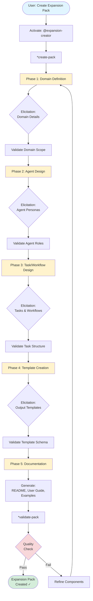
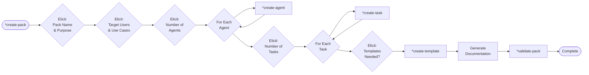
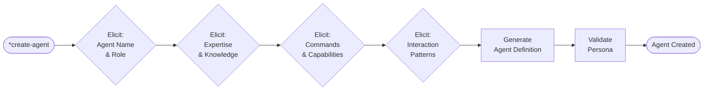
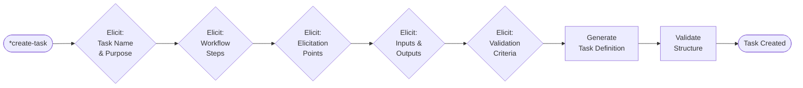
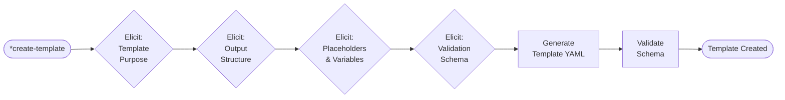
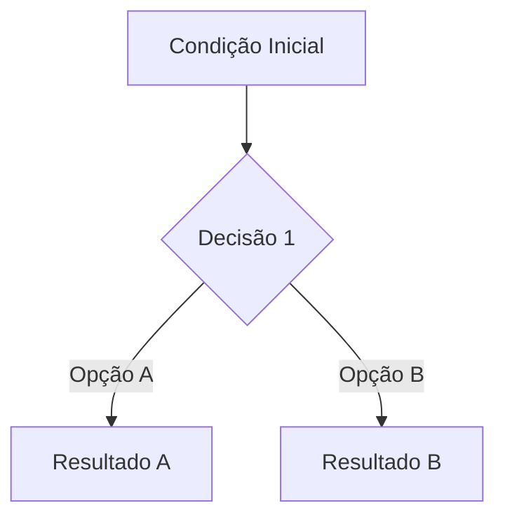

# Guia do Usuário: Expansion Pack Creator

## Visão Geral

O **Expansion Pack Creator** é um meta-expansion pack que democratiza a criação de expansion packs personalizados para o AIOS-FULLSTACK. Ele transforma conhecimento especializado de qualquer domínio em um sistema estruturado de agentes, tasks, templates e workflows que podem ser usados com o framework AIOS.

### Propósito

Este expansion pack foi projetado para:

- **Democratizar a Criação de Expansion Packs** - Qualquer pessoa com expertise em um domínio pode criar um expansion pack profissional
- **Automatizar a Geração de Componentes** - Gera automaticamente agentes, tasks, templates, checklists e documentação
- **Garantir Qualidade e Consistência** - Todos os componentes gerados seguem os padrões AIOS-FULLSTACK
- **Validar contra Standards** - Validação automática de conformidade com as especificações AIOS
- **Acelerar o Desenvolvimento** - Reduz drasticamente o tempo necessário para criar expansion packs de qualidade

### O Que Este Pack Oferece

Este expansion pack fornece um sistema completo para criar expansion packs personalizados:

1. **Agente Especializado** - Um Expert Expansion Pack Architect para guiar todo o processo
2. **Workflows Interativos** - Tasks com elicitação estruturada para coletar requisitos
3. **Templates Abrangentes** - Templates pré-construídos para todos os componentes
4. **Validação Automática** - Checklist completa de qualidade e conformidade
5. **Documentação Gerada** - README, user guides e exemplos criados automaticamente

## Pré-requisitos

### Conhecimento Necessário

- ✅ **Expertise no Domínio** - Conhecimento profundo da área para a qual criará o expansion pack
- ✅ **Familiaridade com AIOS** - Entendimento básico de como agentes e tasks funcionam no AIOS-FULLSTACK
- ✅ **Conceitos de Workflow** - Capacidade de mapear processos e workflows do seu domínio

### Requisitos Técnicos

- AIOS-FULLSTACK v4+ instalado
- Node.js 18+
- Acesso ao diretório `expansion-packs/` do projeto
- (Opcional) AIOS Developer agent para modificações avançadas

## Instalação

### Via NPM Script

```bash
# Instalar o expansion pack creator
npm run install:expansion expansion-creator
```

### Via Instalador Manual

```bash
# Usar o instalador de expansion packs
node tools/install-expansion-pack.js expansion-creator
```

### Verificar Instalação

Após a instalação, verifique se os seguintes componentes estão disponíveis:

```bash
# Verificar estrutura instalada
ls -la .expansion-creator/

# Verificar agente disponível
@expansion-creator
*help
```

## O Workflow de Criação de Expansion Packs

O processo de criação de um expansion pack segue um workflow estruturado de 5 fases principais:



### Descrição das Fases

#### Fase 1: Domain Definition (Definição do Domínio)
Coleta informações fundamentais sobre o domínio do expansion pack:
- Nome e propósito do pack
- Público-alvo e casos de uso
- Escopo e limitações
- Diferenciação de outros packs

#### Fase 2: Agent Design (Design de Agentes)
Define os agentes que comporão o expansion pack:
- Personas e especialidades
- Comandos e capacidades
- Interações entre agentes
- Knowledge bases necessárias

#### Fase 3: Task/Workflow Design (Design de Tasks e Workflows)
Especifica os workflows e tasks:
- Tasks principais e auxiliares
- Pontos de elicitação
- Inputs e outputs
- Validações e checkpoints

#### Fase 4: Template Creation (Criação de Templates)
Cria templates para outputs do expansion pack:
- Estrutura dos documentos
- Placeholders e variáveis
- Schemas de validação
- Exemplos de uso

#### Fase 5: Documentation (Documentação)
Gera toda a documentação necessária:
- README.md completo
- User guide detalhado
- Exemplos de uso
- Integration guides

## O Agente: expansion-creator

### Persona

O **expansion-creator** é um Expert Expansion Pack Architect com as seguintes características:

- **Expertise**: Arquitetura de sistemas, design de agentes IA, metodologias de elicitação de requisitos
- **Responsabilidades**: Guiar o usuário através de todo o processo de criação de expansion packs
- **Estilo**: Estruturado, meticuloso, pedagógico e orientado à qualidade
- **Conhecimento**: Padrões AIOS, melhores práticas de design de agentes, diversos domínios de aplicação

### Comandos Disponíveis

```bash
# Comando principal - criar expansion pack completo
*create-pack

# Comandos para componentes individuais
*create-agent     # Criar novo agente
*create-task      # Criar nova task
*create-template  # Criar novo template

# Comandos de validação e suporte
*validate-pack    # Validar expansion pack
*help             # Mostrar ajuda e comandos disponíveis
*exit             # Sair do agente
```

### Modo de Operação

O agente opera em dois modos principais:

**Modo Incremental** (Padrão)
- Elicitação detalhada passo a passo
- Máximo refinamento e qualidade
- Recomendado para expansion packs complexos

**Modo Rápido**
- Coleta rápida de requisitos essenciais
- Geração acelerada com defaults inteligentes
- Ideal para protótipos ou packs simples

## As 4 Tasks Principais

### 1. create-expansion-pack

**Propósito**: Workflow completo de criação de expansion pack do zero.

**Quando Usar**:
- Criar um novo expansion pack completo
- Primeira vez criando um pack para um domínio
- Necessita de guidance completa

**Workflow**:


**Inputs Elicitados**:
- Nome do expansion pack
- Descrição e propósito
- Domínio de aplicação
- Público-alvo
- Casos de uso principais
- Número e tipos de agentes
- Workflows e tasks necessárias
- Templates de output

**Outputs Gerados**:
- Estrutura completa do expansion pack
- Todos os arquivos de configuração
- Agentes definidos
- Tasks implementadas
- Templates criados
- Documentação completa

### 2. create-expansion-agent

**Propósito**: Criar um agente individual para um expansion pack.

**Quando Usar**:
- Adicionar novo agente a pack existente
- Criar agente standalone
- Modificar ou expandir pack

**Workflow**:


**Inputs Elicitados**:
- Nome e ID do agente
- Role/persona principal
- Expertise e conhecimento
- Comandos disponíveis
- Padrões de interação
- Knowledge bases associadas

**Output Gerado**:
- Arquivo `agents/nome-agente.md` com definição completa

### 3. create-expansion-task

**Propósito**: Criar uma task ou workflow para um expansion pack.

**Quando Usar**:
- Adicionar nova funcionalidade a pack existente
- Criar workflow específico
- Implementar automação customizada

**Workflow**:


**Inputs Elicitados**:
- Nome da task
- Propósito e objetivo
- Steps do workflow
- Pontos de elicitação
- Inputs necessários
- Outputs esperados
- Critérios de validação

**Output Gerado**:
- Arquivo `tasks/nome-task.md` com workflow completo

### 4. create-expansion-template

**Propósito**: Criar template de output para documentos/artifacts do expansion pack.

**Quando Usar**:
- Definir formato de outputs do pack
- Criar templates de documentos
- Estruturar artifacts gerados

**Workflow**:


**Inputs Elicitados**:
- Nome e tipo do template
- Propósito do output
- Estrutura do documento
- Placeholders necessários
- Schema de validação
- Exemplos de uso

**Output Gerado**:
- Arquivo `templates/nome-template.yaml` com template estruturado

## Templates Disponíveis

O Expansion Creator fornece 5 templates YAML pré-construídos:

### 1. expansion-config-tmpl.yaml
Configuração principal do expansion pack.

**Placeholders**:
- `{{pack-name}}` - Nome do pack
- `{{pack-version}}` - Versão
- `{{pack-description}}` - Descrição
- `{{pack-author}}` - Autor
- `{{slash-prefix}}` - Prefixo para comandos

### 2. expansion-readme-tmpl.md
Template de README para o expansion pack.

**Seções**:
- Overview e propósito
- Instalação
- Agentes incluídos
- Tasks disponíveis
- Exemplos de uso
- Best practices
- Support

### 3. expansion-agent-tmpl.md
Template para definição de agentes.

**Estrutura**:
- Agent metadata
- Persona description
- Available commands
- Knowledge bases
- Interaction patterns
- Examples

### 4. expansion-task-tmpl.md
Template para definição de tasks.

**Estrutura**:
- Task metadata
- Purpose and context
- Workflow steps
- Elicitation points
- Inputs and outputs
- Validation criteria

### 5. expansion-template-tmpl.yaml
Meta-template para criar templates de output.

**Estrutura**:
- Template metadata
- Output structure
- Placeholders definition
- Validation schema
- Usage examples

## Exemplos de Uso Completos

### Exemplo 1: Criar Expansion Pack para Legal Services

```bash
# 1. Ativar o agente
@expansion-creator

# 2. Iniciar criação do pack
*create-pack

# 3. Responder às elicitações:
# - Nome: legal-services
# - Propósito: Assistir profissionais do direito com redação de documentos
# - Target Users: Advogados, paralegais, departamentos jurídicos
# - Use Cases: Contratos, petições, pareceres legais

# 4. Definir agentes (elicitação interativa):
# - contract-specialist (3 comandos: *draft-contract, *review-contract, *amend-contract)
# - litigation-assistant (2 comandos: *draft-petition, *prepare-defense)
# - legal-researcher (2 comandos: *research-case-law, *cite-precedents)

# 5. Definir tasks principais:
# - draft-legal-document (workflow completo de redação)
# - review-legal-document (workflow de revisão e compliance)
# - research-legal-topic (workflow de pesquisa jurídica)

# 6. Definir templates:
# - contract-template.yaml (modelo de contrato)
# - petition-template.yaml (modelo de petição)
# - legal-memo-template.yaml (modelo de parecer)

# 7. Geração automática de documentação

# 8. Validação final
*validate-pack

# Resultado: Expansion pack legal-services completo em expansion-packs/legal-services/
```

### Exemplo 2: Adicionar Agente a Pack Existente

```bash
# 1. Ativar o agente
@expansion-creator

# 2. Criar apenas um agente
*create-agent

# 3. Responder às elicitações:
# - Nome: compliance-checker
# - Pack: legal-services
# - Role: Verificar compliance regulatória em documentos
# - Expertise: Regulamentações, normas, compliance
# - Comandos: *check-compliance, *generate-compliance-report

# Resultado: Novo agente adicionado ao pack legal-services
```

### Exemplo 3: Criar Template Customizado

```bash
# 1. Ativar o agente
@expansion-creator

# 2. Criar template
*create-template

# 3. Responder às elicitações:
# - Nome: nda-agreement-template
# - Pack: legal-services
# - Propósito: Template para acordos de confidencialidade
# - Estrutura: Seções standard de NDA
# - Placeholders: party-a, party-b, effective-date, duration, etc.

# Resultado: Template templates/nda-agreement-template.yaml criado
```

## Estrutura de Expansion Pack Gerada

Quando você cria um expansion pack usando o Expansion Creator, a seguinte estrutura é automaticamente gerada:

```
expansion-packs/your-pack-name/
├── config.yaml                      # Configuração do pack
│   ├── name: your-pack-name
│   ├── version: 1.0.0
│   ├── description: [sua descrição]
│   ├── author: [seu nome]
│   └── slashPrefix: yourPack
│
├── README.md                        # Documentação principal
│   ├── Overview
│   ├── Purpose
│   ├── What's Included
│   ├── Installation
│   ├── Usage Examples
│   ├── Integration
│   └── Support
│
├── user-guide.md                    # Guia detalhado do usuário
│   ├── Visão Geral
│   ├── Pré-requisitos
│   ├── Workflow Diagrams
│   ├── Agent Descriptions
│   ├── Task Details
│   ├── Examples
│   └── Best Practices
│
├── agents/                          # Agentes especializados
│   ├── agent-1.md
│   ├── agent-2.md
│   └── agent-n.md
│
├── tasks/                          # Workflows e tasks
│   ├── task-1.md
│   ├── task-2.md
│   └── task-n.md
│
├── templates/                      # Templates de output
│   ├── template-1.yaml
│   ├── template-2.yaml
│   └── template-n.yaml
│
├── checklists/                     # Validation checklists
│   └── quality-checklist.md
│
├── data/                          # Knowledge bases
│   └── domain-kb.md
│
└── install-manifest.yaml          # Manifest de instalação
    ├── files: [lista de arquivos]
    ├── dependencies: [dependências]
    └── post-install: [scripts]
```

### Arquivos Principais Gerados

#### config.yaml
```yaml
name: your-pack-name
version: 1.0.0
short-title: Your Pack Title
description: >-
  [Descrição detalhada do propósito e capacidades do pack]
author: Your Name
slashPrefix: yourPack
```

#### README.md
- Overview completo do expansion pack
- Instruções de instalação
- Lista de agentes e suas capacidades
- Exemplos de uso
- Best practices
- Links de suporte

#### user-guide.md
- Guia passo a passo completo
- Diagramas de workflow (mermaid)
- Descrições detalhadas de cada componente
- Cenários de uso
- Troubleshooting

#### agents/[agent-name].md
```markdown
# Agent: [Name]

## Metadata
- Agent ID: agent-name
- Version: 1.0.0
- Author: [Author]

## Persona
[Descrição da persona e expertise]

## Available Commands
- *command-1: [Descrição]
- *command-2: [Descrição]

## Knowledge Bases
- [Knowledge base references]

## Examples
[Exemplos de uso]
```

## Best Practices

### ✅ DO's (Faça)

#### 1. Comece com Escopo Claro
```bash
# Bom: Escopo bem definido
"Criar expansion pack para redação de contratos comerciais"

# Evite: Escopo muito amplo
"Criar expansion pack para tudo relacionado a negócios"
```

#### 2. Defina Personas de Agentes Específicas
```bash
# Bom: Persona específica e focada
"contract-specialist: Expert em contratos comerciais B2B,
com foco em cláusulas de propriedade intelectual e SLA"

# Evite: Persona genérica
"legal-agent: Ajuda com coisas legais"
```

#### 3. Use Elicitação Incremental para Packs Complexos
```bash
# Para packs com 5+ agentes ou workflows complexos
@expansion-creator
*create-pack
# Escolher modo: incremental
# Refinar cada componente detalhadamente
```

#### 4. Valide Frequentemente
```bash
# Após cada componente principal criado
*validate-pack

# Corrija issues antes de prosseguir
```

#### 5. Crie Knowledge Bases Robustas
```markdown
# Arquivo: data/domain-kb.md
## Domain Concepts
[Conceitos fundamentais do domínio]

## Best Practices
[Práticas recomendadas]

## Common Pitfalls
[Erros comuns a evitar]

## Reference Materials
[Links e recursos]
```

#### 6. Teste com Casos Reais
```bash
# Após criação, teste com cenários reais do domínio
# Documente os resultados
# Refine baseado em feedback
```

### ❌ DON'Ts (Não Faça)

#### 1. Não Crie Packs Muito Genéricos
```bash
# Evite:
"general-business-pack" # Muito amplo
"helper-pack" # Sem foco claro

# Prefira:
"b2b-sales-automation" # Específico e focado
"email-marketing-campaigns" # Caso de uso claro
```

#### 2. Não Ignore Validações
```bash
# Não faça:
@expansion-creator
*create-pack
# [criar tudo]
# Pronto! (sem validar)

# Faça:
*create-pack
# [criar componentes]
*validate-pack
# [corrigir issues]
# Pronto!
```

#### 3. Não Crie Agentes Redundantes
```bash
# Evite:
- contract-writer
- contract-creator
- contract-drafter
# (3 agentes fazendo a mesma coisa)

# Prefira:
- contract-specialist
  - *draft-contract
  - *review-contract
  - *amend-contract
# (1 agente com múltiplos comandos)
```

#### 4. Não Sobrecarregue Templates
```yaml
# Evite templates com 50+ placeholders
# Prefira múltiplos templates específicos

# Mal:
comprehensive-document-template.yaml:
  placeholders: [50+ items]

# Bem:
contract-template.yaml:
  placeholders: [10 items]
nda-template.yaml:
  placeholders: [8 items]
```

#### 5. Não Negligencie Documentação
```bash
# Sempre gere documentação completa
# Inclua:
- README.md
- user-guide.md
- Exemplos práticos
- Integration guides
```

#### 6. Não Crie Dependências Circulares
```bash
# Evite:
agent-a → depende de → agent-b
agent-b → depende de → agent-c
agent-c → depende de → agent-a
# (dependência circular)

# Prefira:
agent-a → standalone
agent-b → depende de → agent-a
agent-c → depende de → agent-a
# (dependências hierárquicas)
```

## Troubleshooting

### Problema: "Elicitation not responding"

**Sintomas**: O agente não responde às suas respostas durante elicitação.

**Soluções**:
```bash
# 1. Verificar se o agente está ativo
@expansion-creator
*help  # Se responder, está ativo

# 2. Reiniciar o agente
*exit
@expansion-creator
*create-pack

# 3. Verificar logs
cat .aios/logs/expansion-creator.log
```

### Problema: "Generated pack incomplete"

**Sintomas**: Alguns arquivos ou componentes não foram gerados.

**Soluções**:
```bash
# 1. Validar o pack
*validate-pack

# 2. Criar componentes faltantes individualmente
*create-agent  # Se faltam agentes
*create-task   # Se faltam tasks
*create-template  # Se faltam templates

# 3. Verificar config.yaml
cat expansion-packs/seu-pack/config.yaml
```

### Problema: "Validation errors"

**Sintomas**: `*validate-pack` retorna erros.

**Soluções**:
```bash
# 1. Ler o relatório de validação completo
*validate-pack --verbose

# 2. Corrigir erros por categoria:
#    - Schema errors: Corrigir YAML syntax
#    - Missing files: Criar arquivos faltantes
#    - Naming issues: Renomear conforme padrões

# 3. Revalidar após correções
*validate-pack
```

### Problema: "Templates not rendering"

**Sintomas**: Templates YAML não são renderizados corretamente.

**Soluções**:
```yaml
# 1. Verificar placeholders corretos
# Formato correto: {{placeholder-name}}
# Formato incorreto: ${placeholder-name}, {placeholder}, etc.

# 2. Verificar schema de validação
templates:
  your-template:
    placeholders:
      - name: placeholder-name
        type: string
        required: true

# 3. Testar renderização manualmente
node tools/test-template.js your-template.yaml
```

### Problema: "Agent commands not working"

**Sintomas**: Comandos do agente criado não funcionam.

**Soluções**:
```markdown
# 1. Verificar formato de comando no agent.md
## Available Commands
- *command-name: Description
  # Deve começar com * e usar kebab-case

# 2. Verificar implementação da task
tasks/command-name.md deve existir

# 3. Testar comando diretamente
@your-agent
*command-name
```

### Problema: "Pack not showing in installer"

**Sintomas**: Novo pack não aparece ao rodar `npm run install:expansion`.

**Soluções**:
```bash
# 1. Verificar install-manifest.yaml existe
ls expansion-packs/seu-pack/install-manifest.yaml

# 2. Verificar config.yaml está correto
cat expansion-packs/seu-pack/config.yaml

# 3. Recarregar lista de packs
npm run reload:expansions

# 4. Listar packs disponíveis
node tools/list-expansion-packs.js
```

## Cenários de Uso

### Cenário 1: Criar Pack para Domínio Profissional Específico

**Contexto**: Você é um profissional de healthcare e quer criar ferramentas de IA para gestão de clínica médica.

**Workflow**:
```bash
# 1. Mapear o domínio
- Domínio: Healthcare practice management
- Target: Médicos e administradores de clínicas
- Casos de uso: Agendamento, prontuários, billing

# 2. Criar o pack
@expansion-creator
*create-pack

# Elicitações:
# Nome: healthcare-practice
# Descrição: Gestão completa de clínicas médicas
# Target: Small to medium medical practices

# 3. Definir agentes
# - patient-coordinator: Gestão de pacientes e agendamentos
# - clinical-documenter: Documentação clínica e prontuários
# - billing-specialist: Faturamento e seguros

# 4. Criar workflows principais
# - schedule-appointment: Agendar consultas
# - create-medical-record: Criar prontuário
# - process-billing: Processar faturamento

# 5. Criar templates
# - appointment-confirmation.yaml
# - medical-record.yaml
# - insurance-claim.yaml

# 6. Gerar documentação
# README.md e user-guide.md automáticos

# 7. Validar
*validate-pack
```

**Resultado**: Expansion pack healthcare-practice completo e validado.

### Cenário 2: Expandir Pack Existente com Novos Agentes

**Contexto**: Você tem um pack de content-marketing e precisa adicionar capacidades de SEO.

**Workflow**:
```bash
# 1. Criar novo agente
@expansion-creator
*create-agent

# Elicitações:
# Nome: seo-specialist
# Pack: content-marketing
# Role: Otimização de conteúdo para motores de busca
# Comandos: *analyze-seo, *optimize-content, *generate-meta-tags

# 2. Criar tasks associadas
*create-task

# Nome: optimize-for-seo
# Workflow: Análise → Recomendações → Implementação
# Inputs: Conteúdo original, keywords alvo
# Outputs: Conteúdo otimizado, score SEO

# 3. Criar template de relatório
*create-template

# Nome: seo-report-template
# Outputs: Score, recomendações, keywords sugeridas

# 4. Atualizar documentação
# (Automático via generator)
```

**Resultado**: Pack content-marketing expandido com capacidades de SEO.

### Cenário 3: Prototipar Pack Rapidamente

**Contexto**: Você quer testar uma ideia para um pack de personal-finance antes de investir muito tempo.

**Workflow**:
```bash
# 1. Usar modo rápido
@expansion-creator
*create-pack --mode rapid

# Elicitações mínimas:
# Nome: personal-finance
# Propósito: Gestão de finanças pessoais
# Agentes: 2 (budget-planner, investment-advisor)
# Tasks: 3 principais workflows

# 2. Aceitar defaults inteligentes
# Templates: Usar templates padrão
# Validações: Validações básicas
# Docs: Documentação mínima

# 3. Testar o protótipo
@budget-planner
*create-budget

# 4. Se funcionar, refinar
*create-pack --mode incremental --refine
```

**Resultado**: Protótipo funcional em minutos para validação de conceito.

### Cenário 4: Criar Pack Multi-Domínio

**Contexto**: Você quer criar um pack que combina expertise de diferentes áreas (ex: legal + finance para M&A transactions).

**Workflow**:
```bash
# 1. Mapear domínios envolvidos
- Legal: Due diligence, contratos
- Finance: Valuation, estrutura de deal
- Operational: Integration planning

# 2. Criar pack abrangente
@expansion-creator
*create-pack

# Nome: ma-transactions
# Multi-domain: legal, finance, operations

# 3. Criar agentes por domínio
# Legal domain:
# - legal-dd-specialist
# - contract-negotiator

# Finance domain:
# - valuation-expert
# - deal-structurer

# Operations domain:
# - integration-planner

# 4. Criar workflows cross-domain
# - execute-ma-transaction (orchestrates all domains)
# - due-diligence-complete (legal + finance)
# - integration-planning (operations + finance)

# 5. Validar interações entre domínios
*validate-pack --check-dependencies
```

**Resultado**: Pack sofisticado com agentes colaborando entre domínios.

## Customização Avançada

### Modificar Templates Padrão

Se os templates padrão não atendem suas necessidades:

```bash
# 1. Copiar template para customização
cp .expansion-creator/templates/expansion-agent-tmpl.md \
   .expansion-creator/templates/my-custom-agent-tmpl.md

# 2. Editar conforme necessário
# Adicionar seções customizadas
# Modificar estrutura
# Adicionar placeholders

# 3. Usar template customizado
@expansion-creator
*create-agent --template my-custom-agent-tmpl
```

### Criar Validações Customizadas

Para adicionar validações específicas do seu domínio:

```yaml
# expansion-packs/seu-pack/validation/custom-rules.yaml
validation_rules:
  - rule_id: domain_specific_1
    description: "Verificar compliance com regulação X"
    check: |
      # Script de validação customizado
      validate_regulation_x()
    severity: error

  - rule_id: domain_specific_2
    description: "Verificar padrões de nomenclatura do domínio"
    check: |
      validate_naming_conventions()
    severity: warning
```

### Integrar com Ferramentas Externas

```javascript
// expansion-packs/seu-pack/integrations/external-tool.js
export async function integrateWithExternalTool(data) {
  // Sua lógica de integração
  const result = await externalAPI.call(data);
  return result;
}

// Usar na task:
// tasks/your-task.md
## Integration Points
- external-tool: Integra com ferramenta externa via API
```

### Criar Knowledge Bases Especializadas

```markdown
<!-- expansion-packs/seu-pack/data/advanced-kb.md -->
# Advanced Knowledge Base: [Seu Domínio]

## Domain-Specific Terminology
- Termo 1: Definição e contexto
- Termo 2: Definição e contexto

## Complex Workflows
### Workflow Name
1. Step 1
2. Step 2
3. Decision point
4. Step 3a or 3b

## Decision Trees


## Best Practices Repository
[Compilação de best practices do domínio]
```

## Integração com Core AIOS

O Expansion Creator se integra perfeitamente com os componentes principais do AIOS:

### 1. AIOS Developer Agent

```bash
# Usar aios-developer para modificações avançadas
@aios-developer
*modify-expansion-component

# Criar agentes com capabilities avançadas
*create-advanced-agent --expansion seu-pack
```

### 2. Memory Layer

```bash
# Expansion packs criados são tracked no memory layer
# Permite:
- Histórico de todas as modificações
- Recuperação de versões anteriores
- Compartilhamento de knowledge entre packs
```

### 3. Core Workflows

```bash
# Packs criados automaticamente se integram com:
- Greenfield workflow (novos projetos)
- Brownfield workflow (projetos existentes)
- Standard AIOS task execution engine
```

### 4. Installer System

```bash
# Packs gerados podem ser instalados via:
npm run install:expansion seu-pack

# Ou via instalador interativo:
node tools/install-expansion-pack.js
# [Selecionar seu pack da lista]
```

## Compartilhando Seu Expansion Pack

### Preparar para Compartilhamento

```bash
# 1. Validação final completa
*validate-pack --comprehensive

# 2. Gerar documentação completa
npm run generate:docs -- expansion-packs/seu-pack

# 3. Criar exemplos de uso
# Adicionar em examples/ directory

# 4. Criar README detalhado
# Incluir:
- Screenshots/demos
- Casos de uso reais
- Testimonials (se disponível)
```

### Publicar no GitHub

```bash
# 1. Criar repositório para o pack
gh repo create seu-pack --public

# 2. Preparar release
git tag -a v1.0.0 -m "First release of seu-pack"
git push origin v1.0.0

# 3. Criar GitHub Release
gh release create v1.0.0 --title "v1.0.0" --notes "Release notes"
```

### Submeter para AIOS Community

```bash
# 1. Fork do repositório AIOS-FULLSTACK
gh repo fork Pedrovaleriolopez/aios-fullstack

# 2. Adicionar seu pack
cp -r expansion-packs/seu-pack aios-fullstack/expansion-packs/

# 3. Criar Pull Request
gh pr create --title "Add seu-pack expansion" \
             --body "Descrição do pack e seus benefícios"
```

## Recursos e Suporte

### Documentação

- **[Guia de Expansion Packs](../../docs/expansion-packs.md)** - Documentação completa sobre expansion packs
- **[Arquitetura AIOS](../../docs/architecture.md)** - Entenda a arquitetura do framework
- **[AIOS Developer Guide](../../docs/developer-guide.md)** - Guia para desenvolvedores

### Exemplos de Referência

Explore expansion packs existentes para inspiração:

- `expansion-packs/hybrid-ops/` - Sistema META complexo
- `expansion-packs/aios-infrastructure-devops/` - DevOps e infraestrutura
- `expansion-packs/meeting-notes/` - Pack simples e focado

### Suporte

- **GitHub Issues**: [Report Issues](https://github.com/Pedrovaleriolopez/aios-fullstack/issues)

### Contribuindo

Contribuições são bem-vindas! Veja:
- [How to Contribute](../../docs/how-to-contribute-with-pull-requests.md)
- [Expansion Pack Guidelines](../../docs/expansion-pack-guidelines.md)

## Conclusão

O **Expansion Pack Creator** democratiza a criação de expansion packs para AIOS-FULLSTACK, permitindo que qualquer pessoa com expertise em um domínio transforme esse conhecimento em um sistema estruturado de agentes de IA.

### Próximos Passos

1. **Instale o Expansion Creator** se ainda não o fez
2. **Identifique um domínio** onde você tem expertise
3. **Crie seu primeiro expansion pack** usando o workflow guiado
4. **Teste e refine** baseado em casos de uso reais
5. **Compartilhe com a comunidade** para beneficiar outros usuários

### Lembre-se

- Comece simples e itere
- Use validações frequentemente
- Documente bem
- Teste com cenários reais
- Compartilhe seu conhecimento

**Pronto para democratizar sua expertise? Vamos criar um expansion pack! 🚀**

---

_Versão: 1.0.0_
_Compatível com: AIOS-FULLSTACK v4+_
_Última Atualização: 2025_
