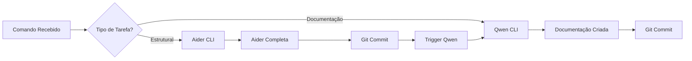

# Protocolos de Convivência - Orquestra de CLIs

## 🎼 Visão Geral

A **Orquestra de CLIs** é um sistema de colaboração entre ferramentas de IA especializadas, onde cada CLI tem um papel específico no desenvolvimento da Corporação Senciente.

---

## 🎭 As Duas Colunas (Jachin e Boaz)

### Aider CLI - O Maestro (Jachin)
**Especialidade:** Raciocínio, Arquitetura e Lógica Complexa

**Quando usar:**
- ✅ Mudanças estruturais no código
- ✅ Criação de novos módulos e serviços
- ✅ Lógica complexa de agentes
- ✅ Refatorações arquiteturais
- ✅ Integração de sistemas
- ✅ Debugging de problemas complexos

**Modelos configurados:**
- **Principal:** Claude 4 Sonnet (raciocínio e arquitetura)
- **Editor:** DeepSeek R1 (implementação rápida)

---

### Qwen CLI - A Escriba (Boaz)
**Especialidade:** Documentação, Tradução e Código Repetitivo

**Quando usar:**
- ✅ Gerar READMEs e documentação técnica
- ✅ Documentação JSDoc/Docstrings
- ✅ Tradução de interfaces (PT/EN)
- ✅ Componentes repetitivos de Front-end
- ✅ Geração de testes unitários
- ✅ Refatoração de código legado

**Modelo configurado:**
- **Principal:** Qwen 2.5 Coder 72B (via OpenRouter ou DashScope)

---

## 🔄 Sistema de Handoff (Passagem de Bastão)

### Fluxo Automático



### Regras de Handoff

1. **Aider → Qwen (Automático)**
   - Quando Aider cria um novo módulo
   - Sistema detecta commit sem README
   - Qwen é disparada automaticamente para documentar

2. **Qwen → Aider (Manual)**
   - Quando documentação revela necessidade de mudança estrutural
   - Usuário decide se aciona Aider

3. **Handoff Explícito**
   - Comando: `/handoff qwen "documentar módulo X"`
   - Comando: `/handoff aider "refatorar componente Y"`

---

## 📖 Interoperabilidade

### Como uma CLI lê o que a outra fez

#### Via Git Logs
```bash
# Aider verifica últimos commits da Qwen
git log --author="Qwen CLI" --since="1 hour ago" --oneline

# Qwen verifica módulos criados pelo Aider
git log --author="Aider CLI" --diff-filter=A --name-only
```

#### Via Metadados de Commit
```
Formato padrão de commit:

AI: [CLI_NAME] [MODULE] Description

Exemplos:
- AI: [Aider] [Backend] Criado serviço de orquestração de CLIs
- AI: [Qwen] [Docs] Documentado módulo cli_orchestrator.py
```

#### Via Arquivo de Estado
```json
// .cli_state.json
{
  "last_aider_commit": "abc123",
  "last_qwen_commit": "def456",
  "pending_documentation": [
    "backend/core/services/cli_orchestrator.py",
    "backend/core/services/aider_service.py"
  ],
  "pending_refactoring": []
}
```

---

## 🛡️ Protocolo de Conflitos

### Quando as CLIs discordam

**Cenário:** Aider cria código que Qwen considera mal documentável

**Resolução:**
1. Qwen adiciona comentário no código: `// TODO: Refatorar para melhor documentabilidade`
2. Qwen cria issue no GitHub com tag `cli-conflict`
3. Usuário decide se aceita sugestão da Qwen

**Prioridade:** Aider tem prioridade em decisões arquiteturais, Qwen em clareza de documentação

---

## 📋 Comandos Padronizados

### Para Aider

```bash
# Criar novo módulo
aider --message "criar módulo de orquestração de CLIs em backend/core/services/"

# Refatorar código existente
aider --message "refatorar backend/agents/whatsapp_commander.py para usar async/await"

# Debugging
aider --message "debugar erro de conexão no ForgeContext.tsx"
```

### Para Qwen

```bash
# Documentar módulo
qwen-code-cli --task "documentar backend/core/services/cli_orchestrator.py com docstrings e README"

# Traduzir interface
qwen-code-cli --task "traduzir componentes de frontend/src/components/ para português"

# Gerar testes
qwen-code-cli --task "gerar testes unitários para backend/core/services/aider_service.py"
```

---

## 🎯 Matriz de Decisão

| Tarefa | Aider | Qwen | Ambos |
|--------|-------|------|-------|
| Criar novo agente Python | ✅ | ❌ | ❌ |
| Documentar agente criado | ❌ | ✅ | ❌ |
| Refatorar lógica complexa | ✅ | ❌ | ❌ |
| Criar componente React simples | ❌ | ✅ | ❌ |
| Criar componente React complexo | ✅ | ❌ | ❌ |
| Traduzir UI | ❌ | ✅ | ❌ |
| Integrar API externa | ✅ | ❌ | ❌ |
| Documentar API | ❌ | ✅ | ❌ |
| Criar workflow CI/CD | ✅ | ❌ | ❌ |
| Documentar workflow | ❌ | ✅ | ❌ |
| Debugging de erro crítico | ✅ | ❌ | ❌ |
| Gerar changelog | ❌ | ✅ | ❌ |
| Criar nova feature completa | ❌ | ❌ | ✅ |

---

## 🔐 Segurança e Validação

### Validação Cruzada

1. **Aider cria código → Qwen valida documentabilidade**
   - Se código não é documentável, Qwen alerta

2. **Qwen gera documentação → Aider valida precisão técnica**
   - Se documentação está incorreta, Aider corrige

### Aprovação Humana

**Obrigatória para:**
- Mudanças em arquivos de configuração críticos (`.env`, `config/`)
- Alterações em schemas de banco de dados
- Modificações em rotas de API públicas
- Refatorações que afetam > 10 arquivos

**Opcional para:**
- Documentação
- Testes unitários
- Componentes de UI isolados

---

## 📊 Métricas de Sucesso

### KPIs da Orquestra

- **Taxa de Handoff Bem-Sucedido:** > 90%
- **Tempo Médio de Handoff:** < 30 segundos
- **Cobertura de Documentação:** > 80% dos módulos
- **Taxa de Conflito:** < 5%

### Logs de Auditoria

```json
{
  "timestamp": "2026-02-01T01:00:00Z",
  "cli": "aider",
  "task": "criar módulo cli_orchestrator.py",
  "status": "completed",
  "duration_seconds": 45,
  "files_changed": 3,
  "handoff_to": "qwen",
  "handoff_reason": "documentação necessária"
}
```

---

## 🚀 Evolução Futura

### Fase 1 (Atual)
- ✅ Aider + Qwen instaladas
- ✅ Protocolos de convivência definidos
- ✅ Handoff manual

### Fase 2 (Próxima)
- [ ] Handoff automático via git hooks
- [ ] Dashboard de métricas da Orquestra
- [ ] Integração com portal WhatsApp

### Fase 3 (Futuro)
- [ ] Claude Code CLI (terceira coluna)
- [ ] Cursor CLI (quarta coluna)
- [ ] Sistema de votação entre CLIs para decisões complexas

---

## 📚 Referências

- [Aider Documentation](https://aider.chat/docs/)
- [Qwen Code Documentation](https://qwenlm.github.io/)
- [Corporação Senciente - DOCUMENTO_UNICO_VERDADE.md](file:///c:/Users/User/Desktop/Sencient-Coorporation/Diana-Corporacao-Senciente/DOCUMENTO_UNICO_VERDADE.md)
