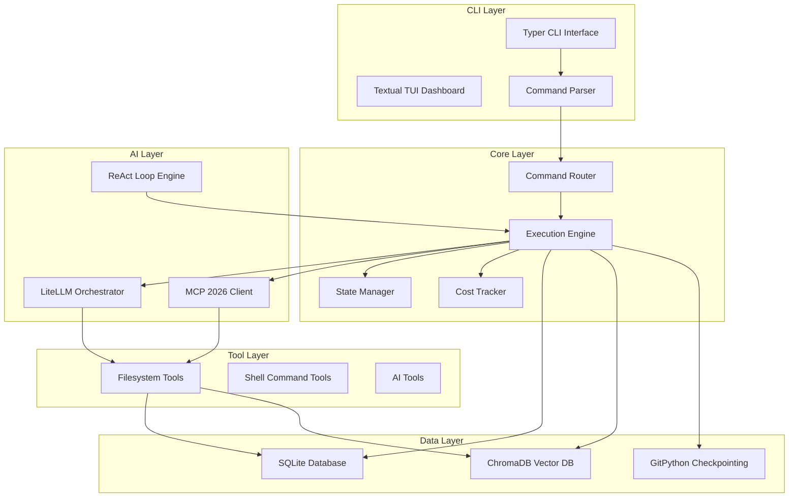

# AZ-OS (Agent Zero Operating System)

**Version:** 1.0.0  
**Status:** Foundation Complete  

---

## 🎯 VISION

Agent Zero Operating System is a CLI-first AI operating system that serves as the frontal cortex for autonomous agents, ensuring 100% autonomy, maximum performance, and complete technical sovereignty.

**Key Innovation:** First CLI combining Level 10 autonomy + 60 FPS TUI + 90% cost optimization + native Agent Zero integration.

---

## 🚀 QUICK START

### Installation
```bash
# Clone the repository
git clone https://github.com/diana-corporacao-senciente/az-os.git
cd az-os

# Install dependencies
pip install -e .
```

### Basic Usage
```bash
# Initialize the system
az db init

# Run a task
az task run "create function isPrime" --model claude

# Show dashboard
az dashboard

# List available tools
az tools list
```

---

## 📋 FEATURES

### Core Features
- **CLI Framework**: Typer-based command routing with auto-completion
- **SQLite Persistence**: Task storage, logs, and state management
- **LiteLLM Integration**: Multi-model AI orchestration with cost tracking
- **MCP Client**: Filesystem and shell tool integration
- **Command Execution**: Async processing with progress tracking

### AI Features
- **Multi-Model Support**: Claude, Gemini, DeepSeek, and free models
- **Cost Optimization**: Smart routing and budget enforcement
- **Tool Calling**: MCP protocol for external tool integration
- **ReAct Engine**: Reasoning-Action-Observation self-correction

### Data Features
- **SQLite Database**: Structured data persistence
- **ChromaDB Vector DB**: Semantic search and RAG
- **Git Checkpointing**: Auto-commit task checkpoints
- **Migration System**: Database schema management

---

## 🏗️ ARCHITECTURE

### Component Diagram


### Package Structure
```
az_os/
├── az_os/
│   ├── __init__.py
│   ├── __main__.py              # CLI entry point
│   ├── core/                   # Core functionality
│   │   ├── __init__.py
│   │   ├── mcp_client.py       # MCP 2026 client
│   │   └── execution_engine.py # Command execution engine
│   ├── cli/                    # CLI interface
│   │   ├── __init__.py
│   │   ├── main.py             # CLI commands
│   │   └── __main__.py          # CLI entry point
│   ├── ai/                     # AI integration
│   │   ├── __init__.py
│   │   └── __main__.py          # AI entry point
│   ├── data/                   # Data layer
│   │   ├── __init__.py
│   │   └── __main__.py          # Data entry point
│   └── tools/                  # Tool layer
│       ├── __init__.py
│       └── __main__.py          # Tools entry point
├── tests/                      # Test suite
│   ├── __init__.py
│   ├── conftest.py             # Test fixtures
│   ├── test_execution.py       # Execution engine tests
│   └── test_mcp_client.py      # MCP client tests
├── docs/                       # Documentation
│   ├── architecture/           # Architecture docs
│   └── planning/               # Planning docs
├── pyproject.toml              # Project configuration
└── README.md                   # This file
```

---

## 🧪 TESTING

Run the test suite:
```bash
pytest tests/
```

---

## 🔧 DEVELOPMENT

### Code Quality
```bash
# Format code
black src/

# Sort imports
isort src/

# Type checking
mypy src/
```

---

## 📄 LICENSE

MIT License - see LICENSE file for details.