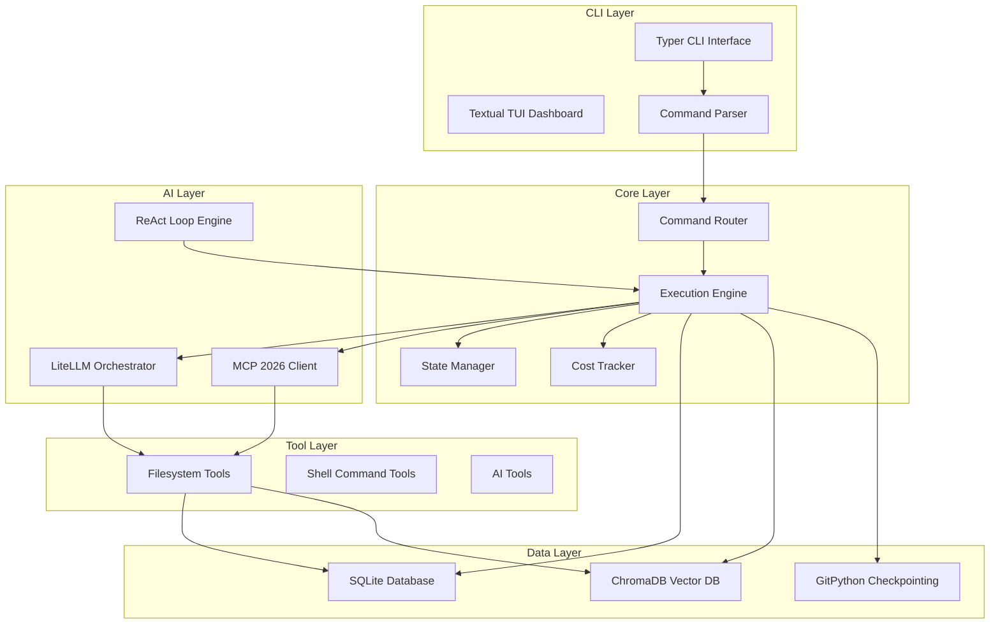

# AZ-OS (Agent Zero Operating System)

**Version:** 1.0.0  
**Status:** Foundation Complete  

---

## 🎯 VISION

Agent Zero Operating System is a CLI-first AI operating system that serves as the frontal cortex for autonomous agents, ensuring 100% autonomy, maximum performance, and complete technical sovereignty.

**Key Innovation:** First CLI combining Level 10 autonomy + 60 FPS TUI + 90% cost optimization + native Agent Zero integration.

---

## 🚀 QUICK START

### Installation
```bash
# Clone the repository
git clone https://github.com/diana-corporacao-senciente/az-os.git
cd az-os

# Install dependencies
pip install -e .
```

### Basic Usage
```bash
# Initialize the system
az db init

# Run a task
az task run "create function isPrime" --model claude

# Show dashboard
az dashboard

# List available tools
az tools list
```

---

## 📋 FEATURES

### Core Features
- **CLI Framework**: Typer-based command routing with auto-completion
- **SQLite Persistence**: Task storage, logs, and state management
- **LiteLLM Integration**: Multi-model AI orchestration with cost tracking
- **MCP Client**: Filesystem and shell tool integration
- **Command Execution**: Async processing with progress tracking

### AI Features
- **Multi-Model Support**: Claude, Gemini, DeepSeek, and free models
- **Cost Optimization**: Smart routing and budget enforcement
- **Tool Calling**: MCP protocol for external tool integration
- **ReAct Engine**: Reasoning-Action-Observation self-correction

### Data Features
- **SQLite Database**: Structured data persistence
- **ChromaDB Vector DB**: Semantic search and RAG
- **Git Checkpointing**: Auto-commit task checkpoints
- **Migration System**: Database schema management

---

## 🏗️ ARCHITECTURE

### Component Diagram


### Package Structure
```
az_os/
├── az_os/
│   ├── __init__.py
│   ├── __main__.py              # CLI entry point
│   ├── core/                   # Core business logic
│   │   ├── __init__.py
│   │   ├── interfaces.py      # Core interfaces
│   │   ├── task_manager.py    # Task orchestration
│   │   ├── state_manager.py   # State management
│   │   ├── cost_tracker.py    # Cost tracking
│   │   └── execution_engine.py # Execution engine
│   ├── ai/                     # AI/ML components
│   │   ├── __init__.py
│   │   ├── interfaces.py      # AI interfaces
│   │   ├── litellm_client.py  # LiteLLM integration
│   │   ├── mcp_client.py      # MCP protocol client
│   │   ├── react_engine.py    # ReAct loop engine
│   │   └── routing_engine.py  # Smart routing
│   ├── data/                   # Data persistence
│   │   ├── __init__.py
│   │   ├── interfaces.py      # Data interfaces
│   │   ├── sqlite_repository.py # SQLite persistence
│   │   ├── chromadb_repository.py # ChromaDB persistence
│   │   ├── migration_manager.py # Database migrations
│   │   └── models/             # Data models
│   │       ├── task.py
│   │       ├── cost.py
│   │       └── state.py
│   ├── tools/                  # Tool integration
│   │   ├── __init__.py
│   │   ├── filesystem.py      # Filesystem tools
│   │   ├── shell.py           # Shell command tools
│   │   └── ai_tools.py        # AI tool definitions
│   └── cli/                    # CLI components
│       ├── __init__.py
│       ├── main.py             # CLI entry point
│       └── commands/           # Command definitions
│           ├── task.py
│           ├── db.py
│           ├── cost.py
│           ├── dashboard.py
│           ├── tools.py
│           └── config.py
├── tests/                     # Test suite
│   ├── __init__.py
│   ├── conftest.py
│   ├── test_cli.py
│   ├── test_core.py
│   ├── test_ai.py
│   └── test_data.py
├── docs/                      # Documentation
│   ├── planning/
│   ├── architecture/
│   └── api/
└── examples/                 # Usage examples
```

---

## 📦 TECH STACK

### Core Dependencies
- **CLI Framework**: Typer 0.12.0
- **AI Orchestration**: LiteLLM 1.0.0
- **Database**: SQLite with aiosqlite 0.19.0
- **Type Validation**: Pydantic 2.9.0
- **Configuration**: Dynaconf 3.2.0
- **Git Integration**: GitPython 3.1.0

### Optional Dependencies
- **TUI**: Textual 0.82.0, Rich 13.9.0
- **Advanced AI**: OpenAI, Anthropic, Google Generative AI
- **Monitoring**: Prometheus Client, Structlog
- **Security**: Cryptography, PyJWT

---

## 📋 COMMAND REFERENCE

### Root Commands
```bash
az task      # Task management and execution
az db        # Database operations
az cost      # Cost tracking and management
az dashboard # TUI dashboard
az tools     # Tool management and discovery
az config    # Configuration management
az log       # Logging and monitoring
az state     # State management
```

### Examples
```bash
# Task execution
az task run "create function isPrime" --model claude --priority high

# Database operations
az db init --force
az db migrate --version 1.2.3

# Cost management
az cost show --period daily
az cost budget set --amount 100 --alert 80

# Dashboard
az dashboard --theme dark --metrics all

# Tool discovery
az tools list --category ai
az tools info --name filesystem

# Configuration
az config set llm.provider=gemini
az config get --all

# Logging
az log show --level error --since "2024-01-01"
az log export --format json --output logs.json

# State management
az state save --name checkpoint-1
az state restore --name checkpoint-1
```

---

## 🧪 TESTING

### Running Tests
```bash
# Run all tests
pytest

# Run with coverage
pytest --cov=az_os

# Run specific test
pytest tests/test_cli.py::test_task_command
```

### Test Structure
```
tests/
├── conftest.py              # Test configuration
├── test_cli.py              # CLI command tests
├── test_core.py             # Core functionality tests
├── test_ai.py               # AI integration tests
└── test_data.py             # Data layer tests
```

---

## 🔧 DEVELOPMENT

### Environment Setup
```bash
# Create virtual environment
python -m venv venv
source venv/bin/activate  # Linux/Mac
# or
venv\Scripts\activate    # Windows

# Install in development mode
pip install -e ".[dev]"
```

### Code Quality
```bash
# Type checking
mypy az_os/

# Code formatting
black az_os/

# Import sorting
isort az_os/

# Linting
flake8 az_os/
```

---

## 📁 DIRECTORY STRUCTURE

```
az-os/
├── pyproject.toml          # Project configuration
├── README.md               # This file
├── src/
│   └── az_os/              # Source code
│       ├── __init__.py
│       ├── __main__.py
│       ├── cli/
│       ├── core/
│       ├── ai/
│       ├── data/
│       └── tools/
├── tests/                  # Test suite
└── docs/                   # Documentation
```

---

## 🤝 CONTRIBUTING

1. Fork the repository
2. Create a feature branch
3. Make your changes
4. Add tests for new functionality
5. Ensure all tests pass
6. Submit a pull request

---

## 📜 LICENSE

MIT License - see LICENSE file for details.

---

## 🐛 ISSUES & SUPPORT

For issues, questions, or feature requests:
- Create an issue on GitHub
- Email: contact@diana.ai
- Documentation: https://docs.diana.ai/az-os

---

## 🌟 ACKNOWLEDGMENTS

- Typer - for the excellent CLI framework
- LiteLLM - for multi-model AI orchestration
- Textual - for the TUI dashboard capabilities
- All contributors to the Python ecosystem