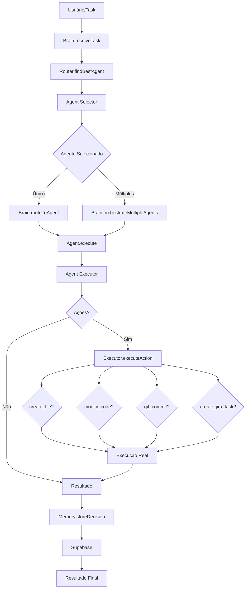

# Arquitetura Atual do Sistema

## Visão Geral

O sistema atual utiliza uma arquitetura de **execução direta** onde o Brain orquestra agentes que executam ações diretamente via código Node.js.

## Componentes Principais

### 1. Brain (`scripts/swarm/brain.js`)
- **Função**: Orquestrador central do sistema
- **Responsabilidades**:
  - Recebe tasks do usuário
  - Roteia tasks para agentes apropriados via Router
  - Executa ações via Executor
  - Armazena decisões na Memory
  - Orquestra múltiplos agentes quando necessário

**Fluxo Principal:**
```
Task → Brain.receiveTask() 
  → Router.findBestAgent() 
  → Brain.routeToAgent() 
  → Agent.execute() 
  → Executor.executeAction() 
  → Memory.storeDecision()
```

### 2. Router (`scripts/swarm/router.js`)
- **Função**: Roteador de agentes
- **Responsabilidades**:
  - Encontra melhor agente para uma task usando `agent_selector.js`
  - Cache de decisões recentes (5 minutos)
  - Valida permissões de chamadas agent-to-agent
  - Roteia e executa agentes (usado por callAgent)

**Dependências:**
- `scripts/cerebro/agent_selector.js` - Sistema de seleção de agentes baseado em embeddings e LLM

### 3. Executor (`scripts/swarm/executor.js`)
- **Função**: Executor real de ações
- **Ações Suportadas**:
  - `create_file` - Criar arquivos
  - `modify_code` - Modificar código (substituição de texto)
  - `create_jira_task` - Criar tasks no Jira
  - `create_confluence_page` - Criar páginas no Confluence
  - `git_commit` - Commits no Git
  - `git_branch` - Criar branches
  - `git_pr` - Criar Pull Requests (não implementado)
  - `run_test` - Executar testes
  - `call_api` - Chamar APIs externas

**Modo Dry-Run**: Suporta modo dry-run para testar sem executar

### 4. Memory (`scripts/swarm/memory.js`)
- **Função**: Memória compartilhada entre agentes
- **Responsabilidades**:
  - Armazena decisões dos agentes (`agent_logs`)
  - Busca decisões similares usando embeddings
  - Busca histórico de agentes específicos
  - Busca conhecimento corporativo (`corporate_memory`)
  - Cache em memória (10 minutos)

**Integração:**
- Supabase com pgvector para busca vetorial
- Funções RPC: `match_agent_logs`, `match_corporate_memory`

### 5. Agent Selector (`scripts/cerebro/agent_selector.js`)
- **Função**: Seleção inteligente de agentes
- **Algoritmo**:
  1. Busca contexto similar na memória corporativa (embeddings)
  2. Busca tarefas similares já executadas
  3. Busca decisões passadas similares
  4. Calcula score para cada agente baseado em:
     - Keywords (30%)
     - Similaridade semântica (40%)
     - Histórico de decisões (20%)
     - Performance histórica (10%)
  5. Validação LLM para ajuste fino
  6. Planeja orquestração se necessário

**Agentes Disponíveis:**
- marketing, copywriting, sales, development, architect, product, finance, validation

### 6. Agent Executor (`scripts/cerebro/agent_executor.js`)
- **Função**: Executa agentes especializados
- **Características**:
  - Integra frameworks ReAct e ToT
  - Suporta múltiplos LLMs (Grok, Gemini)
  - Agentes especializados por setor (Technical, Business, Operations)
  - Execução direta de ações

## Fluxo Atual Completo



## Integrações Externas

### Supabase
- **Tabelas**:
  - `corporate_memory` - Memória corporativa com embeddings
  - `agent_logs` - Logs de decisões dos agentes
  - `task_context` - Contexto de tasks
- **Funções RPC**:
  - `match_corporate_memory` - Busca similaridade na memória
  - `match_agent_logs` - Busca decisões similares
  - `match_task_context` - Busca tasks similares

### Jira/Confluence
- **Status**: Integração via REST API (não MCP ainda)
- **Ações**: Criar tasks e páginas
- **Nota**: Será descontinuado na Fase 2.2.8, substituído por Protocolo L.L.B.

### Git
- **Status**: Execução direta via `child_process.execSync`
- **Ações**: Commit, branch, PR (não implementado)
- **Nota**: GitKraken MCP será substituído por ByteRover na Fase 2.2.8

## Limitações da Arquitetura Atual

1. **Execução Direta**: Agentes executam código diretamente, sem incorporação via prompts
2. **Sem Chat Interface**: Não há interface de chat para incorporar prompts no IDE
3. **Sem Prompt Generators**: Não há geração de prompts estruturados para incorporação
4. **Executor Não Híbrido**: Executor não decide automaticamente entre execução direta vs incorporação
5. **Sem Protocolo L.L.B.**: Ainda depende de Jira/Confluence/GitKraken
6. **Agentes Incompletos**: Nem todos os 30+ agentes estão implementados

## Próximos Passos (Arquitetura Chat/IDE)

A arquitetura será migrada para **Chat/IDE baseada em prompts**:

1. **Brain Prompt Generator**: Gera prompts estruturados do Brain
2. **Agent Prompt Generator**: Gera prompts estruturados de agentes
3. **Chat Interface**: Incorpora prompts no chat/IDE (Cursor)
4. **Executor Híbrido**: Decide automaticamente entre execução direta vs incorporação
5. **Protocolo L.L.B.**: Substitui Jira/Confluence/GitKraken por LangMem/Letta/ByteRover

---

**Última Atualização**: 2025-01-XX
**Status**: Arquitetura atual mapeada, migração para Chat/IDE em progresso


