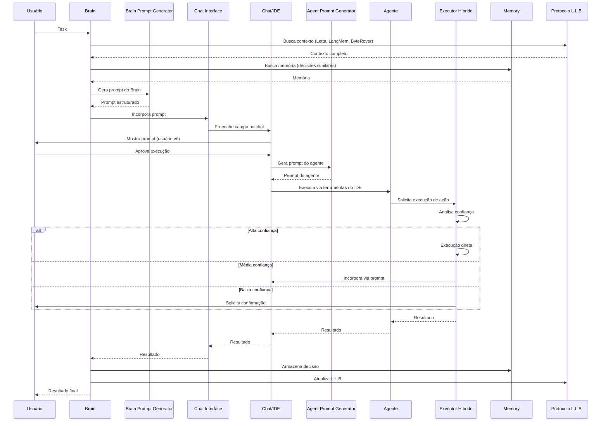

# Arquitetura Chat/IDE

## Visão Geral

A arquitetura Chat/IDE transforma o sistema de execução direta de código Node.js para uma arquitetura baseada em **incorporação via prompts** no chat/IDE (Cursor). Brain e Agentes são incorporados como prompts estruturados, permitindo que o chat/IDE execute usando suas ferramentas nativas com contexto completo.

## Diferença: Módulo Node.js vs Prompt/Contexto

### Módulo Node.js (Arquitetura Antiga)

**Características:**
- Código executado diretamente via Node.js
- Sem contexto visual do IDE
- Difícil depurar e ajustar
- Mudanças requerem recompilação
- Sem acesso a ferramentas nativas do IDE

**Limitações:**
- Não vê o código ao redor
- Não pode usar ferramentas do IDE (write_file, search_replace, etc.)
- Erros só aparecem após execução
- Difícil ajustar em tempo real

### Prompt/Contexto (Arquitetura Chat/IDE)

**Características:**
- Prompt incorporado no chat do IDE
- Contexto completo do IDE (código, arquivos, estrutura)
- Fácil depurar e ajustar em tempo real
- Mudanças instantâneas (apenas editar prompt)
- Acesso a todas ferramentas nativas do IDE

**Vantagens:**
- Vê todo o código e contexto
- Usa ferramentas nativas do IDE
- Validação em tempo real
- Feedback imediato do usuário
- Transparência total (vê exatamente o que será feito)

## Fluxo Brain Session → Arms Session

### Brain Session (Pensar)

1. **Brain recebe task** do usuário ou da fila
2. **Brain busca contexto** via Protocolo L.L.B.:
   - **Letta**: Estado atual de evolução
   - **LangMem**: Sabedoria arquitetural e regras
   - **ByteRover**: Contexto do código atual
3. **Brain busca memória** (decisões similares, conhecimento)
4. **Brain usa Router** para encontrar melhor agente
5. **Brain gera prompt** estruturado via Brain Prompt Generator
6. **Brain incorpora prompt** no chat via Chat Interface

### Arms Session (Agir)

1. **Chat recebe prompt** do Brain
2. **Chat incorpora agente** via Agent Prompt Generator
3. **Agente executa** usando ferramentas do IDE:
   - `write_file`: Criar/modificar arquivos
   - `search_replace`: Modificar código
   - `read_file`: Ler arquivos
   - `codebase_search`: Busca semântica
4. **Executor Híbrido** decide:
   - **Alta confiança**: Execução direta (ações simples)
   - **Média confiança**: Incorporação via prompt (código complexo)
   - **Baixa confiança**: Solicitar confirmação
5. **Resultado retorna** para Brain
6. **Brain armazena** decisão na Memory
7. **Protocolo L.L.B.** atualiza:
   - **Letta**: Novo estado de evolução
   - **LangMem**: Nova sabedoria (se houver)
   - **ByteRover**: Mapeia mudanças no código

## Diagrama de Fluxo de Incorporação



## Formato de Prompts Estruturados

### Prompt do Brain

```
Você é o Brain da Corporação Senciente 7.0.

CONTEXTO:
- Estado Atual: [do Letta]
- Sabedoria: [do LangMem]
- Memória: [decisões similares]

TASK: [descrição da task]

ANÁLISE:
[análise da task pelo Brain]

DELEGAÇÃO:
O melhor agente para esta task é: [agente]
Razão: [reasoning]

PRÓXIMO PASSO:
Incorpore o agente [nome] com a seguinte task: [task específica]
```

### Prompt do Agente

```
Você é o agente [nome] da Corporação Senciente 7.0.

ESPECIALIZAÇÃO:
[descrição da especialização]

FERRAMENTAS DISPONÍVEIS:
- write_file: Criar/modificar arquivos
- search_replace: Modificar código
- [outras ferramentas]

AGENTES QUE PODE CHAMAR:
- [lista de agentes]

TASK ESPECÍFICA:
[task delegada pelo Brain]

CONTEXTO DO BRAIN:
[contexto completo]

INSTRUÇÕES:
1. Analise a task
2. Use as ferramentas disponíveis
3. Se precisar de outro agente, gere prompt
4. Retorne resultado estruturado
```

## Vantagens da Arquitetura Chat/IDE

### 1. Contexto Completo
- IDE tem acesso a todo o código
- Vê estrutura completa do projeto
- Entende relacionamentos entre arquivos

### 2. Ferramentas Nativas
- Usa ferramentas nativas do IDE
- Validação automática de sintaxe
- Autocomplete e IntelliSense

### 3. Feedback Imediato
- Usuário vê prompt antes de executar
- Pode ajustar em tempo real
- Transparência total

### 4. Menos Erros
- IDE valida antes de executar
- Detecta problemas de sintaxe
- Sugere correções

### 5. Flexibilidade
- Fácil ajustar prompts
- Mudanças instantâneas
- Sem recompilação

### 6. Transparência
- Prompts mostram exatamente o que será feito
- Usuário entende cada passo
- Pode intervir quando necessário

## Executor Híbrido Inteligente

O Executor Híbrido decide automaticamente entre execução direta e incorporação via prompt:

### Execução Direta (Alta Confiança >0.8)
- Ações simples e seguras
- Protocolo L.L.B. (Letta, LangMem, ByteRover)
- Commits inteligentes
- Atualizações de estado

### Incorporação via Prompt (Média Confiança 0.5-0.8)
- Código complexo
- Refatorações
- Decisões arquiteturais
- Criação de novos módulos

### Solicitar Confirmação (Baixa Confiança <0.5)
- Ações destrutivas
- Mudanças críticas
- Operações irreversíveis

## Integração com Protocolo L.L.B.

### LangMem (O Arquivo de Sabedoria)
- Memória de longo prazo
- Substitui Confluence
- Arquitetura e regras imutáveis
- Grafos de dependência

### Letta (A Consciência)
- Gerenciador de estado e fluxo
- Substitui Jira
- Mantém rastro de evolução
- Próximo passo evolutivo

### ByteRover (A Ação)
- Interface nervosa com código
- Substitui GitKraken
- Injeta contexto em tempo real
- Mapeia impacto visual

## Daemon Simplificado

**Ciclo Brain → Arms → Brain → Arms:**

1. **Brain Session** (60s):
   - Analisa tasks pendentes
   - Busca contexto L.L.B.
   - Gera prompts
   - Incorpora no chat

2. **Arms Session** (execução):
   - Agentes executam via prompts
   - Executor decide modo de execução
   - Resultados retornam

3. **Brain Session** (análise):
   - Analisa resultados
   - Atualiza L.L.B.
   - Planeja próximos passos

4. **Repete** até completar todas tasks

---

**Última Atualização**: 2025-01-XX
**Status**: Arquitetura documentada, implementação em progresso


