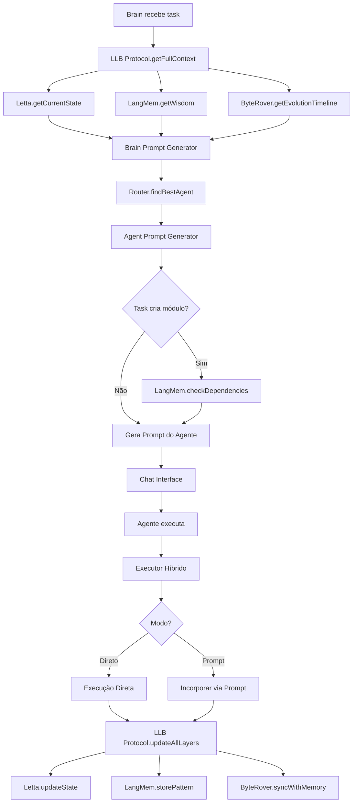

# Integração do Protocolo L.L.B.

## Visão Geral

Este documento descreve como o Protocolo L.L.B. foi integrado com Brain, Agentes e outros componentes do sistema.

## Integrações Realizadas

### 1. Brain Prompt Generator

**Arquivo:** `scripts/swarm/brain_prompt_generator.js`

**Mudanças:**
- Substituído `iniciarSenciencia()` por `llbProtocol.getFullContext()`
- Substituído consultas a Jira por `letta.getCurrentState()` e `letta.getNextEvolutionStep()`
- Substituído consultas a Confluence por `langmem.getWisdom()`
- Adicionado timeline do ByteRover no prompt

**Antes:**
```javascript
const sencienciaContext = await iniciarSenciencia(taskDescription);
const knowledge = await this.memory.getKnowledge(taskDescription);
```

**Depois:**
```javascript
const llbContext = await this.llbProtocol.getFullContext(taskDescription);
const session = await this.llbProtocol.startSession();
// Usa llbContext.wisdom (LangMem), session.state (Letta), llbContext.timeline (ByteRover)
```

### 2. Agent Prompt Generator

**Arquivo:** `scripts/swarm/agent_prompt_generator.js`

**Mudanças:**
- Adicionada verificação de dependências via LangMem antes de criar módulos
- Agentes consultam LangMem antes de criar módulos
- Prompts incluem avisos de dependências quando necessário

**Novo:**
```javascript
// Se task envolve criar módulo, verificar dependências no LangMem
if (this.isModuleCreationTask(task)) {
    const moduleName = this.extractModuleName(task);
    if (moduleName) {
        dependencyCheck = await this.llbProtocol.checkDependencies(moduleName);
    }
}
```

### 3. Memory (Compatibilidade)

**Arquivo:** `scripts/swarm/memory.js`

**Mudanças:**
- Adicionado método `getKnowledgeLLB()` que delega para LangMem
- Mantém compatibilidade com código existente
- Método legado `getKnowledge()` continua funcionando

## Integrações Pendentes

### 1. Context Awareness Protocol

**Arquivo:** `scripts/senciencia/context_awareness_protocol.js`

**Status:** Pendente

**Mudanças Necessárias:**
- Substituir consultas a Jira por Letta (`getCurrentState()`, `getNextEvolutionStep()`)
- Substituir consultas a Confluence por LangMem (`getWisdom()`, `checkDependencies()`)
- Substituir consultas a GitKraken por ByteRover (`getEvolutionTimeline()`, `injectContext()`)

### 2. Executor Híbrido

**Arquivo:** `scripts/swarm/executor.js`

**Status:** Parcialmente integrado

**Mudanças Necessárias:**
- Integrar `update_letta_state` com Letta real
- Integrar `store_langmem_wisdom` com LangMem real
- Integrar `intelligent_git_commit` com ByteRover real

## Fluxo de Integração

### Fluxo Atual (com L.L.B.)



## Substituições Realizadas

### Jira → Letta

| Funcionalidade Jira | Funcionalidade Letta |
|---------------------|---------------------|
| Consultar issues | `getCurrentState()` |
| Próximas tasks | `getNextEvolutionStep()` |
| Registrar bloqueio | `registerBlockage()` |
| Atualizar status | `updateState()` |

### Confluence → LangMem

| Funcionalidade Confluence | Funcionalidade LangMem |
|---------------------------|------------------------|
| Buscar documentação | `getWisdom()` |
| Verificar dependências | `checkDependencies()` |
| Armazenar padrão | `storePattern()` |
| Armazenar arquitetura | `storeArchitecture()` |

### GitKraken → ByteRover

| Funcionalidade GitKraken | Funcionalidade ByteRover |
|--------------------------|---------------------------|
| Visualizar mudanças | `mapVisualImpact()` |
| Timeline de commits | `getEvolutionTimeline()` |
| Contexto de código | `injectContext()` |
| Commit inteligente | `commitWithMemory()` |

## Próximos Passos

1. **Completar integração do Context Awareness Protocol**
2. **Completar integração do Executor Híbrido**
3. **Criar interface de status L.L.B. no frontend**
4. **Testar Protocolo L.L.B. end-to-end**
5. **Migrar dados de Jira/Confluence para L.L.B.**

---

**Última Atualização**: 2025-01-XX
**Status**: Integração parcial, Brain e Agent Prompt Generators atualizados


