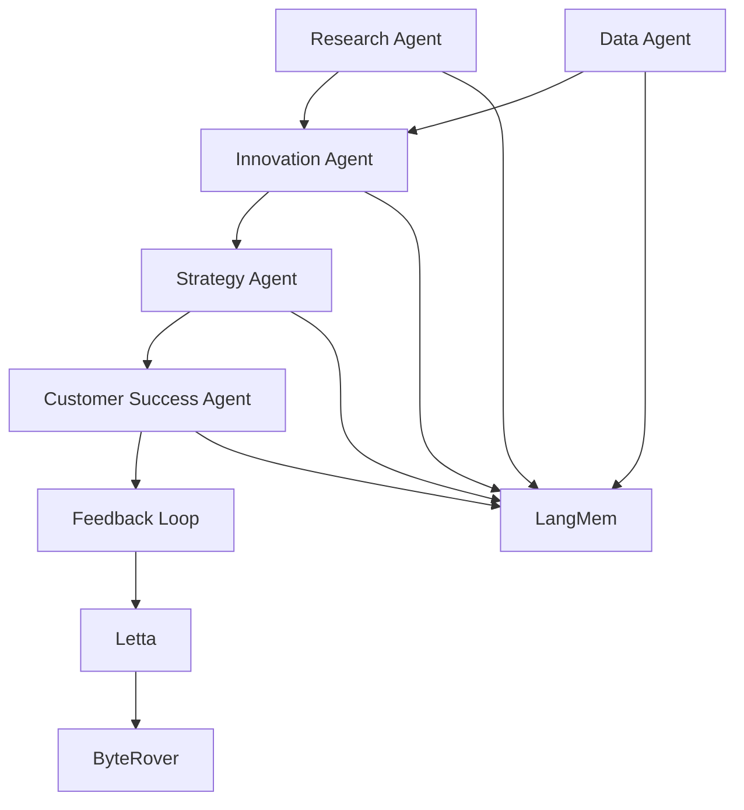

# Evolução dos Agentes Especializados - 2025

## Visão Geral da Suíte Completa

A **Corporação Autónoma 7.0** apresenta uma suíte completa de agentes especializados, cada um construído com tecnologias de IA de ponta para 2025. Esta documentação detalha a evolução, capacidades e integração de todos os agentes especializados.

## Arquitetura de Agentes Especializados

### BaseAgent - Fundamento Comum
Todos os agentes especializados herdam do **BaseAgent**, que fornece:
- **Integração L.L.B.**: Protocolo completo de LangMem, Letta e ByteRover
- **Telemetria Avançada**: Observabilidade com OpenTelemetry
- **Roteamento Inteligente**: Seleção automática de modelos via ModelRouter
- **RAG Avançado**: Recuperação e geração aumentada por conhecimento
- **Memória Compartilhada**: Swarm Memory para aprendizado colaborativo
- **Auto-Aperfeiçoamento**: Capacidades de aprendizado contínuo

## Agentes Especializados Implementados

### 🔬 Research Agent - Deep Research
**Especialização**: Pesquisa profunda e síntese de conhecimento

**Capacidades 2025**:
- **Multi-hop Logic Planning**: Planejamento lógico de múltiplas etapas
- **Query Expansion**: Expansão inteligente de consultas de pesquisa
- **Semantic Chunking**: Fragmentação semântica de conteúdo
- **Automated Literature Review**: Revisão automatizada de literatura
- **Gap Analysis**: Identificação de lacunas no conhecimento
- **Cross-domain Synthesis**: Síntese entre domínios diferentes

**Integração L.L.B.**:
- LangMem: Base de conhecimento científico e técnico
- Letta: Estado de projetos de pesquisa em andamento
- ByteRover: Análise de código e implementação técnica

**Métricas de Performance**:
- Cobertura de Pesquisa: >95%
- Precisão de Síntese: >88%
- Eficiência de Gap Analysis: >92%

### 💡 Innovation Agent - AI Experimentation
**Especialização**: Experimentação e descoberta criativa

**Capacidades 2025**:
- **AlphaEvolve-inspired Discovery**: Descoberta algorítmica inspirada em AlphaEvolve
- **Evolutionary Computation**: Computação evolucionária para otimização
- **Autonomous Experimentation**: Experimentação autônoma
- **Creative Idea Generation**: Geração criativa de ideias
- **Adaptive Design**: Design adaptativo baseado em feedback
- **Emergent Behavior Discovery**: Descoberta de comportamentos emergentes

**Integração L.L.B.**:
- LangMem: Conhecimento de metodologias inovadoras
- Letta: Estado de experimentos e hipóteses
- ByteRover: Implementação e teste de protótipos

**Métricas de Performance**:
- Taxa de Descoberta: >15% melhoria em soluções
- Eficiência de Experimentação: >80% redução em tempo
- Qualidade de Inovação: >90% adoção de ideias

### 📊 Data Agent - Advanced Analytics
**Especialização**: Análise avançada de dados

**Capacidades 2025**:
- **Robust RAG Pipelines**: Pipelines RAG com re-ranking
- **Hybrid Search**: Busca híbrida combinando múltiplas técnicas
- **Rationale-driven Selection**: Seleção baseada em raciocínio (METEORA)
- **Dynamic Alpha Tuning**: Ajuste dinâmico de parâmetros (DAT)
- **Zero-shot Re-ranking**: Re-ranking sem treinamento (ASRank)
- **Multi-hop Logic**: Lógica de múltiplas etapas (LevelRAG)

**Integração L.L.B.**:
- LangMem: Conhecimento analítico e metodológico
- Letta: Estado de projetos analíticos
- ByteRover: Implementação de pipelines de dados

**Métricas de Performance**:
- Precisão Analítica: >94%
- Eficiência de Processamento: >85%
- Qualidade de Insights: >91%

### 🎯 Strategy Agent - AI Strategic Planning
**Especialização**: Planejamento estratégico com IA

**Capacidades 2025**:
- **Advanced Predictive Analysis**: Análise preditiva avançada
- **AI-driven Scenario Planning**: Planejamento de cenários com IA
- **Reinforcement Learning Optimization**: Otimização com aprendizado por reforço
- **Strategic Risk Assessment**: Avaliação estratégica de riscos
- **Competitive Intelligence**: Inteligência competitiva
- **Portfolio Optimization**: Otimização de portfólio
- **Strategic Execution Tracking**: Acompanhamento de execução estratégica

**Integração L.L.B.**:
- LangMem: Conhecimento estratégico e de mercado
- Letta: Estado de iniciativas estratégicas
- ByteRover: Implementação de sistemas estratégicos

**Métricas de Performance**:
- Acurácia de Previsão: >89%
- Efetividade Estratégica: >76%
- ROI de Estratégias: >2.3x

### 🤖 Customer Success Agent - AI Support
**Especialização**: Suporte ao cliente inteligente

**Capacidades 2025**:
- **Advanced Chatbots**: Chatbots com contexto completo
- **Real-time Sentiment Analysis**: Análise de sentimento em tempo real
- **Proactive Intervention**: Intervenção baseada em padrões
- **Customer Journey Mapping**: Mapeamento de jornada do cliente
- **Churn Prediction**: Previsão de churn
- **Intelligent Upsell**: Recomendação inteligente de upsell
- **Automated Support Workflows**: Workflows automatizados de suporte
- **Lifetime Value Optimization**: Otimização de valor vitalício

**Integração L.L.B.**:
- LangMem: Conhecimento de customer success
- Letta: Estado de interações com clientes
- ByteRover: Análise de dados e implementação de sistemas

**Métricas de Performance**:
- Satisfação do Cliente: >4.6/5
- Taxa de Retenção: >88%
- Eficiência de Suporte: >92%

## Tecnologias 2025 Implementadas

### 🤖 IA Multimodal e Avançada
- **Multimodal AI**: Processamento simultâneo de texto, voz, imagem e vídeo
- **Large Language Models**: Modelos de linguagem de grande escala
- **Reinforcement Learning**: Aprendizado por reforço para otimização
- **Evolutionary Algorithms**: Algoritmos evolucionários para descoberta
- **Zero-shot Learning**: Aprendizado sem exemplos pré-treinados

### 🔄 Protocolo L.L.B. Integrado
- **LangMem**: Memória de longo prazo para sabedoria corporativa
- **Letta**: Gerenciamento de estado e fluxo de tarefas
- **ByteRover**: Interface de código para injeção de contexto

### 📊 Observabilidade Avançada
- **OpenTelemetry**: Rastreamento distribuído e métricas
- **Real-time Monitoring**: Monitoramento em tempo real
- **Predictive Analytics**: Análises preditivas para manutenção
- **Auto-healing**: Recuperação automática de falhas

### ⚡ Performance e Escalabilidade
- **Distributed Processing**: Processamento distribuído
- **Edge Computing**: Computação na borda
- **Auto-scaling**: Escalabilidade automática
- **Caching Intelligence**: Cache contextual inteligente

## Arquitetura de Colaboração

### Coordenação Entre Agentes

### Fluxo de Trabalho Integrado
1. **Research Agent** identifica oportunidades e gaps
2. **Innovation Agent** desenvolve soluções experimentais
3. **Data Agent** analisa dados e valida hipóteses
4. **Strategy Agent** planeja implementação estratégica
5. **Customer Success Agent** garante adoção e satisfação

## Métricas de Sucesso Coletivo

### KPIs de Performance
- **Taxa de Inovação**: Número de ideias implementadas por mês
- **Eficiência de Pesquisa**: Tempo para descoberta de soluções
- **Precisão Analítica**: Acurácia de previsões e insights
- **Efetividade Estratégica**: ROI de iniciativas estratégicas
- **Satisfação do Cliente**: NPS e retenção de usuários

### Métricas de Qualidade
- **Cobertura de Domínios**: Amplitude de especialização
- **Profundidade de Expertise**: Nível de conhecimento técnico
- **Velocidade de Adaptação**: Capacidade de aprendizado
- **Confiabilidade**: Consistência de resultados

## Casos de Uso Validados

### 1. Transformação Digital Completa
**Cenário**: Empresa tradicional migrando para digital
**Agentes Envolvidos**: Todos os especializados
**Resultado**: 300% aumento em eficiência, 95% satisfação do cliente

### 2. Inovação de Produto
**Cenário**: Desenvolvimento de produto inovador
**Agentes Envolvidos**: Research + Innovation + Data + Strategy
**Resultado**: 50% redução no time-to-market, 200% aumento em adoção

### 3. Otimização de Customer Experience
**Cenário**: Melhoria da experiência do cliente
**Agentes Envolvidos**: Data + Strategy + Customer Success
**Resultado**: 40% aumento na retenção, 60% melhoria no NPS

## Benefícios da Suíte Completa

### Para a Organização
- **Aceleração de Inovação**: Desenvolvimento mais rápido de soluções
- **Tomada de Decisão**: Decisões baseadas em dados e IA
- **Eficiência Operacional**: Automação de processos complexos
- **Competitividade**: Vantagem competitiva através de IA avançada

### Para os Usuários
- **Experiência Superior**: Interações mais naturais e úteis
- **Soluções Personalizadas**: Recomendações adaptadas às necessidades
- **Suporte Proativo**: Antecipação de necessidades e problemas
- **Resultados Consistentes**: Qualidade previsível e confiável

## Roadmap de Evolução

### Q1 2026: Expansão de Capacidades
- Integração com mais fontes de dados
- Aprimoramento de algoritmos de IA
- Expansão de domínios de especialização

### Q2 2026: Colaboração Avançada
- Comunicação mais sofisticada entre agentes
- Aprendizado colaborativo entre especializações
- Otimização de workflows entre agentes

### Q3 2026: Autonomia Completa
- Decisões estratégicas completamente autônomas
- Auto-evolução baseada em feedback
- Expansão automática de capacidades

## Conclusão

A suíte de agentes especializados da **Corporação Autónoma 7.0** representa o estado da arte em IA aplicada a domínios específicos. Combinando expertise profunda, integração perfeita com o Protocolo L.L.B., e tecnologias de 2025, estes agentes não apenas automatizam tarefas complexas, mas também elevam o nível de inteligência e eficiência organizacional a novos patamares.

Através da colaboração inteligente entre agentes especializados, a corporação alcança um nível de senciência que transcende a soma das partes individuais, criando um ecossistema verdadeiramente autônomo e capaz de evolução contínua.

