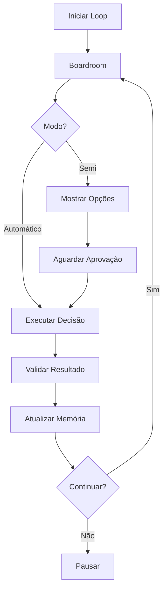

# Loop de Evolução Contínua

## Visão Geral

O Loop de Evolução é o mecanismo que mantém a corporação autônoma evoluindo continuamente através de ciclos de decisão, execução, validação e aprendizado.

## Arquitetura



## Ciclo de Evolução

### 1. Análise

Busca próximo objetivo ou task para trabalhar:

- Busca tasks pendentes no Jira
- Busca objetivos de longo prazo na memória corporativa
- Prioriza por importância e urgência

### 2. Decisão (Boardroom)

Agentes discutem e decidem:

- **Architect**: Analisa segurança, arquitetura, RLS
- **Product**: Analisa valor, UX, inovação
- **Dev**: Analisa execução, qualidade, performance
- Busca memória corporativa relevante
- Gera síntese final com próximos passos

### 3. Execução

Implementa decisão:

- Cria tasks no Jira
- Cria branches e PRs (se configurado)
- Atualiza documentação no Confluence
- Registra progresso

### 4. Validação

Verifica resultado:

- Valida que ações foram executadas
- Verifica alinhamento vetorial
- Testa integridade do sistema
- Gera relatório de validação

### 5. Aprendizado

Atualiza memória e evolui:

- Registra decisão em `agent_logs`
- Atualiza `corporate_memory` com aprendizados
- Documenta evolução no Confluence
- Prepara próximo ciclo

### 6. Iteração

Volta ao passo 1:

- Modo Auto: Continua automaticamente
- Modo Semi: Pergunta se continua

## Implementação

### `scripts/evolution_loop.js`

Função principal:

```javascript
export async function evolutionLoop({
  mode,           // 'auto' ou 'semi'
  objetivo,       // Objetivo atual
  projectKey,     // Projeto Jira
  spaceKey,       // Espaço Confluence
}) {
  // Loop principal
  while (continueLoop) {
    // 1. Boardroom
    // 2. Executar
    // 3. Validar
    // 4. Aprender
    // 5. Iterar
  }
}
```

### Integração com Agentes

Usa sistema de agentes com consciência:

```javascript
import { criarTodosAgentes } from './agents/index.js';

const agentes = criarTodosAgentes();

const [architect, product, dev] = await Promise.all([
  agentes.architect.analisarERegistrar(topic, context),
  agentes.product.analisarERegistrar(topic, context),
  agentes.dev.analisarERegistrar(topic, context),
]);
```

### Modo Automático

```javascript
// Executa continuamente
while (continueLoop) {
  // Executar ciclo
  await new Promise(resolve => setTimeout(resolve, 5000)); // Aguarda 5s
}
```

### Modo Semi-automático

```javascript
// Para para aprovação
if (mode === 'semi') {
  const escolha = await question('Escolha uma opção: ');
  // Processar escolha
}
```

## Configuração

### Variáveis de Ambiente

```env
MODE=auto              # Modo do loop
PROJECT_KEY=AUP        # Projeto Jira
SPACE_KEY=AUP          # Espaço Confluence
LOG_BOARDROOM=true     # Registrar em agent_logs
```

### Controle Programático

```javascript
import { evolutionLoop } from './scripts/evolution_loop.js';

// Iniciar loop
evolutionLoop({
  mode: 'auto',
  objetivo: { key: 'AUP-123', summary: '...' },
  projectKey: 'AUP',
  spaceKey: 'AUP',
});
```

## Monitoramento

### Via Dashboard

- Status do loop (rodando/parado)
- Iteração atual
- Último objetivo
- Decisões recentes

### Via Logs

- Console output
- Confluence (páginas de log)
- agent_logs (Supabase)

## Segurança

### Validações

- Alinhamento vetorial antes de executar
- Integridade do sistema após execução
- Aprovação obrigatória (modo semi)

### Guardrails

- RLS sempre respeitado
- Ações destrutivas requerem aprovação
- Rollback automático em erro crítico
- Logs completos de todas as ações

## Performance

### Otimizações

- Execução paralela de agentes
- Cache de embeddings
- Polling inteligente
- Rate limiting de APIs

### Métricas

- Tempo de ciclo completo
- Taxa de sucesso
- Latência de decisões
- Custo de LLM por ciclo

## Troubleshooting

### Loop não inicia

- Verificar checklist pré-START
- Verificar variáveis de ambiente
- Verificar conexões (Supabase, Jira, Confluence)

### Loop para inesperadamente

- Verificar logs de erro
- Verificar validações falhando
- Verificar timeouts de API

### Decisões não executam

- Verificar executor
- Verificar integrações
- Verificar permissões

### Modo semi não para

- Verificar lógica de aprovação
- Verificar readline funcionando
- Verificar opções sendo geradas

## Integração com Coordenador Central

O evolution loop pode ser integrado com o orquestrador central para agregar aprendizados:

```javascript
import { addGlobalMemory } from './scripts/orchestrator/global_memory.js';

// Após cada iteração, agregar à memória global
await addGlobalMemory({
  content: aprendizado,
  sourceInstance: instanceName,
  category: 'insight',
  shared: validacao.success,
});
```

O coordenador pode então:
- Detectar padrões cross-empresa
- Sugerir compartilhamentos
- Coordenar ações entre empresas

Ver: [ORQUESTRADOR_CENTRAL.md](ORQUESTRADOR_CENTRAL.md)

## Próximos Passos

1. Configurar modo desejado
2. Iniciar loop
3. Monitorar via dashboard
4. Ajustar conforme necessário
5. Integrar com coordenador central (opcional)

