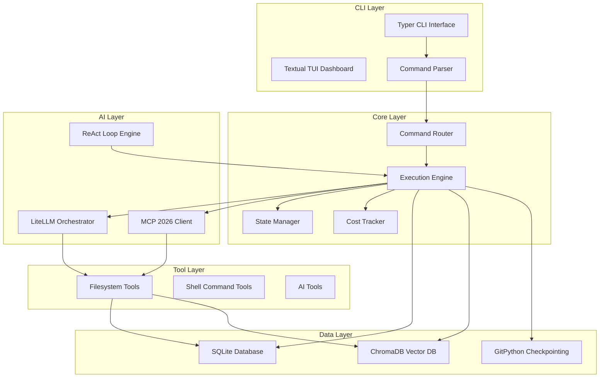

# 🏗️ AZ-OS SYSTEM ARCHITECTURE

**Project:** AZ-OS (Agent Zero Operating System)
**Version:** 1.0.0
**Date:** 2026-02-15
**Status:** Architecture Design

---

## 🎯 SYSTEM OVERVIEW

**Vision:** Agent Zero Operating System is a CLI-first AI operating system that serves as the frontal cortex for autonomous agents, ensuring 100% autonomy, maximum performance, and complete technical sovereignty.

**Key Innovation:** First CLI combining Level 10 autonomy + 60 FPS TUI + 90% cost optimization + native Agent Zero integration.

---

## 🏗️ COMPONENT DIAGRAM (ASCII/Mermaid)



---

## 📋 MODULE BREAKDOWN

### 1. CLI Layer (`az_os.cli`)
- **Typer CLI Interface**: Command routing, auto-completion, help system
- **Textual TUI Dashboard**: 60 FPS rendering, CSS-like styling, real-time metrics
- **Command Parser**: Argument parsing, validation, type conversion

### 2. Core Layer (`az_os.core`)
- **Command Router**: Maps CLI commands to execution functions
- **Execution Engine**: Async task execution, progress tracking, error handling
- **State Manager**: Task state management, checkpointing, recovery
- **Cost Tracker**: Real-time cost monitoring, budget enforcement

### 3. AI Layer (`az_os.ai`)
- **LiteLLM Orchestrator**: Multi-model routing, cost tracking, fallback
- **MCP 2026 Client**: Tool calling, bidirectional sampling, filesystem integration
- **ReAct Loop Engine**: Reasoning-Action-Observation-Self-correction cycle

### 4. Data Layer (`az_os.data`)
- **SQLite Database**: Structured data persistence (tasks, logs, state)
- **ChromaDB Vector DB**: Semantic search, RAG, document embeddings
- **GitPython Checkpointing**: Auto-commit checkpoints, task resumption

### 5. Tool Layer (`az_os.tools`)
- **Filesystem Tools**: File operations, directory management, search
- **Shell Command Tools**: Command execution, process management
- **AI Tools**: Model-specific tools, custom tool definitions

---

## 🔄 DATA FLOW

### Command Execution Flow
```
User Input → CLI Parser → Command Router → Execution Engine →
LiteLLM/MCP → Tool Execution → Result Processing → State Update → Response
```

### Data Persistence Flow
```
Task Execution → SQLite (Structured) → ChromaDB (Semantic) → Git Checkpoints
```

### Real-time Monitoring Flow
```
Execution Events → Cost Tracker → Metrics Collector → TUI Dashboard
```

---

## 🔄 STATE MANAGEMENT

### State Machine
```
INITIALIZED → PENDING → RUNNING → COMPLETED
                    ↓
                    FAILED → RETRYING → RUNNING
                    ↓
                    CANCELLED → FINALIZED
```

### State Persistence
- **SQLite**: Task state, execution logs, cost metrics
- **ChromaDB**: Document embeddings, semantic context
- **Git**: Checkpoint snapshots, version history

### Checkpoint Strategy
- Auto-commit every 10 minutes or milestone
- State snapshots include task progress and context
- Resume capability with `az task resume {id}`

---

## 📁 CLI → CORE → TOOLS → STORAGE LAYERS

### CLI Layer Responsibilities
- Command routing and validation
- User input parsing and auto-completion
- TUI rendering and user feedback

### Core Layer Responsibilities
- Task orchestration and execution
- State management and checkpointing
- Cost tracking and budget enforcement
- Error handling and recovery

### Tools Layer Responsibilities
- Filesystem operations and management
- Shell command execution
- AI tool integration and discovery
- MCP protocol compliance

### Storage Layer Responsibilities
- Structured data persistence (SQLite)
- Semantic data storage (ChromaDB)
- Version control and checkpointing (Git)
- Data integrity and recovery

---

## ⚡ PERFORMANCE TARGETS

### Latency Requirements
- **CLI Response**: <100ms
- **TUI Load**: <500ms
- **Task Execution**: <2s (simple tasks)
- **Semantic Search**: <500ms

### Throughput Requirements
- **Concurrent Tasks**: 100+ active tasks
- **FPS**: 60 FPS sustained
- **Cost per Task**: $0.002 (target)

### Scalability Requirements
- **Horizontal Scaling**: N/A (CLI-first)
- **Vertical Scaling**: Multi-core support
- **Memory Usage**: <500MB baseline

---

## 🔒 SECURITY PATTERNS

### Isolation Patterns
- **Agent Zero Isolation**: Complete separation from external systems
- **Sandboxed Execution**: Tool execution in isolated environments
- **Input Validation**: All external input validated and sanitized

### Authentication & Authorization
- **CLI Access Control**: Role-based access for commands
- **Tool Permissions**: Fine-grained tool access control
- **Audit Logging**: Complete execution audit trail

### Data Protection
- **Encryption at Rest**: SQLite and ChromaDB encryption
- **Secure Communication**: MCP protocol security
- **Data Retention**: Configurable retention policies

---

## 🚀 DEPLOYMENT FLOW

### Development Setup
```bash
# Install dependencies
pip install -e .

# Initialize database
az db init

# Configure LiteLLM
az config set llm.provider=claude
```

### Production Deployment
```bash
# Build package
python -m build

# Install production
pip install az_os-1.0.0.tar.gz

# Initialize production database
az db init --production

# Configure production settings
az config set --production
```

### Runtime Operations
```bash
# Start dashboard
az dashboard

# Execute task
az task run "create function isPrime"

# Monitor costs
az cost show

# Resume task
az task resume {id}
```

---

## 📊 MONITORING & METRICS

### Key Performance Indicators
- **Latency**: Command execution time
- **Throughput**: Tasks per second
- **Cost**: Cost per task and total
- **Uptime**: System availability
- **Error Rate**: Task failure percentage

### Real-time Metrics
- **Cost Tracking**: Real-time cost updates
- **Performance**: FPS, latency, throughput
- **Health**: System health indicators
- **Usage**: Command usage patterns

---

## 🔄 DEPENDENCY MAP

```
CLI Layer ← Core Layer ← AI Layer ← Data Layer ← Storage Layer
     ↓           ↓           ↓           ↓           ↓
  Typer       Router      LiteLLM      SQLite      GitPython
  Textual     Executor    MCP          ChromaDB    Pydantic
  Commands    StateMgr    ReAct        Git         Dynaconf
```

---

## 📋 ACCEPTANCE CRITERIA

### Functional Requirements
- [ ] CLI commands execute in <100ms
- [ ] TUI dashboard loads in <500ms
- [ ] 60 FPS sustained with 100+ tasks
- [ ] Cost tracking accurate within 5%
- [ ] Task resumption works in 95% of cases

### Non-Functional Requirements
- [ ] Memory usage <500MB baseline
- [ ] SQLite database initialized correctly
- [ ] ChromaDB semantic search <500ms
- [ ] Git checkpointing works automatically
- [ ] Security patterns implemented

### Performance Requirements
- [ ] Cost per task: $0.002 target
- [ ] Concurrent tasks: 100+ active
- [ ] Error rate: <1% for simple tasks
- [ ] Recovery time: <5s for failed tasks

---

## 🔄 VERSION HISTORY

**1.0.0 (2026-02-15)**: Initial architecture design
- Complete system diagram
- Module breakdown and data flow
- State management and persistence
- Performance targets and security patterns
- Deployment flow and monitoring

---