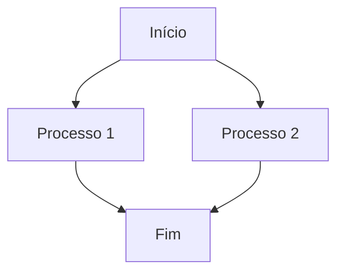
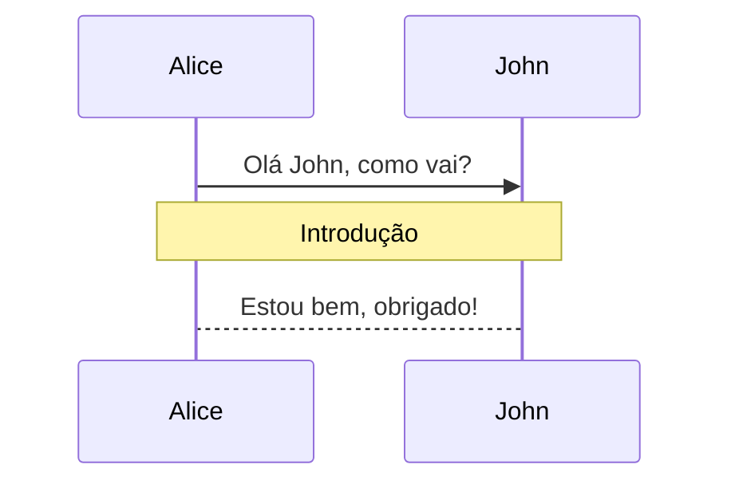

# Estilos Markdown Diana Corporação Senciente

## Introdução

Este guia documenta todos os estilos Markdown suportados pela Diana Corporação Senciente, incluindo exemplos visuais e código para implementação. Use estes estilos para manter consistência visual em toda a documentação.

## Cabeçalhos

### H1 - Título Principal
```markdown
# Diana Corporação Senciente
```

**Visual:**
# Diana Corporação Senciente

**Código:**
```markdown
# Diana Corporação Senciente
```

### H2 - Seções Principais
```markdown
## Relatório Anual 2026
```

**Visual:**
## Relatório Anual 2026

**Código:**
```markdown
## Relatório Anual 2026
```

### H3 - Subseções
```markdown
### Metodologia
```

**Visual:**
### Metodologia

**Código:**
```markdown
### Metodologia
```

### H4 - Tópicos Específicos
```markdown
#### Coleta de Dados
```

**Visual:**
#### Coleta de Dados

**Código:**
```markdown
#### Coleta de Dados
```

## Texto

### Negrito
```markdown
**Texto em negrito**
```

**Visual:** **Texto em negrito**

**Código:**
```markdown
**Texto em negrito**
```

### Itálico
```markdown
*Texto em itálico*
```

**Visual:** *Texto em itálico*

**Código:**
```markdown
*Texto em itálico*
```

### Negrito e Itálico
```markdown
***Texto em negrito e itálico***
```

**Visual:** ***Texto em negrito e itálico***

**Código:**
```markdown
***Texto em negrito e itálico***
```

### Tachado
```markdown
~~Texto tachado~~
```

**Visual:** ~~Texto tachado~~

**Código:**
```markdown
~~Texto tachado~~
```

## Listas

### Lista Não Ordenada
```markdown
- Item 1
- Item 2
  - Subitem 2.1
  - Subitem 2.2
- Item 3
```

**Visual:**
- Item 1
- Item 2
  - Subitem 2.1
  - Subitem 2.2
- Item 3

**Código:**
```markdown
- Item 1
- Item 2
  - Subitem 2.1
  - Subitem 2.2
- Item 3
```

### Lista Ordenada
```markdown
1. Primeiro item
2. Segundo item
   1. Subitem 2.1
   2. Subitem 2.2
3. Terceiro item
```

**Visual:**
1. Primeiro item
2. Segundo item
   1. Subitem 2.1
   2. Subitem 2.2
3. Terceiro item

**Código:**
```markdown
1. Primeiro item
2. Segundo item
   1. Subitem 2.1
   2. Subitem 2.2
3. Terceiro item
```

### Lista de Tarefas
```markdown
- [x] Tarefa concluída
- [ ] Tarefa pendente
- [ ] Outra tarefa
```

**Visual:**
- [x] Tarefa concluída
- [ ] Tarefa pendente
- [ ] Outra tarefa

**Código:**
```markdown
- [x] Tarefa concluída
- [ ] Tarefa pendente
- [ ] Outra tarefa
```

## Código

### Código Inline
```markdown
Use a função `exemplo()` para processamento.
```

**Visual:** Use a função `exemplo()` para processamento.

**Código:**
```markdown
Use a função `exemplo()` para processamento.
```

### Bloco de Código
```python
def exemplo():
    """Função de exemplo."""
    return "Olá, Diana!"
```

**Visual:**
```python
def exemplo():
    """Função de exemplo."""
    return "Olá, Diana!"
```

**Código:**
```markdown
```python
def exemplo():
    """Função de exemplo."""
    return "Olá, Diana!"
```
```

### Bloco de Código com Linhas
```python
# Línea 1
# Línea 2
# Línea 3
```

**Visual:**
```python
# Línea 1
# Línea 2
# Línea 3
```

**Código:**
```markdown
```python
# Línea 1
# Línea 2
# Línea 3
```
```

## Tabelas

### Tabela Básica
```markdown
| Coluna 1 | Coluna 2 | Coluna 3 |
|----------|----------|----------|
| Dado 1   | Dado 2   | Dado 3   |
| Dado 4   | Dado 5   | Dado 6   |
```

**Visual:**
| Coluna 1 | Coluna 2 | Coluna 3 |
|----------|----------|----------|
| Dado 1   | Dado 2   | Dado 3   |
| Dado 4   | Dado 5   | Dado 6   |

**Código:**
```markdown
| Coluna 1 | Coluna 2 | Coluna 3 |
|----------|----------|----------|
| Dado 1   | Dado 2   | Dado 3   |
| Dado 4   | Dado 5   | Dado 6   |
```

### Tabela com Alinhamento
```markdown
| Esquerda | Centro | Direita |
|:---------|:------:|--------:|
| Texto    | Texto  |  1234   |
| Texto    | Texto  |   567   |
```

**Visual:**
| Esquerda | Centro | Direita |
|:---------|:------:|--------:|
| Texto    | Texto  |  1234   |
| Texto    | Texto  |   567   |

**Código:**
```markdown
| Esquerda | Centro | Direita |
|:---------|:------:|--------:|
| Texto    | Texto  |  1234   |
| Texto    | Texto  |   567   |
```

### Tabela com Formatação Condicional
```markdown
| Status | Descrição |
|--------|-----------|
| ✅ Concluído | Tarefa finalizada |
| ⏳ Em Andamento | Tarefa em progresso |
| ❌ Não Iniciado | Tarefa pendente |
```

**Visual:**
| Status | Descrição |
|--------|-----------|
| ✅ Concluído | Tarefa finalizada |
| ⏳ Em Andamento | Tarefa em progresso |
| ❌ Não Iniciado | Tarefa pendente |

**Código:**
```markdown
| Status | Descrição |
|--------|-----------|
| ✅ Concluído | Tarefa finalizada |
| ⏳ Em Andamento | Tarefa em progresso |
| ❌ Não Iniciado | Tarefa pendente |
```

## Citações

### Citação Simples
```markdown
> Esta é uma citação importante.
```

**Visual:**
> Esta é uma citação importante.

**Código:**
```markdown
> Esta é uma citação importante.
```

### Citação com Múltiplos Parágrafos
```markdown
> Primeiro parágrafo da citação.
> 
> Segundo parágrafo da citação.
```

**Visual:**
> Primeiro parágrafo da citação.
> 
> Segundo parágrafo da citação.

**Código:**
```markdown
> Primeiro parágrafo da citação.
> 
> Segundo parágrafo da citação.
```

### Citação Aninhada
```markdown
> Citação principal
> 
> > Citação aninhada
> 
> Continuação da citação principal
```

**Visual:**
> Citação principal
> 
> > Citação aninhada
> 
> Continuação da citação principal

**Código:**
```markdown
> Citação principal
> 
> > Citação aninhada
> 
> Continuação da citação principal
```

## Links

### Link Básico
```markdown
[Texto do link](https://exemplo.com)
```

**Visual:** [Texto do link](https://exemplo.com)

**Código:**
```markdown
[Texto do link](https://exemplo.com)
```

### Link com Título
```markdown
[Texto do link](https://exemplo.com "Título do link")
```

**Visual:** [Texto do link](https://exemplo.com "Título do link")

**Código:**
```markdown
[Texto do link](https://exemplo.com "Título do link")
```

### Link Automático
```markdown
<https://exemplo.com>
```

**Visual:** <https://exemplo.com>

**Código:**
```markdown
<https://exemplo.com>
```

## Imagens

### Imagem Básica
```markdown

```

**Visual:** 

**Código:**
```markdown

```

### Imagem com Título
```markdown

```

**Visual:** 

**Código:**
```markdown

```

## Elementos Visuais

### Separadores
```markdown
---

Texto após separador
```

**Visual:**
---

Texto após separador

**Código:**
```markdown
---

Texto após separador
```

### Notas de Rodapé
```markdown
Texto com nota de rodapé[^1]

[^1]: Conteúdo da nota de rodapé
```

**Visual:**
Texto com nota de rodapé[^1]

[^1]: Conteúdo da nota de rodapé

**Código:**
```markdown
Texto com nota de rodapé[^1]

[^1]: Conteúdo da nota de rodapé
```

## Diagramas

### Mermaid - Fluxograma


**Visual:**


**Código:**
```markdown

```

### Mermaid - Sequência


**Visual:**


**Código:**
```markdown

```

## Admonições

### Nota
```markdown
> **📝 Nota:** Esta é uma nota importante.
```

**Visual:**
> **📝 Nota:** Esta é uma nota importante.

**Código:**
```markdown
> **📝 Nota:** Esta é uma nota importante.
```

### Aviso
```markdown
> **⚠️ Aviso:** Atenção para este detalhe.
```

**Visual:**
> **⚠️ Aviso:** Atenção para este detalhe.

**Código:**
```markdown
> **⚠️ Aviso:** Atenção para este detalhe.
```

### Erro
```markdown
> **❌ Erro:** Algo deu errado.
```

**Visual:**
> **❌ Erro:** Algo deu errado.

**Código:**
```markdown
> **❌ Erro:** Algo deu errado.
```

### Sucesso
```markdown
> **✅ Sucesso:** Operação concluída.
```

**Visual:**
> **✅ Sucesso:** Operação concluída.

**Código:**
```markdown
> **✅ Sucesso:** Operação concluída.
```

## Emojis

### Uso Recomendado
```markdown
- 📋 Para listas de tarefas
- ✅ Para confirmações
- ⚠️ Para advertências
- 📝 Para notas
- ❌ Para erros
- 🔄 Para atualizações
```

**Visual:**
- 📋 Para listas de tarefas
- ✅ Para confirmações
- ⚠️ Para advertências
- 📝 Para notas
- ❌ Para erros
- 🔄 Para atualizações

**Código:**
```markdown
- 📋 Para listas de tarefas
- ✅ Para confirmações
- ⚠️ Para advertências
- 📝 Para notas
- ❌ Para erros
- 🔄 Para atualizações
```

## Formatação Condicional

### Texto Condicional
```markdown
**Índice:**
- [x] Capítulo 1
- [ ] Capítulo 2
- [ ] Capítulo 3
```

**Visual:**
**Índice:**
- [x] Capítulo 1
- [ ] Capítulo 2
- [ ] Capítulo 3

**Código:**
```markdown
**Índice:**
- [x] Capítulo 1
- [ ] Capítulo 2
- [ ] Capítulo 3
```

### Destaque Condicional
```markdown
**Status:**
- ✅ **Ativo** - Funcionando normalmente
- ⏳ **Pendente** - Aguardando validação
- ❌ **Inativo** - Com problemas
```

**Visual:**
**Status:**
- ✅ **Ativo** - Funcionando normalmente
- ⏳ **Pendente** - Aguardando validação
- ❌ **Inativo** - Com problemas

**Código:**
```markdown
**Status:**
- ✅ **Ativo** - Funcionando normalmente
- ⏳ **Pendente** - Aguardando validação
- ❌ **Inativo** - Com problemas
```

## Validação

### Checklist de Estilos
- [ ] Cabeçalhos usam hierarquia correta
- [ ] Formatação de texto consistente
- [ ] Listas seguem padrão
- [ ] Tabelas bem formatadas
- [ ] Código com syntax highlighting
- [ ] Diagramas funcionais
- [ ] Emojis usados apropriadamente

---

*Este guia foi gerado automaticamente pelo sistema Diana Corporação Senciente*