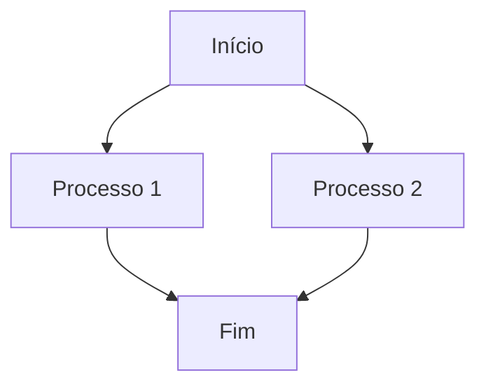

# Diana Corporação Senciente - Template de Relatório

**Status:** PRONTO
**Prioridade:** ALTA
**Versão:** 1.0
**Data de Criação:** 2026-02-14
**Data de Última Atualização:** 2026-02-14
**Autor:** Diana Corporação Senciente
**Tipo:** Template
**Categoria:** Documentação Corporativa
**Aprovação:** Pendente

---

## 🎯 Título do Relatório

Insira aqui o título principal do documento. Deve ser conciso, descritivo e refletir o propósito central do relatório.

---

## 📋 Sumário Executivo

### Objetivo
Descreva brevemente o propósito deste documento e o que o leitor encontrará nele.

### Escopo
Defina claramente o que está incluído e o que está fora do escopo deste relatório.

### Principais Conclusões
Liste os pontos mais importantes que o leitor deve reter.

---

## 📁 Estrutura do Documento

### 1. Introdução
Contexto, motivação e objetivos do relatório.

### 2. Metodologia
Abordagem utilizada para coleta e análise de dados.

### 3. Resultados
Principais descobertas e dados coletados.

### 4. Análise
Interpretação dos resultados e suas implicações.

### 5. Conclusões
Síntese dos aprendizados e recomendações.

### 6. Apêndices
Material complementar e detalhes técnicos.

---

## 📊 Seção 1: Introdução

### Contexto
Descreva o cenário que motivou a criação deste relatório.

### Objetivos
Defina claramente o que este documento pretende alcançar.

### Perguntas de Pesquisa
Liste as questões principais que serão respondidas.

---

## 🔬 Seção 2: Metodologia

### Abordagem
Descreva a estratégia geral utilizada.

### Fontes de Dados
Liste todas as fontes consultadas (internas, externas, ferramentas).

### Critérios de Seleção
Explique como os dados foram filtrados e selecionados.

### Limitações
Seja transparente sobre as restrições e possíveis vieses.

---

## 📈 Seção 3: Resultados

### Principais Descobertas
Apresente os dados mais relevantes de forma clara.

### Tabelas de Dados
Use tabelas para organizar informações estruturadas:

| Métrica | Valor | Unidade | Período |
|---------|-------|---------|----------|
| Exemplo | 1234 | unidades | 2026-01 |
| Teste | 567 | % | Q1 2026 |

### Gráficos e Visualizações
Utilize diagramas Mermaid quando aplicável:



---

## 🔍 Seção 4: Análise

### Interpretação dos Dados
Explique o que os números significam no contexto.

### Padrões Identificados
Descreva tendências e correlações observadas.

### Causa e Efeito
Analise as relações de causa-efeito entre variáveis.

### Comparações
Compare com benchmarks, períodos anteriores ou padrões da indústria.

---

## 🎯 Seção 5: Conclusões

### Respostas às Perguntas de Pesquisa
Resuma como cada questão foi respondida.

### Recomendações
Liste ações concretas baseadas nas descobertas.

### Próximos Passos
Defina o que deve ser feito após este relatório.

---

## 📚 Seção 6: Apêndices

### Apêndice A: Dados Detalhados
Informações complementares não incluídas no corpo principal.

### Apêndice B: Código Fonte
Trechos de código relevantes:

```python
def exemplo_funcao():
    """Função de exemplo."""
    return "Olá, Diana!"
```

### Apêndice C: Referências
Lista de fontes consultadas:

1. [Título da Fonte](https://exemplo.com)
2. [Outra Fonte](https://exemplo.org)

---

## 🔗 Notas e Referências

### Definições
Esclareça termos técnicos ou específicos do domínio.

### Siglas
| Sigla | Significado |
|-------|-------------|
| AI | Inteligência Artificial |
| ML | Machine Learning |

### Glossário
Definições detalhadas de conceitos importantes.

---

## 📝 Rascunhos e Observações

Espaço para anotações temporárias durante o desenvolvimento do documento.

---

## 👥 Revisores e Aprovações

### Revisores Técnicos
- [ ] Nome - Data
- [ ] Nome - Data

### Aprovação Final
- [ ] Nome - Data

---

## 🔒 Carimbo de Integridade

**Hash SHA256:** `$(echo -n "$CONTENT" | sha256sum | cut -d' ' -f1)`

**Data de Geração:** $(date +%Y-%m-%d)

**Versão:** 1.0

**Autor:** Diana Corporação Senciente

---

## 📚 Guia de Estilo

### Tipografia
- **Fonte Principal:** Inter (web), SF Mono (código)
- **Tamanho:** 12pt para corpo, 14pt para títulos
- **Espaçamento:** 1.5x entre parágrafos

### Cores
- **Títulos:** #1a1a1a (preto profundo)
- **Texto:** #333333 (cinza escuro)
- **Links:** #0066cc (azul corporativo)
- **Destaques:** #ff6b35 (laranja Diana)

### Elementos Visuais
- **Admonições:** Use blocos de citação com emojis
- **Código:** Syntax highlighting com linguagem específica
- **Tabelas:** Bordas claras, alinhamento consistente
- **Diagramas:** Mermaid para fluxos e arquitetura

---

## 🚀 Versões Anteriores

### v1.0 (2026-02-14)
- Template inicial completo
- Estrutura Areté padronizada
- Carimbo de integridade implementado

### v0.9 (2026-02-13)
- Estrutura básica definida
- Seções principais criadas

---

*Template gerado automaticamente pelo sistema Diana Corporação Senciente*