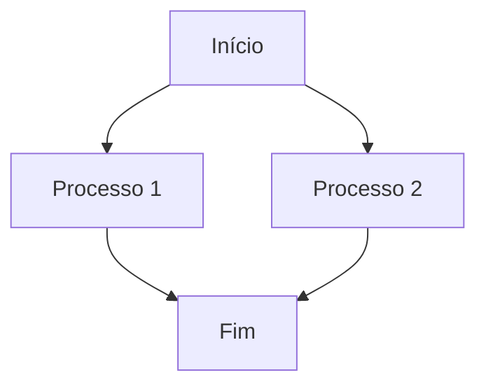

# Guia de Escrita Diana Corporação Senciente

## Introdução

Este guia estabelece as práticas de escrita e formatação para todos os documentos corporativos da Diana Corporação Senciente. Siga estas diretrizes para garantir consistência, profissionalismo e clareza em toda a documentação.

## Estrutura de Metadados Areté

Todo documento deve iniciar com um cabeçalho contendo os seguintes campos:

```markdown
**Status:** [Status atual]
**Prioridade:** [ALTA/MÉDIA/BAIXA]
**Versão:** [Número da versão]
**Data de Criação:** [YYYY-MM-DD]
**Data de Última Atualização:** [YYYY-MM-DD]
**Autor:** [Nome completo]
**Tipo:** [Tipo do documento]
**Categoria:** [Categoria do documento]
**Aprovação:** [Pendente/Aprovado/Reprovado]
```

### Campos Obrigatórios
- **Status:** Status atual do documento
- **Versão:** Número da versão (formato X.Y)
- **Data de Criação:** Data inicial do documento
- **Autor:** Nome completo do autor
- **Tipo:** Tipo de documento (Relatório, Técnico, Briefing, etc.)

### Campos Opcionais
- **Prioridade:** Nível de urgência
- **Data de Última Atualizaão:** Data da última modificação
- **Categoria:** Classificação do documento
- **Aprovação:** Status de aprovação

## Estrutura Padronizada

Todo documento deve seguir esta estrutura:

### 1. Título Principal
- Use # para título principal
- Seja conciso e descritivo
- Reflita o propósito central do documento

### 2. Sumário Executivo
- Objetivo: Propósito do documento
- Escopo: O que está incluído e excluído
- Principais Conclusões: Pontos chave

### 3. Estrutura do Documento
- Lista numerada das seções principais
- Breve descrição de cada seção

### 4. Seções Principais
- Use ## para títulos de seção
- Use ### para subseções
- Use #### para tópicos específicos

### 5. Apêndices
- Material complementar
- Detalhes técnicos
- Referências

## Formatação de Texto

### Parágrafos
- Use espaçamento 1.5x entre parágrafos
- Alinhamento justificado
- Indente a primeira linha (opcional)

### Listas
- **Não ordenadas:** Use traços (-) ou asteriscos (*)
- **Ordenadas:** Use 1., 2., 3., etc.
- Mantenha consistência no estilo

### Citações
- Use > para citações em bloco
- Adicione emojis para destaque:
  - 📝 Para notas importantes
  - ⚠️ Para advertências
  - ✅ Para confirmações

### Destaques
- **Negrito:** Use para termos importantes
- *Itálico:* Use para ênfase ou títulos de obras
- `Código:* Use para trechos de código ou comandos

## Tabelas

### Formatação Básica
```markdown
| Coluna 1 | Coluna 2 | Coluna 3 |
|----------|----------|----------|
| Dado 1   | Dado 2   | Dado 3   |
| Dado 4   | Dado 5   | Dado 6   |
```

### Boas Práticas
- Use alinhamento consistente
- Adicione cabeçalhos descritivos
- Mantenha largura de colunas uniforme
- Use formatação condicional para destaque

## Código

### Blocos de Código
```python
def exemplo_funcao():
    """Função de exemplo."""
    return "Olá, Diana!"
```

### Syntax Highlighting
- Especifique a linguagem: python, javascript, bash, etc.
- Use indentação consistente
- Adicione comentários explicativos

## Diagramas

### Mermaid


### Tipos Suportados
- Fluxogramas (graph TD/FD)
- Sequência (sequenceDiagram)
- Gantt (gantt)
- Class (classDiagram)

## Carimbo de Integridade

Todo documento deve incluir no final:

```markdown
## 🔒 Carimbo de Integridade

**Hash SHA256:** [hash gerado]

**Data de Geração:** [YYYY-MM-DD]

**Versão:** [Número da versão]

**Autor:** [Nome completo]
```

## Controle de Versão

### Nomenclatura
- Use formato X.Y (ex: 1.0, 1.1, 2.0)
- Incremente Y para mudanças menores
- Incremente X para mudanças significativas

### Changelog
```markdown
## 🚀 Versões Anteriores

### v1.0 (2026-02-14)
- Template inicial completo
- Estrutura Areté padronizada
- Carimbo de integridade implementado

### v0.9 (2026-02-13)
- Estrutura básica definida
- Seções principais criadas
```

## Aprovação e Revisão

### Processo de Revisão
- [ ] Revisão técnica
- [ ] Revisão de conteúdo
- [ ] Aprovação final

### Status de Aprovação
- **Pendente:** Aguardando revisão
- **Aprovado:** Documento validado
- **Reprovado:** Necessita correções

## Boas Práticas

### Clareza
- Seja conciso e direto
- Evite jargões desnecessários
- Explique termos técnicos

### Consistência
- Use mesma formatação em todo documento
- Mantenha nomenclatura consistente
- Siga a estrutura padronizada

### Acessibilidade
- Use títulos hierárquicos
- Adicione descrições a imagens
- Use contraste adequado

## Validação

### Checklist de Validação
- [ ] Metadados completos
- [ ] Estrutura padronizada
- [ ] Formatação consistente
- [ ] Carimbo de integridade
- [ ] Revisão técnica
- [ ] Aprovação final

## Referências

### Ferramentas Recomendadas
- **Editor:** VS Code, Obsidian
- **Preview:** GitHub, Markdown Preview Enhanced
- **Conversão:** Pandoc (PDF, HTML)

### Templates Relacionados
- [Template de Relatório](report-template.md)
- [Template Técnico](technical-template.md)
- [Template Briefing](briefing-template.md)

---

*Este guia foi gerado automaticamente pelo sistema Diana Corporação Senciente*