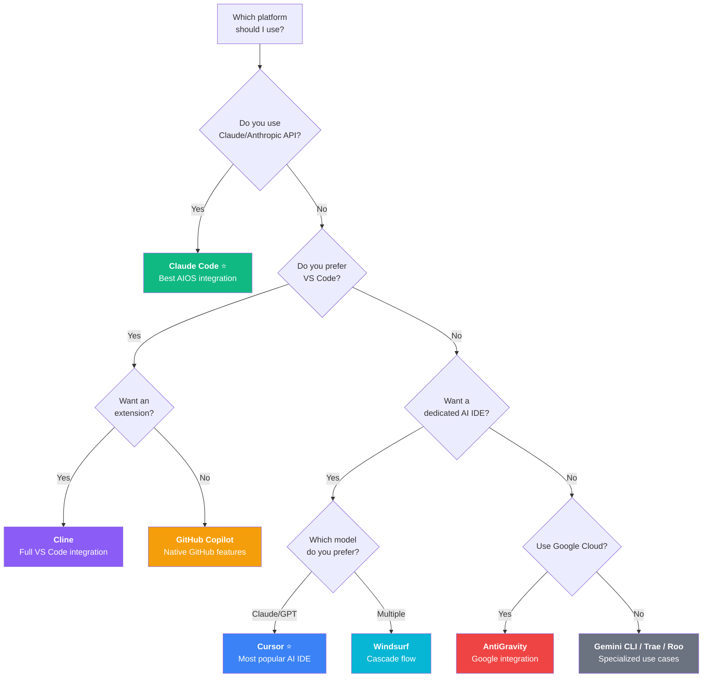
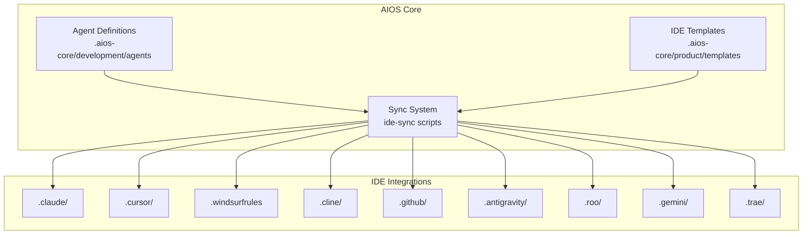
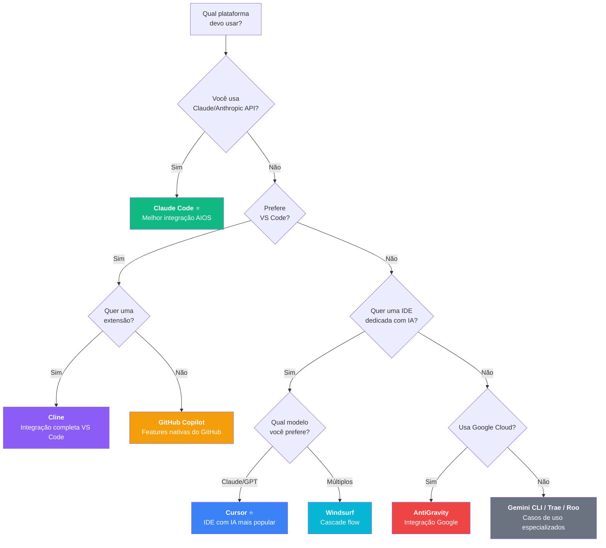
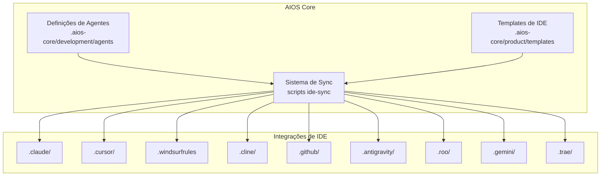
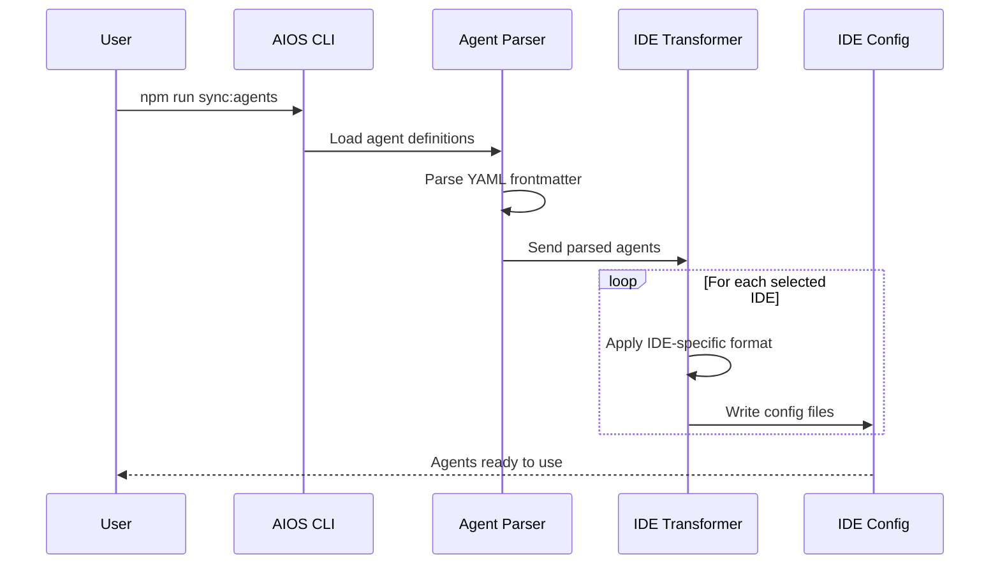

# Platform Guides / Guias por Plataforma

> **[English](#english)** | **[Português](#português)**

---

## English

### Supported Platforms Overview

AIOS supports 9 AI-powered development platforms. Choose the one that best fits your workflow.

### Quick Comparison Table

| Feature | Claude Code | Cursor | Windsurf | Cline | Copilot | AntiGravity | Roo Code | Gemini CLI | Trae |
|---------|:-----------:|:------:|:--------:|:-----:|:-------:|:-----------:|:--------:|:----------:|:----:|
| **Agent Activation** | /command | @mention | @mention | @mention | 4 Modes | Workflow | Mode | Prompt | @mention |
| **MCP Support** | Native | Config | Config | Limited | Yes | Native | No | No | Limited |
| **Subagent Tasks** | Yes | No | No | No | Yes | Yes | No | No | No |
| **Auto-sync** | Yes | Yes | Yes | Yes | Yes | Yes | Yes | Yes | Yes |
| **Hooks System** | Yes | No | No | No | No | No | No | No | No |
| **Skills/Commands** | Native | No | No | No | No | No | No | No | No |
| **Recommendation** | ⭐⭐⭐ | ⭐⭐⭐ | ⭐⭐ | ⭐⭐ | ⭐⭐ | ⭐⭐ | ⭐ | ⭐ | ⭐ |

### Platform Decision Guide



### Platform Guides

| Priority | Platform | Guide | Description |
|:--------:|----------|-------|-------------|
| ⭐⭐⭐ | **Claude Code** | [EN](./claude-code.md) \| [PT](../pt/platforms/claude-code.md) | Anthropic's official CLI - **Recommended** |
| ⭐⭐⭐ | **Cursor** | [EN](./cursor.md) \| [PT](../pt/platforms/cursor.md) | AI-first code editor with Composer |
| ⭐⭐ | **Windsurf** | [EN](./windsurf.md) \| [PT](../pt/platforms/windsurf.md) | AI-powered IDE with Cascade flow |
| ⭐⭐ | **Cline** | [EN](./cline.md) \| [PT](../pt/platforms/cline.md) | VS Code AI coding assistant |
| ⭐ | **GitHub Copilot** | [EN](./github-copilot.md) \| [PT](../pt/platforms/github-copilot.md) | GitHub's AI pair programmer |
| ⭐⭐ | **AntiGravity** | [EN](./antigravity.md) \| [PT](../pt/platforms/antigravity.md) | Google's agentic development platform |
| ⭐ | **Roo Code** | [EN](./roo-code.md) \| [PT](../pt/platforms/roo-code.md) | Mode-based VS Code extension |
| ⭐ | **Gemini CLI** | [EN](./gemini-cli.md) \| [PT](../pt/platforms/gemini-cli.md) | Google AI CLI assistant |
| ⭐ | **Trae** | [EN](./trae.md) \| [PT](../pt/platforms/trae.md) | Modern AI code editor |

### Technical Specifications

<details>
<summary><b>Claude Code</b></summary>

```yaml
config_file: .claude/CLAUDE.md
agent_folder: .claude/commands/AIOS/agents
activation: /agent-name (slash commands)
format: full-markdown-yaml
mcp_support: native
special_features:
  - Task tool for subagents
  - Native MCP integration
  - Hooks system (pre/post)
  - Custom skills
  - Memory persistence
```
</details>

<details>
<summary><b>Cursor</b></summary>

```yaml
config_file: .cursor/rules.md
agent_folder: .cursor/rules
activation: @agent-name
format: condensed-rules
mcp_support: via configuration
special_features:
  - Composer integration
  - Chat modes
  - @codebase context
  - Multi-file editing
```
</details>

<details>
<summary><b>Windsurf</b></summary>

```yaml
config_file: .windsurfrules
agent_folder: .windsurf/rules
activation: @agent-name
format: xml-tagged-markdown
mcp_support: via configuration
special_features:
  - Cascade flow
  - Supercomplete
  - Flows system
```
</details>

<details>
<summary><b>Cline</b></summary>

```yaml
config_file: .cline/rules.md
agent_folder: .cline/agents
activation: @agent-name
format: condensed-rules
mcp_support: limited
special_features:
  - VS Code integration
  - Extension ecosystem
  - Inline suggestions
```
</details>

<details>
<summary><b>GitHub Copilot</b></summary>

```yaml
config_file: .github/copilot-instructions.md
agent_folder: .github/agents
activation: chat modes
format: text
mcp_support: none
special_features:
  - GitHub integration
  - PR assistance
  - Code review
```
</details>

<details>
<summary><b>AntiGravity</b></summary>

```yaml
config_file: .antigravity/rules.md
config_json: .antigravity/antigravity.json
agent_folder: .agent/workflows
activation: workflow-based
format: cursor-style
mcp_support: native (Google)
special_features:
  - Google Cloud integration
  - Workflow system
  - Native Firebase tools
```
</details>

<details>
<summary><b>Roo Code</b></summary>

```yaml
config_file: .roo/rules.md
agent_folder: .roo/agents
activation: mode selector
format: text
mcp_support: none
special_features:
  - Mode-based workflow
  - VS Code extension
  - Custom modes
```
</details>

<details>
<summary><b>Gemini CLI</b></summary>

```yaml
config_file: .gemini/rules.md
agent_folder: .gemini/agents
activation: prompt mention
format: text
mcp_support: none
special_features:
  - Google AI models
  - CLI-based workflow
  - Multimodal support
```
</details>

<details>
<summary><b>Trae</b></summary>

```yaml
config_file: .trae/rules.md
agent_folder: .trae/agents
activation: @agent-name
format: project-rules
mcp_support: limited
special_features:
  - Modern UI
  - Fast iteration
  - Builder mode
```
</details>

### Integration Architecture



### Quick Start

1. **Install AIOS** in your project:
   ```bash
   npx @anthropic/aios init
   ```

2. **Select your IDE(s)** during setup

3. **Sync agents** to your platform:
   ```bash
   npm run sync:agents
   ```

4. **Start using agents** with platform-specific activation

---

## Português

### Visão Geral das Plataformas Suportadas

O AIOS suporta 9 plataformas de desenvolvimento com IA. Escolha a que melhor se adapta ao seu fluxo de trabalho.

### Tabela Comparativa Rápida

| Recurso | Claude Code | Cursor | Windsurf | Cline | Copilot | AntiGravity | Roo Code | Gemini CLI | Trae |
|---------|:-----------:|:------:|:--------:|:-----:|:-------:|:-----------:|:--------:|:----------:|:----:|
| **Ativação de Agente** | /comando | @menção | @menção | @menção | 4 Modos | Workflow | Modo | Prompt | @menção |
| **Suporte MCP** | Nativo | Config | Config | Limitado | Sim | Nativo | Não | Não | Limitado |
| **Tarefas Subagente** | Sim | Não | Não | Não | Sim | Sim | Não | Não | Não |
| **Sync Automático** | Sim | Sim | Sim | Sim | Sim | Sim | Sim | Sim | Sim |
| **Sistema de Hooks** | Sim | Não | Não | Não | Não | Não | Não | Não | Não |
| **Skills/Comandos** | Nativo | Não | Não | Não | Não | Não | Não | Não | Não |
| **Recomendação** | ⭐⭐⭐ | ⭐⭐⭐ | ⭐⭐ | ⭐⭐ | ⭐⭐ | ⭐⭐ | ⭐ | ⭐ | ⭐ |

### Guia de Decisão de Plataforma



### Guias por Plataforma

| Prioridade | Plataforma | Guia | Descrição |
|:----------:|------------|------|-----------|
| ⭐⭐⭐ | **Claude Code** | [EN](./claude-code.md) \| [PT](../pt/platforms/claude-code.md) | CLI oficial da Anthropic - **Recomendado** |
| ⭐⭐⭐ | **Cursor** | [EN](./cursor.md) \| [PT](../pt/platforms/cursor.md) | Editor de código AI-first com Composer |
| ⭐⭐ | **Windsurf** | [EN](./windsurf.md) \| [PT](../pt/platforms/windsurf.md) | IDE com IA e Cascade flow |
| ⭐⭐ | **Cline** | [EN](./cline.md) \| [PT](../pt/platforms/cline.md) | Assistente de código IA para VS Code |
| ⭐ | **GitHub Copilot** | [EN](./github-copilot.md) \| [PT](../pt/platforms/github-copilot.md) | Programador par IA do GitHub |
| ⭐⭐ | **AntiGravity** | [EN](./antigravity.md) \| [PT](../pt/platforms/antigravity.md) | Plataforma de desenvolvimento agêntico do Google |
| ⭐ | **Roo Code** | [EN](./roo-code.md) \| [PT](../pt/platforms/roo-code.md) | Extensão VS Code baseada em modos |
| ⭐ | **Gemini CLI** | [EN](./gemini-cli.md) \| [PT](../pt/platforms/gemini-cli.md) | Assistente CLI do Google AI |
| ⭐ | **Trae** | [EN](./trae.md) \| [PT](../pt/platforms/trae.md) | Editor de código IA moderno |

### Arquitetura de Integração



### Início Rápido

1. **Instale o AIOS** no seu projeto:
   ```bash
   npx @anthropic/aios init
   ```

2. **Selecione sua(s) IDE(s)** durante a configuração

3. **Sincronize os agentes** para sua plataforma:
   ```bash
   npm run sync:agents
   ```

4. **Comece a usar os agentes** com a ativação específica da plataforma

---

## Agent Synchronization Flow / Fluxo de Sincronização de Agentes



---

## Migration / Migração

Need to switch platforms? Each guide includes migration instructions:
- **From** another IDE to your target
- **To** another IDE from your current

Precisa trocar de plataforma? Cada guia inclui instruções de migração:
- **De** outra IDE para seu destino
- **Para** outra IDE a partir da sua atual

---

*Synkra AIOS - Platform Documentation v1.0*
