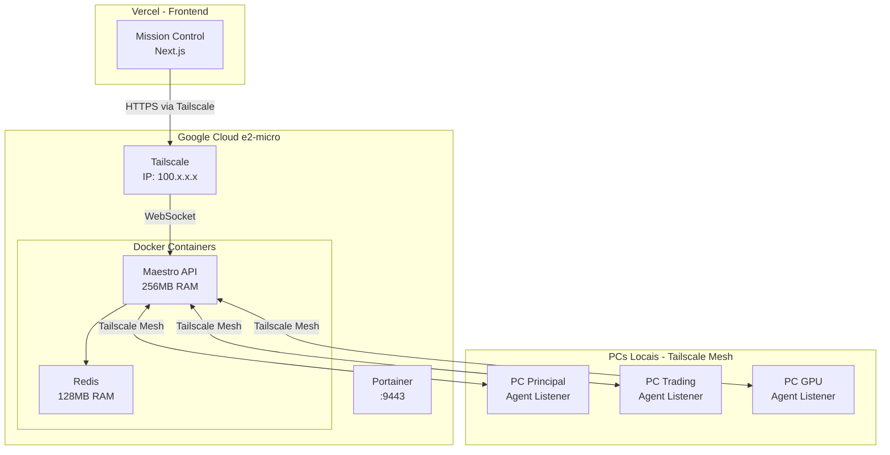

# 🧬 Arquitetura Tailscale - Corporação Senciente (Rota Soberana)

**Estado**: Google Cloud Brain + Tailscale Mesh Network  
**Versão**: 1.0.0  
**Data**: 22/01/2026

## 📐 Visão Geral

Arquitetura híbrida usando Google Cloud e2-micro como "Farol" (Brain/Orchestrator) conectado via Tailscale aos PCs locais, eliminando a necessidade de portas públicas e mantendo segurança Zero Trust.

## 🏗️ Arquitetura



## 🎯 Componentes

### 1. Google Cloud Brain (Farol)

**Função**: Ponto de encontro estável com IP fixo

**Especificações**:
- **Provider**: Google Cloud Platform (Free Tier)
- **VM**: e2-micro (2 vCPU, 1GB RAM)
- **OS**: Ubuntu 22.04 LTS
- **Swap**: 2GB (Total: 3GB disponível)

**Stack**:
- Docker + Docker Compose
- Portainer (Gestão Visual)
- Tailscale (Mesh VPN)
- Redis (128MB limitado)
- Maestro API (256MB limitado)

**IP Tailscale**: `100.78.145.65` (exemplo)

### 2. Maestro API

**Função**: Hub WebSocket para comunicação com agentes

**Stack**:
- FastAPI
- Socket.IO
- Redis (Pub/Sub)
- Python 3.12

**Endpoints**:
- `GET /health` - Health check
- `GET /agents` - Lista agentes
- `GET /agents/{id}` - Info de agente
- `POST /agents/{id}/command` - Enviar comando
- `POST /agents/{id}/restart` - Reiniciar agente
- `POST /agents/{id}/stop` - Parar agente
- `POST /agents/{id}/screenshot` - Screenshot

**Porta**: 8080 (acessível via Tailscale)

### 3. Redis

**Função**: Cache e Pub/Sub para mensagens

**Configuração**:
- **Memória**: 128MB máximo
- **Política**: allkeys-lru (evict menos usados)
- **Persistência**: Desabilitada (volátil)
- **Uso**: ~100-150MB em produção

### 4. Agent Listener (PCs Locais)

**Função**: Cliente que conecta PCs ao Maestro

**Stack**:
- Python 3.12
- Socket.IO Client
- psutil (métricas)

**Funcionalidades**:
- Conexão WebSocket via Tailscale
- Heartbeat automático (10s)
- Execução de comandos locais
- Coleta de métricas (CPU/RAM/Disco)
- Screenshot (opcional)

### 5. Mission Control (Vercel)

**Função**: Dashboard de controle remoto

**Stack**:
- Next.js 14
- Tailwind CSS
- Socket.IO Client

**Acesso**: Via Tailscale (IP do Google Cloud Brain)

## 🔄 Fluxo de Dados

### Heartbeat

```
Agent Listener → Tailscale → Maestro → Redis → Mission Control
  ↑                                                      ↓
  └─────────────────── Status Update ───────────────────┘
```

### Comando Remoto

```
Mission Control → Tailscale → Maestro → Tailscale → Agent Listener
                                                          ↓
                                                  Execução Local
                                                          ↓
Agent Listener → Tailscale → Maestro → Redis → Mission Control
  ↑                                                      ↓
  └─────────────── Response ─────────────────────────────┘
```

## 🔐 Segurança

### Zero Trust Network

- **Sem Portas Públicas**: Tudo via Tailscale mesh
- **IPs Privados**: Apenas IPs 100.x.x.x (Tailscale)
- **Autenticação**: Tailscale gerencia autenticação
- **Criptografia**: End-to-end via Tailscale

### Vantagens vs Oracle VPS

| Aspecto | Oracle VPS | Google Cloud + Tailscale |
|---------|------------|-------------------------|
| **Portas Públicas** | Sim (80, 443) | Não (Zero Trust) |
| **SSL/TLS** | Let's Encrypt | Tailscale (built-in) |
| **IP Fixo** | Sim | Sim (Tailscale) |
| **Custo** | Free Tier | Free Tier |
| **Segurança** | Boa | Excelente (Zero Trust) |
| **Resiliência** | Depende de IP público | Auto-reconexão Tailscale |

## 📊 Otimizações de Memória

### Redis

```yaml
maxmemory: 128mb
maxmemory-policy: allkeys-lru
appendonly: no
```

**Uso Real**: ~100-150MB

### Maestro

```yaml
memory_limit: 256MB
memory_reservation: 128MB
workers: 1
```

**Uso Real**: ~128-256MB

### Total

- **Redis**: ~150MB
- **Maestro**: ~200MB
- **Sistema**: ~100MB
- **Total**: ~450MB (dentro de 1GB)

## 🚀 Deploy

### 1. Google Cloud Brain

```bash
# No servidor Google Cloud
cd google-cloud-brain
chmod +x setup.sh
./setup.sh

# Obter IP Tailscale
tailscale ip -4

# Deploy via Portainer
# Acesse: https://<IP_TAILSCALE>:9443
# Crie Stack usando docker-compose.yml
```

### 2. Agent Listeners

```bash
# Em cada PC local
cd agent-listener
./setup.sh  # ou setup.ps1 no Windows

# Editar .env
MAESTRO_URL=http://100.78.145.65:8080

# Rodar
python listener.py
```

### 3. Mission Control

```bash
# Configurar variável de ambiente na Vercel
NEXT_PUBLIC_MAESTRO_URL=http://100.78.145.65:8080

# Deploy
vercel --prod
```

## 🔍 Monitoramento

### Health Checks

```bash
# Maestro
curl http://100.78.145.65:8080/health

# Redis (via Portainer Exec Console)
redis-cli ping
```

### Logs

```bash
# Maestro logs (Portainer)
Containers > senciente-maestro > Logs

# Agent Listener logs
tail -f logs/listener.log
```

## 🐛 Troubleshooting

### Agente não conecta

1. Verificar Tailscale:
   ```bash
   tailscale status
   ```

2. Testar conectividade:
   ```bash
   ping 100.78.145.65
   curl http://100.78.145.65:8080/health
   ```

3. Verificar firewall (se aplicável)

### Maestro não responde

1. Verificar containers:
   ```bash
   docker ps | grep maestro
   ```

2. Verificar logs:
   ```bash
   docker logs senciente-maestro
   ```

3. Verificar memória:
   ```bash
   free -h
   ```

### Redis usando muita memória

1. Verificar uso:
   ```bash
   redis-cli INFO memory
   ```

2. Limpar cache:
   ```bash
   redis-cli FLUSHALL
   ```

## 📈 Métricas e KPIs

| Métrica | Alvo | Ferramenta |
|---------|------|-----------|
| Latência de heartbeat | < 100ms | Maestro |
| Uptime Brain | 99.9% | Google Cloud |
| Memória Redis | < 150MB | Docker stats |
| Memória Maestro | < 256MB | Docker stats |
| Agentes conectados | Todos | Mission Control |

## 🔮 Próximos Passos

- [ ] Integrar Netdata para observabilidade
- [ ] Configurar alertas (Telegram/Discord)
- [ ] Implementar backup automático
- [ ] Adicionar métricas históricas
- [ ] Implementar terminal remoto via xterm.js

## 📚 Documentação Relacionada

- [PORTAINER_DEPLOY.md](google-cloud-brain/PORTAINER_DEPLOY.md) - Guia de deploy
- [agent-listener/README.md](agent-listener/README.md) - Agent Listener
- [mission-control/README.md](mission-control/README.md) - Mission Control

---

**Última atualização**: 22/01/2026
