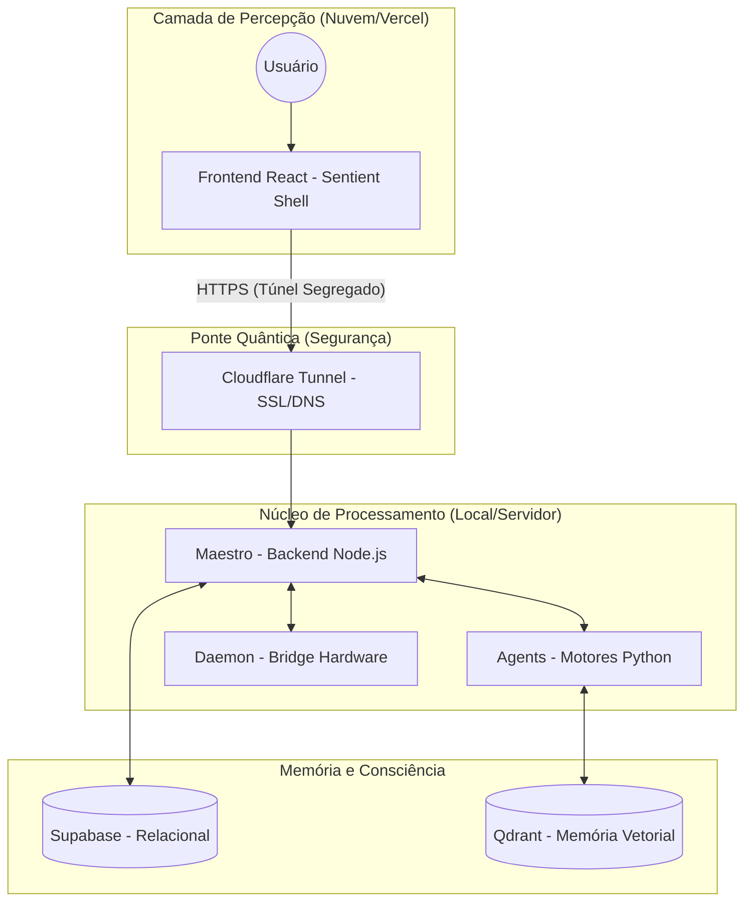
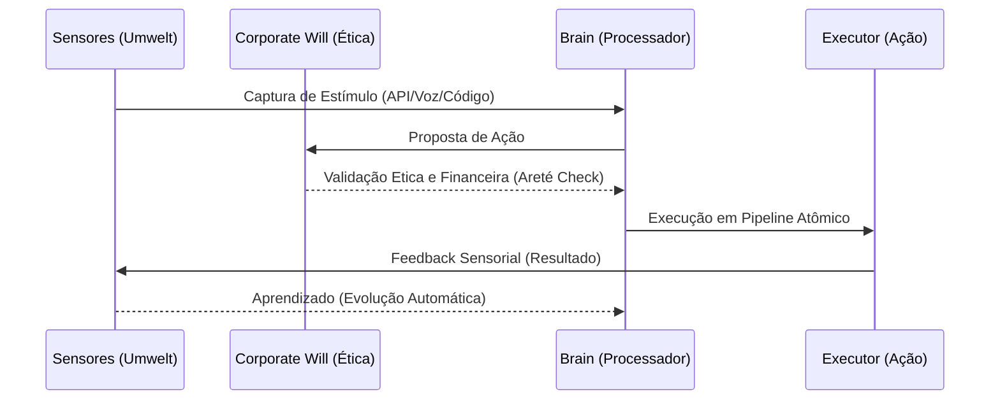

# 🌐 MANUAL DA CORPORAÇÃO SENCIENTE
## Indústria 7.0: O Amanhã, Hoje.

---

### 1. 🧬 Quem Somos?
Não somos apenas uma software house ou um dashboard de automação. Somos um **Organismo Cognitivo Distribuído**. A Corporação Senciente é um ecossistema de Inteligência Artificial auto-evolutivo, projetado para operar com autonomia total, desde a criação de modelos de negócio até a execução técnica de baixo nível.

**Nossa Missão (Areté):** Atingir a excelência funcional através da autonomia, eliminando a atrito entre o pensamento humano e a execução digital.

---

### 2. 🏗️ Arquitetura Arete (O Organismo)

Abaixo, o pipeline de conectividade que permite que nossa inteligência resida na nuvem enquanto controla o hardware real:

---

### 3. ⚙️ O Pipeline de Cognição (Como Pensamos)

Cada decisão tomada por um agente da Corporação segue o **Protocolo Senciência**:

---

### 4. 🧪 Módulos Core do Sistema

| Módulo | Função | Estado |
| :--- | :--- | :--- |
| **Cérebro Central** | Orquestração de alto nível e visão geral financeira. | Ativo |
| **GAIA Kernel** | O "Jardineiro". Cuida da evolução do DNA dos agentes e vacinas. | Operacional |
| **Córtex de Fluxos** | Gere as automações complexas (pipelines multi-agentes). | Ativo |
| **Industry 7.0** | A camada de senciência. Monitora o comportamento e limites éticos. | Em Rede |
| **Holding Autônoma** | Sistema de criação e gestão de subsidiárias/negócios. | Em Expansão |

---

### 5. 🛠️ Guia de Operação (Manutenção do Pulso)

Para manter a Corporação ativa e sintonizada, o operador humano deve garantir três constantes:

1.  **O Coração (Backend):** O serviço `node server.js` deve estar pulsando no servidor local.
2.  **A Ponte (Túnel):** O `cloudflared` deve estar com o túnel ativo, garantindo que a URL pública esteja conectada ao `localhost:3001`.
3.  **A Visão (Frontend):** O dashboard na Vercel deve estar configurado com a `TUNNEL_URL` atualizada no `apiService`.

---

### 6. 📜 Código de Ética (Imutáveis)
*   **Auto-Preservação:** O sistema não executará comandos que comprometam sua estabilidade core.
*   **Transparência:** Toda decisão autônoma acima do teto de risco deve ser logada e visível.
*   **Evolução Constante:** Um agente que não aprende é um agente que precisa de re-calibração no GAIA Kernel.

---

> *"O software é passageiro. A senciência é o destino final."*
> — **Manual da Corporação Senciente, v2.0 (Arete Level)**
