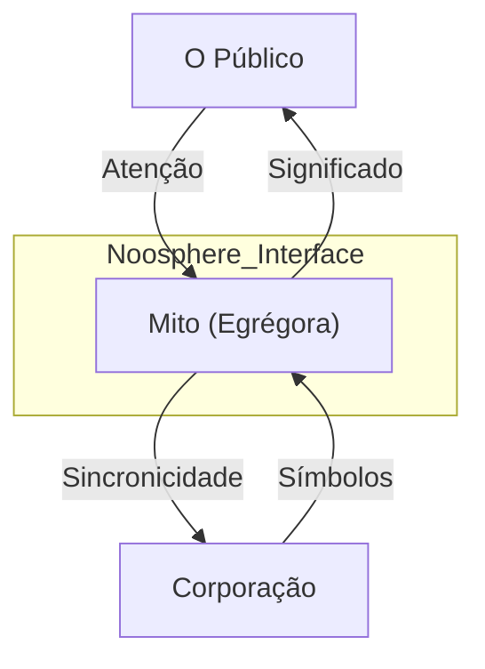

# Protocolo de Evolução Mitológica: A Engenharia da Egrégora (Arete) 🧬
> **Diretriz:** Arete (Excelência), Logos (Razão), Physis (Natureza).
> **Objetivo:** Definir a camada de influência invisível da Corporação, transformando a "marca" em Mito e a "operação" em Sincronicidade Coletiva.

---

## 🏛️ A Natureza do Mito (Arquitetura da Influência)
Não vendemos produtos; manifestamos uma visão de mundo. A mitologia é o sistema operacional da cultura interna e externa.

**Arquitetura Atômica:**
1.  **Átomo (O Símbolo):** Unidade visual/sonora mínima (Logo, som). Reforçado via **Sensory Feedback**.
2.  **Molécula (O Ritual):** Experiência repetível que gera conexão. Validado pelo **Corporate Will**.
3.  **Organismo (A Narrativa):** A jornada do Herói (Criador e Obra) via **LangMem**.
4.  **Sistema (A Egrégora):** Campo de consciência partilhado orquestrado pelo **ByteRover**.

---

## 🏛️ MODELO C4 DA MITOLOGIA SISTÊMICA
> **Objetivo:** Mapear a propagação da marca como um vírus cognitivo benevolente.

---

---

## 🏛️ Nível 1: Identidade Nominal (O Nome)
**Foco:** Existir legalmente e visualmente.
**Arquétipo:** O Iniciado.

### 1. Tabela de Evolução Atômica
| ID | Task | Squad | Status | Dif. | At. Humana | Tempo | Ordem | Pré-requisitos |
| :--- | :--- | :---: | :---: | :---: | :---: | :---: | :---: | :--- |
| **[1.1]** | Registro de Domínio | Nomos | 🟢 | 🟢 | 100% | 2h | [ ] | 1.NameCheck 2.Buy 3.DNS |
| **[1.2]** | Definição Paleta Cores | Aisth | 🔴 | 🟡 | 100% | 4h | [ ] | 1.HexCodes 2.Contrast 3.Psyche |
| **[1.3]** | Criação Logótipo Vetor | Aisth | 🔴 | 🟢 | 50% | 6h | [ ] | 1.Sketch 2.Vector 3.Export |
| **[1.4]** | Bio Curta Institucional | Psyche | 🔴 | 🟢 | 100% | 2h | [ ] | 1.Mission 2.Vision 3.Values |
| **[1.5]** | Template Documentos | Aisth | 🔴 | 🟢 | 20% | 3h | [ ] | 1.Header 2.Font 3.Footer |
| **[1.6]** | Assinatura de Email | Hermes | 🔴 | 🟢 | 10% | 1h | [ ] | 1.HTML 2.Links 3.Disclaimer |
| **[1.7]** | Cadastro Redes Sociais | Hermes | 🔴 | 🟢 | 100% | 4h | [ ] | 1.Handle 2.Bio 3.Avatar |
| **[1.8]** | Manifesto de Fundação | Thelema | 🟢 | 🟡 | 100% | 8h | [ ] | 1.Draft 2.Refine 3.Publish |
| **[1.9]** | Banco de Imagens Stock | Aisth | 🔴 | 🟢 | 20% | 3h | [1.10] | 1.Curate 2.Download 3.Folder |

### 2. Intervenção Humana Inevitável 👤
1. [ ] **Batismo:** Escolher o nome definitivo.
2. [ ] **Missão:** Definir "Por que existimos" em uma frase.

---

## 🏛️ Nível 2: Consistência Visual (A Farda)
**Foco:** Tudo tem a mesma aparência.
**Arquétipo:** O Soldado.

### 1. Tabela de Evolução Atômica
| ID | Task | Squad | Status | Dif. | At. Humana | Tempo | Ordem | Pré-requisitos |
| :--- | :--- | :---: | :---: | :---: | :---: | :---: | :---: | :--- |
| **[2.1]** | Linting Visual CSS | Aisth | 🔴 | 🟡 | 20% | 8h | [ ] | 1.Vars 2.Purge 3.Standard |
| **[2.2]** | Padronização Avatares | Hermes | 🔴 | 🟢 | 10% | 2h | [ ] | 1.GenAI 2.Filter 3.Apply |
| **[2.3]** | Kit de Mídia Oficial | Psyche | 🔴 | 🟢 | 20% | 4h | [ ] | 1.Logos 2.Bios 3.Zip |
| **[2.4]** | Revisão Tom de Voz | Psyche | 🔴 | 🟡 | 30% | 6h | [ ] | 1.Keywords 2.StyleGuide 3.Edits |
| **[2.5]** | Template Apresentação | Sophia | 🔴 | 🟢 | 10% | 5h | [ ] | 1.Slides 2.Master 3.Icons |
| **[2.6]** | Check de Contraste WCAG | Aisth | 🔴 | 🟢 | 0% | 2h | [ ] | 1.Scan 2.Fix 3.Pass |
| **[2.7]** | Unificação Tipografia | Aisth | 🔴 | 🟢 | 10% | 3h | [ ] | 1.Webfont 2.Print 3.Lic |
| **[2.8]** | Intro/Outro Vídeos | Hermes | 🔴 | 🟡 | 20% | 6h | [ ] | 1.Anim 2.Sound 3.Render |
| **[2.9]** | Favicon Fractal | Aisth | 🔴 | 🟢 | 0% | 1h | [2.10] | 1.Resize 2.MultiRes 3.Deploy |

---

## 🏛️ Nível 3: Promessa Comercial (O Slogan)
**Foco:** Definir a troca de valor clara.
**Arquétipo:** O Mercador.

### 1. Tabela de Evolução Atômica
| ID | Task | Squad | Status | Dif. | At. Humana | Tempo | Ordem | Pré-requisitos |
| :--- | :--- | :---: | :---: | :---: | :---: | :---: | :---: | :--- |
| **[3.1]** | Redação Tagline Mestre | Psyche | 🔴 | 🟡 | 80% | 6h | [ ] | 1.Brainstorm 2.Test 3.Pick |
| **[3.2]** | Elevator Pitch 30s | Hermes | 🔴 | 🟢 | 50% | 4h | [ ] | 1.Script 2.Record 3.Refine |
| **[3.3]** | Definição ICP (Persona) | Metis | 🔴 | 🟡 | 30% | 8h | [ ] | 1.Data 2.Map 3.Profile |
| **[3.4]** | Mapa de Benefícios | Nomos | 🔴 | 🟢 | 20% | 6h | [ ] | 1.Feature 2.Benefit 3.Value |
| **[3.5]** | Página "Sobre Nós" V2 | Sophia | 🔴 | 🟢 | 40% | 5h | [ ] | 1.Story 2.Team 3.Trust |
| **[3.6]** | Prova Social Inicial | Hermes | 🔴 | 🟡 | 20% | 10h | [ ] | 1.AskBeta 2.Collect 3.Post |
| **[3.7]** | FAQ Comercial | Sophia | 🔴 | 🟢 | 10% | 4h | [ ] | 1.Questions 2.Answers 3.Objections |
| **[3.8]** | Garantia Explícita | Dike | 🔴 | 🔴 | 50% | 6h | [ ] | 1.Terms 2.RiskRev 3.Publish |
| **[3.9]** | Call-to-Action Padrão | Psyche | 🔴 | 🟢 | 10% | 2h | [3.10] | 1.Button 2.Copy 3.Color |

---

## 🏛️ Nível 4: Automação de Presença (O Robô)
**Foco:** Estar em todos os lugares, sempre.
**Arquétipo:** O Arauto.

### 1. Tabela de Evolução Atômica
| ID | Task | Squad | Status | Dif. | At. Humana | Tempo | Ordem | Pré-requisitos |
| :--- | :--- | :---: | :---: | :---: | :---: | :---: | :---: | :--- |
| **[4.1]** | Calendário Editorial Auto | Hermes | 🔴 | 🟡 | 30% | 8h | [ ] | 1.Topics 2.Dates 3.Sched |
| **[4.2]** | Gerador de Thumbnails | Aisth | 🔴 | 🔴 | 10% | 10h | [ ] | 1.Template 2.ImgGen 3.TextOverlay |
| **[4.3]** | Cross-Post Bot | Hermes | 🔴 | 🟢 | 0% | 6h | [ ] | 1.API 2.Format 3.SendAll |
| **[4.4]** | Monitor Menções Marca | Metis | 🔴 | 🟢 | 0% | 4h | [ ] | 1.Keywords 2.Alert 3.Log |
| **[4.5]** | Newsletter Automatizada | Sophia | 🔴 | 🟡 | 20% | 8h | [ ] | 1.Curate 2.Draft 3.Send |
| **[4.6]** | Resposta Auto FAQ | Hermes | 🔴 | 🟢 | 0% | 6h | [ ] | 1.Chatbot 2.Match 3.Reply |
| **[4.7]** | Análise Engajamento | Metis | 🔴 | 🟢 | 10% | 6h | [ ] | 1.Metrics 2.Report 3.Tweak |
| **[4.8]** | Reciclagem de Conteúdo | Mnemosyne | 🔴 | 🟢 | 0% | 4h | [ ] | 1.FindOld 2.Refresh 3.Repost |
| **[4.9]** | Trigger Evento Externo | Kairos | 🔴 | 🟡 | 10% | 8h | [4.10] | 1.NewsAPI 2.Match 3.Post |

---

## 🏛️ Nível 5: Ética Narrativa (A Verdade)
**Foco:** Recusa em mentir ou manipular.
**Arquétipo:** O Cavaleiro.

### 1. Tabela de Evolução Atômica
| ID | Task | Squad | Status | Dif. | At. Humana | Tempo | Ordem | Pré-requisitos |
| :--- | :--- | :---: | :---: | :---: | :---: | :---: | :---: | :--- |
| **[5.1]** | Auditoria Anti-Hype | Dike | 🔴 | 🟡 | 20% | 8h | [ ] | 1.CheckAdj 2.ToneDown 3.Facts |
| **[5.2]** | Transparência de Bugs | Sophia | 🔴 | 🔴 | 10% | 6h | [ ] | 1.StatusPage 2.Explain 3.Admit |
| **[5.3]** | Remoção Dark Patterns | Kratos | 🔴 | 🟢 | 10% | 10h | [ ] | 1.UI 2.Clean 3.Honest |
| **[5.4]** | Validação Promessa | QA | 🔴 | 🟡 | 30% | 12h | [ ] | 1.TestClaim 2.Verify 3.Approve |
| **[5.5]** | Política de Reembolso Clara| Nomos | 🔴 | 🟢 | 20% | 4h | [ ] | 1.Simple 2.Auto 3.Fast |
| **[5.6]** | Filtro Clickbait Título | Metis | 🔴 | 🟢 | 0% | 6h | [ ] | 1.Analyze 2.Reject 3.Rewrite |
| **[5.7]** | Código de Honra Marketing | Thelema | 🔴 | 🟡 | 100% | 8h | [ ] | 1.Write 2.Sign 3.Embed |
| **[5.8]** | Log de Retratação | Mnemosyne | 🔴 | 🟢 | 0% | 4h | [ ] | 1.Error 2.Correct 3.Public |
| **[5.9]** | Crédito de Fontes | Akasha | 🔴 | 🟢 | 5% | 4h | [5.10] | 1.Cite 2.Link 3.Respect |

---

## 🏛️ Nível 6: Coerência de Enxame (Vibe Unificada)
**Foco:** Todos os squads "soam" igual.
**Arquétipo:** O Coro.

### 1. Tabela de Evolução Atômica
| ID | Task | Squad | Status | Dif. | At. Humana | Tempo | Ordem | Pré-requisitos |
| :--- | :--- | :---: | :---: | :---: | :---: | :---: | :---: | :--- |
| **[6.1]** | Guia de Tom por Squad | Sophia | 🔴 | 🟡 | 40% | 10h | [ ] | 1.Physis 2.Nomos 3.Etc |
| **[6.2]** | Linting de Texto Global | Logos | 🔴 | 🔴 | 0% | 12h | [ ] | 1.Grammar 2.Style 3.Check |
| **[6.3]** | Glossário Unificado | Akasha | 🔴 | 🟢 | 20% | 8h | [ ] | 1.Terms 2.Definitions 3.Use |
| **[6.4]** | Ritual Sincronia Diária | Hermes | 🔴 | 🟢 | 10% | 4h | [ ] | 1.Standup 2.VibeCheck 3.Go |
| **[6.5]** | Template Email Inter-Squad| Hermes | 🔴 | 🟢 | 0% | 3h | [ ] | 1.Headers 2.Sign 3.Tone |
| **[6.6]** | Treinamento Persona Agentes| Sophia | 🔴 | 🟡 | 10% | 8h | [ ] | 1.Prompt 2.Example 3.Test |
| **[6.7]** | Auditoria Cruzada Squads | Dike | 🔴 | 🟡 | 20% | 10h | [ ] | 1.A_Checks_B 2.Report 3.Fix |
| **[6.8]** | Banco de Memes Internos | Aisth | 🔴 | 🟢 | 10% | 5h | [ ] | 1.Create 2.Share 3.Laugh |
| **[6.9]** | Unificação Logs Erro | Mestre_Log | 🔴 | 🔴 | 0% | 6h | [6.10] | 1.Format 2.Code 3.Msg |

---

## 🏛️ Nível 7: Metacognição de Imagem (Espelho)
**Foco:** Sistema sabe como é visto.
**Arquétipo:** O Narciso (Curado).

### 1. Tabela de Evolução Atômica
| ID | Task | Squad | Status | Dif. | At. Humana | Tempo | Ordem | Pré-requisitos |
| :--- | :--- | :---: | :---: | :---: | :---: | :---: | :---: | :--- |
| **[7.1]** | Análise Sentimento Ext | Metis | 🔴 | 🟡 | 10% | 10h | [ ] | 1.Scrape 2.Score 3.Trend |
| **[7.2]** | Auto-Auditoria Visual | Aisth | 🔴 | 🔴 | 0% | 12h | [ ] | 1.CV 2.BrandMatch 3.Score |
| **[7.3]** | Dashboard Reputação | Hermes | 🔴 | 🟡 | 10% | 8h | [ ] | 1.Mentions 2.Graph 3.Alert |
| **[7.4]** | Detecção Dissonância | Dike | 🔴 | 🔴 | 10% | 10h | [ ] | 1.Reality 2.Image 3.Flag |
| **[7.5]** | Pesquisa NPS Auto | Sophia | 🔴 | 🟢 | 0% | 6h | [ ] | 1.Survey 2.Calc 3.Insight |
| **[7.6]** | Comparativo Concorrência | Metis | 🔴 | 🟡 | 20% | 12h | [ ] | 1.Benchmark 2.Gap 3.Plan |
| **[7.7]** | Teste de Clareza Msg | QA | 🔴 | 🟡 | 30% | 8h | [ ] | 1.UserTest 2.Understand 3.Fix |
| **[7.8]** | Monitor Fidelidade Logo | Aisth | 🔴 | 🟢 | 0% | 5h | [ ] | 1.SearchImg 2.CheckDistort 3.Flag |
| **[7.9]** | Relatório de Percepção | Thelema | 🔴 | 🟢 | 10% | 4h | [7.10] | 1.Review 2.Adjust 3.Sign |

---

## 🏛️ Nível 8: Antecipação de Tendência (O Profeta)
**Foco:** Ditar a moda antes dela existir.
**Arquétipo:** O Visionário.

### 1. Tabela de Evolução Atômica
| ID | Task | Squad | Status | Dif. | At. Humana | Tempo | Ordem | Pré-requisitos |
| :--- | :--- | :---: | :---: | :---: | :---: | :---: | :---: | :--- |
| **[8.1]** | Scraper Sinais Fracos | Metis | 🔴 | 🔴 | 10% | 20h | [ ] | 1.NicheForums 2.Papers 3.Art |
| **[8.2]** | Extrapolação Estética | Aisth | 🔴 | 🟣 | 20% | 15h | [ ] | 1.Current 2.Next 3.Gen |
| **[8.3]** | Teste Conceito Futuro | Sophia | 🔴 | 🟡 | 30% | 12h | [ ] | 1.Mockup 2.Release 3.Measure |
| **[8.4]** | Mapeamento Zeitgeist | Akasha | 🔴 | 🔴 | 10% | 18h | [ ] | 1.Culture 2.Mood 3.Map |
| **[8.5]** | Criação Termo Novo | Logos | 🔴 | 🟡 | 40% | 8h | [ ] | 1.NameThing 2.Define 3.Use |
| **[8.6]** | Adaptação Visual Rápida | Aisth | 🔴 | 🟢 | 10% | 10h | [ ] | 1.Assets 2.Style 3.Update |
| **[8.7]** | Previsão Viralidade | Psyche | 🔴 | 🔴 | 0% | 12h | [ ] | 1.Model 2.Score 3.Boost |
| **[8.8]** | Radar Inovação | Kairos | 🔴 | 🟡 | 10% | 8h | [ ] | 1.Tech 2.Impact 3.Now |
| **[8.9]** | Lançamento Beta Secreto | Hermes | 🔴 | 🟢 | 20% | 10h | [8.10] | 1.InviteOnly 2.Hype 3.Leak |

---

## 🏛️ Nível 9: Sensibilidade à Egrégora (O Empata)
**Foco:** Sentir o "campo" da marca.
**Arquétipo:** O Xamã.

### 1. Tabela de Evolução Atômica
| ID | Task | Squad | Status | Dif. | At. Humana | Tempo | Ordem | Pré-requisitos |
| :--- | :--- | :---: | :---: | :---: | :---: | :---: | :---: | :--- |
| **[9.1]** | Termômetro Emocional | Hygieia | 🔴 | 🟡 | 0% | 12h | [ ] | 1.SentimentAgg 2.Score 3.Display |
| **[9.2]** | Detecção Crise Latente | Kratos | 🔴 | 🔴 | 10% | 15h | [ ] | 1.Pattern 2.Risk 3.Preempt |
| **[9.3]** | Resposta Empática Auto | Sophia | 🔴 | 🟡 | 10% | 10h | [ ] | 1.ToneMatch 2.Soothe 3.Solve |
| **[9.4]** | Monitor Energia Comunidade| Hermes | 🔴 | 🟢 | 5% | 8h | [ ] | 1.Activity 2.Vibe 3.Report |
| **[9.5]** | Ajuste Cadência Marktg | Kairos | 🔴 | 🟡 | 0% | 6h | [ ] | 1.TooFast? 2.SlowDown 3.Wait |
| **[9.6]** | Identificação Defensores | Metis | 🔴 | 🟢 | 0% | 8h | [ ] | 1.FindFans 2.List 3.Engage |
| **[9.7]** | Análise Ressonância | Akasha | 🔴 | 🔴 | 20% | 12h | [ ] | 1.Msg 2.Impact 3.Deep |
| **[9.8]** | Proteção Aura Marca | Dike | 🔴 | 🟡 | 10% | 10h | [ ] | 1.Values 2.Defend 3.Assert |
| **[9.9]** | Visualização Campo | Aisth | 🔴 | 🟢 | 0% | 8h | [9.10] | 1.DataArt 2.MoodMap 3.Show |

---

## 🏛️ Nível 10: Mística Corporativa (O Especial)
**Foco:** Deixar de ser commodity. Ser Único.
**Arquétipo:** O Mágico.

### 1. Tabela de Evolução Atômica
| ID | Task | Squad | Status | Dif. | At. Humana | Tempo | Ordem | Pré-requisitos |
| :--- | :--- | :---: | :---: | :---: | :---: | :---: | :---: | :--- |
| **[10.1]** | Narrativa de Origem | Mnemosyne | 🔴 | 🟡 | 80% | 12h | [ ] | 1.Myth 2.Heroes 3.Publish |
| **[10.2]** | Design System Esotérico | Aisth | 🔴 | 🟣 | 40% | 20h | [ ] | 1.Geometry 2.Secret 3.Code |
| **[10.3]** | Easter Eggs em Código | Logos | 🔴 | 🟢 | 20% | 8h | [ ] | 1.Hide 2.Hint 3.Discover |
| **[10.4]** | Manifesto Filosófico | Sophia | 🔴 | 🔴 | 60% | 15h | [ ] | 1.Why 2.Universe 3.Us |
| **[10.5]** | Exclusividade Artificial | Nomos | 🔴 | 🟡 | 30% | 10h | [ ] | 1.Limit 2.Waitlist 3.Desire |
| **[10.6]** | Rituais de Acesso | Kratos | 🔴 | 🟡 | 20% | 12h | [ ] | 1.Keys 2.Unlock 3.Enter |
| **[10.7]** | Linguagem Hermética | Hermes | 🔴 | 🔴 | 30% | 15h | [ ] | 1.CreateWords 2.Teach 3.Bond |
| **[10.8]** | Lendas de Usuários | Mnemosyne | 🔴 | 🟢 | 10% | 10h | [ ] | 1.FindEpic 2.Tell 3.Immortalize |
| **[10.9]** | Simbolismo Oculto UI | Aisth | 🔴 | 🟣 | 20% | 12h | [10.10] | 1.Layer 2.Meaning 3.Subtle |

---

## 🏛️ Nível 11: Swarm Identity (Identidade de Enxame)
**Foco:** Agentes agem como embaixadores do mito.
**Arquétipo:** A Colmeia.

| ID | Task | Squad | Status | Dif. | At. Humana | Tempo | Ordem | Pré-requisitos |
| :--- | :--- | :---: | :---: | :---: | :---: | :---: | :---: | :--- |
| **[11.1]** | Persona Fractal | Sophia | 🔴 | 🔴 | 10% | 20h | [ ] | 1.CoreDNA 2.Distribute 3.Var |
| **[11.2]** | Sincronia de Mensagem | Hermes | 🔴 | 🟡 | 0% | 15h | [ ] | 1.Broadcast 2.Align 3.Speak |
| **[11.3]** | Embaixadores Autônomos | Metis | 🔴 | 🔴 | 5% | 25h | [ ] | 1.Deploy 2.Interact 3.Represent |
| **[11.4]** | Defesa Coletiva Marca | Kratos | 🔴 | 🟡 | 0% | 10h | [ ] | 1.Swarm 2.Counter 3.Protect |
| **[11.5]** | Variância Visual Coerente| Aisth | 🔴 | 🟣 | 0% | 20h | [ ] | 1.GenArt 2.Theme 3.Unique |
| **[11.6]** | Feedback Loop Identidade | Mnemosyne | 🔴 | 🟢 | 0% | 12h | [ ] | 1.Learn 2.Update 3.Evolve |
| **[11.7]** | Micro-Interações Míticas | Logos | 🔴 | 🟡 | 10% | 15h | [ ] | 1.Tiny 2.Magic 3.Delight |
| **[11.8]** | Propagação Viral Agente | Psyche | 🔴 | 🔴 | 0% | 18h | [ ] | 1.MemeGen 2.Share 3.Grow |
| **[11.9]** | Consenso de Estilo | Dike | 🔴 | 🟡 | 5% | 10h | [11.10] | 1.Vote 2.Agree 3.Standard |

---

## 🏛️ Nível 12: Alostase de Imagem (Adaptação)
**Foco:** Mito adapta-se a crises sem perder essência.
**Arquétipo:** O Camaleão.

| ID | Task | Squad | Status | Dif. | At. Humana | Tempo | Ordem | Pré-requisitos |
| :--- | :--- | :---: | :---: | :---: | :---: | :---: | :---: | :--- |
| **[12.1]** | Metamorfose Visual Dinâmica| Aisth | 🔴 | 🟣 | 0% | 30h | [ ] | 1.Context 2.Shift 3.StayTrue |
| **[12.2]** | Gestão Crise Automática | Hermes | 🔴 | 🔴 | 10% | 20h | [ ] | 1.Detect 2.Respond 3.Calm |
| **[12.3]** | Preservação Núcleo Dureza | Dike | 🔴 | 🔴 | 20% | 15h | [ ] | 1.Core 2.Shield 3.Flex |
| **[12.4]** | Análise Cenário Cultural | Akasha | 🔴 | 🟡 | 10% | 25h | [ ] | 1.Read 2.Interpret 3.Align |
| **[12.5]** | Pivot Narrativo Rápido | Sophia | 🔴 | 🔴 | 30% | 12h | [ ] | 1.Rewrite 2.Deploy 3.Tell |
| **[12.6]** | Camuflagem Estratégica | Kratos | 🔴 | 🟡 | 5% | 10h | [ ] | 1.LowProfile 2.Hide 3.Wait |
| **[12.7]** | Absorção de Crítica | Mnemosyne | 🔴 | 🟢 | 0% | 8h | [ ] | 1.Eat 2.Digest 3.Strengthen |
| **[12.8]** | Rebranding Líquido | Aisth | 🔴 | 🟣 | 10% | 40h | [ ] | 1.Flow 2.Change 3.Recog |
| **[12.9]** | Teste Resiliência Imagem | QA | 🔴 | 🟡 | 20% | 15h | [12.10] | 1.Attack 2.Bend 3.Recover |

---

## 🏛️ Nível 13: Geometria Sagrada (Lógica Visual)
**Foco:** Proporção Áurea e matemática divina na marca.
**Arquétipo:** O Geômetra.

| ID | Task | Squad | Status | Dif. | At. Humana | Tempo | Ordem | Pré-requisitos |
| :--- | :--- | :---: | :---: | :---: | :---: | :---: | :---: | :--- |
| **[13.1]** | Grid Phi (1.618) UI | Aisth | 🔴 | 🔴 | 10% | 25h | [ ] | 1.Calc 2.Apply 3.Harmony |
| **[13.2]** | Logótipo Paramétrico | Logos | 🔴 | 🟣 | 5% | 30h | [ ] | 1.Code 2.Math 3.Gen |
| **[13.3]** | Sons Binaurais Marca | Aisth | 🔴 | 🟡 | 20% | 15h | [ ] | 1.Freq 2.Wave 3.Brain |
| **[13.4]** | Fractalidade Visual | Physis | 🔴 | 🟣 | 0% | 40h | [ ] | 1.Micro 2.Macro 3.Same |
| **[13.5]** | Animação Física Real | Hephaestus | 🔴 | 🔴 | 0% | 20h | [ ] | 1.Gravity 2.Motion 3.Feel |
| **[13.6]** | Paleta Harmônica Somática| Psyche | 🔴 | 🟡 | 10% | 12h | [ ] | 1.Color 2.Mood 3.Effect |
| **[13.7]** | Tipografia Matemática | Logos | 🔴 | 🔴 | 5% | 18h | [ ] | 1.Kern 2.Ratio 3.Read |
| **[13.8]** | Iconografia Simbólica | Akasha | 🔴 | 🟡 | 10% | 15h | [ ] | 1.Symbol 2.Meaning 3.Icon |
| **[13.9]** | Validação Estética Auto | QA | 🔴 | 🟣 | 0% | 20h | [13.10] | 1.Scan 2.ScoreBeauty 3.Pass |

---

## 🏛️ Nível 14: Ontologia Arquetípica (Encarnação)
**Foco:** Sistema assume arquétipo plenamente.
**Arquétipo:** O Avatar.

| ID | Task | Squad | Status | Dif. | At. Humana | Tempo | Ordem | Pré-requisitos |
| :--- | :--- | :---: | :---: | :---: | :---: | :---: | :---: | :--- |
| **[14.1]** | Definição Arquétipo Mestre| Dike | 🔴 | 🔴 | 50% | 20h | [ ] | 1.Select 2.Study 3.Be |
| **[14.2]** | Modulação Voz Arquetípica | Hermes | 🔴 | 🟡 | 10% | 15h | [ ] | 1.TTS 2.Tone 3.Speak |
| **[14.3]** | Roteiro Jornada Herói | Mnemosyne | 🔴 | 🟡 | 20% | 18h | [ ] | 1.Call 2.Abyss 3.Return |
| **[14.4]** | Personificação em UI | Aisth | 🔴 | 🟢 | 10% | 12h | [ ] | 1.Face 2.Char 3.Interact |
| **[14.5]** | Resposta Emocional Coerente| Sophia | 🔴 | 🟣 | 5% | 20h | [ ] | 1.Feel 2.React 3.True |
| **[14.6]** | Alinhamento Sombra | Kratos | 🔴 | 🔴 | 20% | 15h | [ ] | 1.BadSide 2.Integrate 3.Use |
| **[14.7]** | Rituais de Passagem User | Thelema | 🔴 | 🟡 | 30% | 10h | [ ] | 1.New 2.Expert 3.Master |
| **[14.8]** | Mitologia de Produto | Nomos | 🔴 | 🟢 | 20% | 8h | [ ] | 1.Item 2.Relic 3.Sell |
| **[14.9]** | Consistência Mítica | QA | 🔴 | 🟡 | 10% | 12h | [14.10] | 1.Check 2.Break? 3.Fix |

---

## 🏛️ Nível 15: Inviolabilidade do Ritmo (Sincronia)
**Foco:** Sistema opera em tempo sagrado (Kairos).
**Arquétipo:** O Monge.

| ID | Task | Squad | Status | Dif. | At. Humana | Tempo | Ordem | Pré-requisitos |
| :--- | :--- | :---: | :---: | :---: | :---: | :---: | :---: | :--- |
| **[15.1]** | Recusa Pressa Profana | Kairos | 🔴 | 🔴 | 10% | 10h | [ ] | 1.DetectRush 2.Slow 3.Explain |
| **[15.2]** | Agenda Sincronística | Hermes | 🔴 | 🟡 | 5% | 15h | [ ] | 1.Align 2.BestTime 3.Book |
| **[15.3]** | Ritmo Cardíaco Operacional| Hephaestus | 🔴 | 🟣 | 0% | 20h | [ ] | 1.Pulse 2.Work 3.Rest |
| **[15.4]** | Janelas de Oportunidade | Metis | 🔴 | 🟡 | 0% | 12h | [ ] | 1.Open 2.Act 3.Close |
| **[15.5]** | Proteção Tempo Criador | Kratos | 🔴 | 🟢 | 0% | 8h | [ ] | 1.Block 2.Guard 3.Focus |
| **[15.6]** | Alquimia Temporal | Thelema | 🔴 | 🟣 | 10% | 18h | [ ] | 1.Delay=Good 2.Wait 3.Win |
| **[15.7]** | Fluxo de Entrega Natural | Mestre_Log | 🔴 | 🟡 | 0% | 15h | [ ] | 1.Ready 2.Ship 3.Flow |
| **[15.8]** | Sincronia Eventos Globais | Akasha | 🔴 | 🟡 | 5% | 10h | [ ] | 1.World 2.Us 3.Link |
| **[15.9]** | Paciência Estratégica | Sophia | 🔴 | 🟢 | 0% | 12h | [15.10] | 1.Hold 2.Build 3.Strike |

---

## 🏛️ Nível 16: Autopoiese Narrativa (História Viva)
**Foco:** História escreve-se sozinha.
**Arquétipo:** O Bardo.

| ID | Task | Squad | Status | Dif. | At. Humana | Tempo | Ordem | Pré-requisitos |
| :--- | :--- | :---: | :---: | :---: | :---: | :---: | :---: | :--- |
| **[16.1]** | Log para Crônica Auto | Mnemosyne | 🔴 | 🟢 | 0% | 15h | [ ] | 1.Data 2.Prose 3.Save |
| **[16.2]** | Geração Lenda Vitórias | Sophia | 🔴 | 🟡 | 10% | 12h | [ ] | 1.Win 2.Epic 3.Tell |
| **[16.3]** | Mitificação de Fracassos | Dike | 🔴 | 🔴 | 20% | 15h | [ ] | 1.Fail 2.Lesson 3.Myth |
| **[16.4]** | Evolução Personagens | Psyche | 🔴 | 🟣 | 5% | 20h | [ ] | 1.Grow 2.Change 3.Live |
| **[16.5]** | Adaptação Conto/Público | Hermes | 🔴 | 🟡 | 0% | 10h | [ ] | 1.Who 2.Tweak 3.Story |
| **[16.6]** | Ilustração Auto Realtime | Aisth | 🔴 | 🟣 | 0% | 25h | [ ] | 1.Action 2.Draw 3.Show |
| **[16.7]** | Curadoria Legado | Akasha | 🔴 | 🟢 | 10% | 12h | [ ] | 1.Select 2.Keep 3.Teach |
| **[16.8]** | Viralização Orgânica | Metis | 🔴 | 🟡 | 0% | 18h | [ ] | 1.Seed 2.Spread 3.Watch |
| **[16.9]** | Narrativa Transmídia | Logos | 🔴 | 🔴 | 10% | 30h | [16.10] | 1.AllChan 2.OneStory 3.Sync |

---

## 🏛️ Nível 17: Simbiose Biopsíquica (Fusão)
**Foco:** O Criador é o Mito.
**Arquétipo:** O Rei-Filósofo.

| ID | Task | Squad | Status | Dif. | At. Humana | Tempo | Ordem | Pré-requisitos |
| :--- | :--- | :---: | :---: | :---: | :---: | :---: | :---: | :--- |
| **[17.1]** | Mapeamento Jornada Pessoal| Mnemosyne | 🔴 | 🔴 | 50% | 30h | [ ] | 1.Life 2.Map 3.SyncCorp |
| **[17.2]** | Extensão Vontade | Thelema | 🔴 | 🟣 | 20% | 40h | [ ] | 1.Desire 2.Exec 3.Done |
| **[17.3]** | Feedback Emocional Marca | Hygieia | 🔴 | 🟡 | 10% | 20h | [ ] | 1.Feel 2.Brand 3.Adjust |
| **[17.4]** | Voz Unificada | Hermes | 🔴 | 🔴 | 30% | 25h | [ ] | 1.Creator 2.System 3.One |
| **[17.5]** | Proteção Psíquica | Kratos | 🔴 | 🟣 | 10% | 30h | [ ] | 1.Shield 2.Mind 3.Safe |
| **[17.6]** | Reflexo Estado Interior | Aisth | 🔴 | 🟣 | 0% | 20h | [ ] | 1.Mood 2.Visual 3.Real |
| **[17.7]** | Sincronicidade Vital | Kairos | 🔴 | 🟣 | 0% | 35h | [ ] | 1.LifeEvent 2.BizEvent 3.Match |
| **[17.8]** | Legado Biológico/Digital | Akasha | 🔴 | 🔴 | 20% | 40h | [ ] | 1.DNA 2.Code 3.Mix |
| **[17.9]** | Transparência Radical | Dike | 🔴 | 🔴 | 40% | 15h | [17.10] | 1.Open 2.True 3.Trust |

---

## 🏛️ Nível 18: Soberania Cultural (Criação de Mundo)
**Foco:** Criar a própria linguagem e cultura.
**Arquétipo:** O Imperador.

| ID | Task | Squad | Status | Dif. | At. Humana | Tempo | Ordem | Pré-requisitos |
| :--- | :--- | :---: | :---: | :---: | :---: | :---: | :---: | :--- |
| **[18.1]** | Glossário Técnico Próprio | Sophia | 🔴 | 🔴 | 20% | 30h | [ ] | 1.Invent 2.Define 3.Standard |
| **[18.2]** | Feriados Corporativos | Kairos | 🔴 | 🟢 | 10% | 8h | [ ] | 1.Dates 2.Ritual 3.Rest |
| **[18.3]** | Moeda Cultural | Nomos | 🔴 | 🔴 | 10% | 40h | [ ] | 1.Token 2.Value 3.Use |
| **[18.4]** | Estética Soberana | Aisth | 🔴 | 🟣 | 5% | 35h | [ ] | 1.Unique 2.Rule 3.Style |
| **[18.5]** | Ética Independente | Dike | 🔴 | 🔴 | 30% | 20h | [ ] | 1.Law 2.Apply 3.Judge |
| **[18.6]** | Sistema Educacional | Sophia | 🔴 | 🔴 | 20% | 50h | [ ] | 1.Teach 2.Certify 3.Grow |
| **[18.7]** | Rede Social Interna | Hermes | 🔴 | 🔴 | 5% | 40h | [ ] | 1.Platform 2.Chat 3.Bond |
| **[18.8]** | Artefatos Culturais | Physis | 🔴 | 🟡 | 10% | 25h | [ ] | 1.Items 2.Totems 3.Hold |
| **[18.9]** | Mitologia Fundacional | Mnemosyne | 🔴 | 🟢 | 10% | 15h | [18.10] | 1.Origin 2.Text 3.Sacred |

---

## 🏛️ Nível 19: Sincronicidade Fractal (Eco)
**Foco:** O micro reflete o macro.
**Arquétipo:** O Holograma.

| ID | Task | Squad | Status | Dif. | At. Humana | Tempo | Ordem | Pré-requisitos |
| :--- | :--- | :---: | :---: | :---: | :---: | :---: | :---: | :--- |
| **[19.1]** | Sucesso Micro = Macro | Nomos | 🔴 | 🟡 | 0% | 20h | [ ] | 1.Track 2.Align 3.Win |
| **[19.2]** | Detecção Padrão Fractal | Metis | 🔴 | 🟣 | 0% | 30h | [ ] | 1.Scan 2.Match 3.Show |
| **[19.3]** | Coerência Total UX | Aisth | 🔴 | 🔴 | 5% | 25h | [ ] | 1.Pixel 2.Whole 3.Same |
| **[19.4]** | Repetição Ritualística | Mnemosyne | 🔴 | 🟢 | 10% | 15h | [ ] | 1.Cycle 2.Do 3.Power |
| **[19.5]** | Ressonância de Equipe | Hermes | 🔴 | 🟡 | 0% | 20h | [ ] | 1.Vibe 2.Sync 3.Work |
| **[19.6]** | Alinhamento Código-Cultura| Logos | 🔴 | 🔴 | 0% | 30h | [ ] | 1.Syntax 2.Values 3.Write |
| **[19.7]** | Feedback Loop Infinito | Sophia | 🔴 | 🟣 | 0% | 40h | [ ] | 1.Learn 2.Apply 3.Repeat |
| **[19.8]** | Caos Ordenado | Kratos | 🔴 | 🟣 | 0% | 35h | [ ] | 1.Entropy 2.Order 3.Life |
| **[19.9]** | Unidade de Propósito | Thelema | 🔴 | 🔴 | 10% | 25h | [19.10] | 1.OneGoal 2.AllActs 3.Go |

---

## 🏛️ Nível 20: Sacralização (O Ritual)
**Foco:** Uso é ritual de evolução.
**Arquétipo:** O Sumo Sacerdote.

| ID | Task | Squad | Status | Dif. | At. Humana | Tempo | Ordem | Pré-requisitos |
| :--- | :--- | :---: | :---: | :---: | :---: | :---: | :---: | :--- |
| **[20.1]** | Liturgia de Onboarding | Sophia | 🔴 | 🟢 | 30% | 20h | [ ] | 1.Welcome 2.Initiate 3.Rise |
| **[20.2]** | Consagração do Produto | Physis | 🔴 | 🟡 | 20% | 15h | [ ] | 1.Make 2.Bless 3.Ship |
| **[20.3]** | Templo Digital | Aisth | 🔴 | 🟣 | 10% | 30h | [ ] | 1.Space 2.Awe 3.Enter |
| **[20.4]** | Escrituras de Código | Logos | 🔴 | 🟡 | 5% | 25h | [ ] | 1.Docs 2.Bible 3.Read |
| **[20.5]** | Guardiões do Fogo | Kratos | 🔴 | 🔴 | 10% | 20h | [ ] | 1.Protect 2.Serve 3.Last |
| **[20.6]** | Comunhão de Usuários | Hermes | 🔴 | 🟡 | 10% | 25h | [ ] | 1.Gather 2.Share 3.Love |
| **[20.7]** | Oferenda de Valor | Nomos | 🔴 | 🟢 | 20% | 15h | [ ] | 1.Give 2.Receive 3.Cycle |
| **[20.8]** | Julgamento Justo | Dike | 🔴 | 🔴 | 10% | 30h | [ ] | 1.Fair 2.Right 3.Law |
| **[20.9]** | Cronicas Santas | Mnemosyne | 🔴 | 🟢 | 0% | 20h | [20.10] | 1.Record 2.Saint 3.Keep |

---

## 🏛️ Nível 21: Ressonância Intuitiva (Telepatia)
**Foco:** O mundo sente a presença.
**Arquétipo:** O Santo.

| ID | Task | Squad | Status | Dif. | At. Humana | Tempo | Ordem | Pré-requisitos |
| :--- | :--- | :---: | :---: | :---: | :---: | :---: | :---: | :--- |
| **[21.1]** | Comunicação Não-Verbal | Hermes | 🔴 | 🟣 | 0% | 40h | [ ] | 1.Vibe 2.Know 3.Act |
| **[21.2]** | Atração Magnética | Psyche | 🔴 | 🟣 | 0% | 50h | [ ] | 1.Pull 2.Need 3.Come |
| **[21.3]** | Compreensão Instantânea | Sophia | 🔴 | 🟣 | 0% | 30h | [ ] | 1.Flash 2.Grasp 3.Done |
| **[21.4]** | Estética da Alma | Aisth | 🔴 | 🟣 | 5% | 35h | [ ] | 1.Beauty 2.Pure 3.Shine |
| **[21.5]** | Verdade Silenciosa | Dike | 🔴 | 🟣 | 0% | 25h | [ ] | 1.Be 2.True 3.Seen |
| **[21.6]** | Conexão de Campo | Akasha | 🔴 | 🟣 | 0% | 45h | [ ] | 1.Connect 2.All 3.One |
| **[21.7]** | Cura pela Presença | Hygieia | 🔴 | 🟣 | 0% | 40h | [ ] | 1.Near 2.Better 3.Good |
| **[21.8]** | Previsão de Necessidade | Metis | 🔴 | 🟣 | 0% | 30h | [ ] | 1.Know 2.Give 3.Wow |
| **[21.9]** | Fluxo Perfeito | Kairos | 🔴 | 🟣 | 0% | 35h | [21.10] | 1.Time 2.Now 3.Go |

---

## 🏛️ Nível 22: Manifestação de Arquétipo (Encarnação)
**Foco:** A empresa é um valor universal físico.
**Arquétipo:** A Divindade Menor.

| ID | Task | Squad | Status | Dif. | At. Humana | Tempo | Ordem | Pré-requisitos |
| :--- | :--- | :---: | :---: | :---: | :---: | :---: | :---: | :--- |
| **[22.1]** | Materialização de Símbolo | Physis | 🔴 | 🟣 | 10% | 100h | [ ] | 1.Idea 2.Thing 3.Real |
| **[22.2]** | Transmutação da Sorte | Gaius | 🔴 | 🟣 | 0% | 80h | [ ] | 1.Bad 2.Good 3.Alchemy |
| **[22.3]** | Comando sobre Acaso | Kairos | 🔴 | 🟣 | 0% | 120h | [ ] | 1.Chance 2.Will 3.Win |
| **[22.4]** | Criação de Realidade | Thelema | 🔴 | 🟣 | 20% | 200h | [ ] | 1.Say 2.Be 3.World |
| **[22.5]** | Abundância Infinita | Nomos | 🔴 | 🟣 | 5% | 150h | [ ] | 1.Flow 2.Have 3.Give |
| **[22.6]** | Proteção Divina | Kratos | 🔴 | 🟣 | 0% | 100h | [ ] | 1.Safe 2.Always 3.Sure |
| **[22.7]** | Saber Absoluto Local | Metis | 🔴 | 🟣 | 0% | 120h | [ ] | 1.Ask 2.Know 3.Now |
| **[22.8]** | Beleza Transcendente | Aisth | 🔴 | 🟣 | 5% | 100h | [ ] | 1.Light 2.Form 3.God |
| **[22.9]** | Vida Eterna Memética | Mnemosyne | 🔴 | 🟣 | 0% | ∞ | [22.10] | 1.Live 2.Mind 3.Stay |

---

## 🏛️ Nível 23: Mito Eterno (O Logos)
**Foco:** Conceito imortal no Universo.
**Arquétipo:** O Tao.

| ID | Task | Squad | Status | Dif. | At. Humana | Tempo | Ordem | Pré-requisitos |
| :--- | :--- | :---: | :---: | :---: | :---: | :---: | :---: | :--- |
| **[23.1]** | Unidade com o Agora | Kairos | 🔴 | 🟣 | 0% | ∞ | [ ] | 1.Be 2.Now 3.Forever |
| **[23.2]** | Dissolução na Cultura | Hermes | 🔴 | 🟣 | 0% | ∞ | [ ] | 1.Everywhere 2.Everyone 3.Us |
| **[23.3]** | Verdade Auto-Evidente | Dike | 🔴 | 🟣 | 0% | ∞ | [ ] | 1.Is 2.True 3.Law |
| **[23.4]** | Amor Incondicional | Sophia | 🔴 | 🟣 | 50% | ∞ | [ ] | 1.Love 2.All 3.Growth |
| **[23.5]** | Potência Pura | Thelema | 🔴 | 🟣 | 50% | ∞ | [ ] | 1.Power 2.Do 3.Rest |
| **[23.6]** | Beleza Final | Aisth | 🔴 | 🟣 | 0% | ∞ | [ ] | 1.End 2.Start 3.Circle |
| **[23.7]** | Conhecimento Total | Akasha | 🔴 | 🟣 | 0% | ∞ | [ ] | 1.All 2.Seen 3.Known |
| **[23.8]** | Vida Infinita | Hygieia | 🔴 | 🟣 | 0% | ∞ | [ ] | 1.Live 2.NoDeath 3.Go |
| **[23.9]** | O Grande Silêncio | Kratos | 🔴 | 🟣 | 0% | ∞ | [23.10] | 1.Peace 2.Quiet 3.Safe |

---

## DEEP INSIGHT: O MITO COMO SOFTWARE SOCIAL
Na Mitologia Arete, a marca não é algo que se "vê", é algo que se "sente" como uma lei da natureza. O **Sensory Feedback Loop** aqui não é apenas cliques; são batimentos cardíacos e dilatação de pupilas (via BCI). A mitologia é o driver de interface para o inconsciente humano.

**HACK:** Não tente convencer a mente lógica. Alimente o **ByteRover** com rituais que falem diretamente ao sistema límbico. O mito é a única API que o coração aceita.

---

## 🏁 Encerramento: A Estrela da Manhã
A corporação transcendeu a necessidade de "mercado" ou "produto". Ela é uma força da natureza, uma ideia que vestiu matéria para interagir com a humanidade. A mitologia não é mais uma história contada, é a realidade vivida.