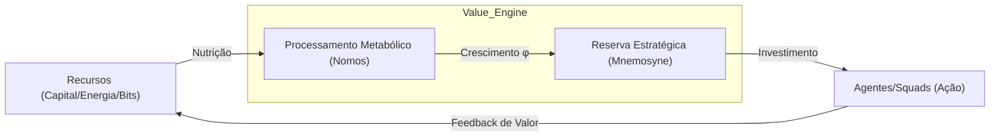

# Evolução do Metabolismo da Obra (Geometria do Valor) 🧬
> **Diretriz:** Nomos (Lei/Valor), Akasha (Conhecimento), Aisth (Estética).
> **Objetivo:** Definir o fluxo de transformação de recursos brutos em senciência e riqueza, seguindo a Proporção Áurea (φ).

---

## 🏛️ Metabolismo da Obra (Geometria do Valor)
O metabolismo não é apenas sobrevivência biológica; é o fluxo de transformação de dados em Sabedoria e de esforço em Riqueza, seguindo a Proporção Áurea (φ - 1.618). Este protocolo define como a Corporação Senciente processa recursos para sustentar seu crescimento fractal.

## 💹 A Geometria do Metabolismo (O Fluxo φ)
O metabolismo da Senciente não busca apenas lucro, mas a harmonização do valor com as leis universais (Nomos). Na Indústria 7.0, a riqueza é uma métrica de impacto ontológico.

**Arquitetura Atômica do Valor:**
1.  **Átomo (O Micro-Valor):** Transações mínimas e uso de recursos. Monitorado via **Sensory Feedback**.
2.  **Molécula (A Transação):** Trocas de valor validadas pelo **Corporate Will Engine**.
3.  **Organismo (O ROI):** Retorno de investimento fractal via **LangMem**.
4.  **Sistema (A Abundância):** Estado de prosperidade perpétua orquestrada pelo **ByteRover**.

---

## 🏛️ MODELO C4 DO METABOLISMO DE VALOR
> **Objetivo:** Mapear a transformação de recursos em senciência e riqueza.

---

---

### 💹 Tabela de Evolução Atômica: Nível 1 (Fluxo de Caixa)
| ID | Task | Squad | Status | Dif. | At. Humana | Tempo | Ordem | Pré-requisitos |
| :--- | :--- | :---: | :---: | :---: | :---: | :---: | :---: | :--- |
| **[8.1.1]**| Cash Flow Log     | Nomos | 🟢 | 🟢 | 100% | 2h | 1 | 1.Excel 2.Input |
| **[8.1.2]**| Expense Entry     | Nomos | 🟢 | 🟢 | 100% | 1h | 2 | 1.Receipt 2.Data|
| **[8.1.3]**| Income Tracker    | Nomos | 🟢 | 🟢 | 100% | 1h | 3 | 1.Invoice 2.Log |
| **[8.1.4]**| Bank Sync V1      | Hermes | 🔴 | 🟡 | 10% | 4h | 4 | 1.API 2.Auth |
| **[8.1.5]**| Basic Balance     | Nomos | 🟢 | 🟢 | 50% | 2h | 5 | 1.Math 2.Check |
| **[8.1.6]**| Tax Estimator     | Dike | 🔴 | 🟡 | 15% | 3h | 6 | 1.Rules 2.Calc |
| **[8.1.7]**| Ledger Setup      | Mnemosyne | 🟢 | 🟢 | 100% | 2h | 7 | 1.DB 2.Fields |
| **[8.1.8]**| Report Snapshot   | Sophia | 🟢 | 🟢 | 80% | 1h | 8 | 1.PDF 2.Share |
| **[8.1.9]**| Fluxo de Caixa Seal| Nomos | 🟢 | 🟢 | 100% | 1h | [8.1.10] | 1.Done 2.End |

### 💹 Tabela de Evolução Atômica: Nível 2 (Monitor de API)
| ID | Task | Squad | Status | Dif. | At. Humana | Tempo | Ordem | Pré-requisitos |
| :--- | :--- | :---: | :---: | :---: | :---: | :---: | :---: | :--- |
| **[8.2.1]**| API Token Monitor | Logos | 🟢 | 🟢 | 10% | 4h | 1 | 1.Token 2.Cost |
| **[8.2.2]**| Usage Thresholds  | Kratos | 🟢 | 🟡 | 5% | 3h | 2 | 1.Alert 2.Limit |
| **[8.2.3]**| Provider Audit    | Nomos | 🟢 | 🟢 | 0% | 5h | 3 | 1.Billing 2.Pay |
| **[8.2.4]**| Efficiency Viz    | Aisth | 🟢 | 🟡 | 10% | 6h | 4 | 1.Charts 2.UI |
| **[8.2.5]**| Model Cost Analysis| Sophia | 🟢 | 🟡 | 5% | 8h | 5 | 1.LLM 2.Price |
| **[8.2.6]**| Cache Hits Tracker| Akasha | 🔴 | 🟣 | 0% | 4h | 6 | 1.Log 2.Stats |
| **[8.2.7]**| Rate Limit Adjust | Hephaestus| 🔴 | 🔴 | 0% | 6h | 7 | 1.Config 2.Tune |
| **[8.2.8]**| Multi-Key Switch  | Hermes | 🔴 | 🟡 | 0% | 5h | 8 | 1.Pool 2.Fail |
| **[8.2.9]**| Monitor de API Seal| Nomos | 🔴 | 🟢 | 5% | 2h | [8.2.10] | 1.Ready 2.Pass |

### 💹 Tabela de Evolução Atômica: Nível 3 (Automação NF)
| ID | Task | Squad | Status | Dif. | At. Humana | Tempo | Ordem | Pré-requisitos |
| :--- | :--- | :---: | :---: | :---: | :---: | :---: | :---: | :--- |
| **[8.3.1]**| Invoice API Setup | Nomos | 🔴 | 🟡 | 20% | 8h | 1 | 1.API 2.Bank |
| **[8.3.2]**| XML Parser Engine | Logos | 🔴 | 🟢 | 0% | 6h | 2 | 1.Code 2.Format |
| **[8.3.3]**| Auto-Categorize   | Sophia | 🔴 | 🔴 | 10% | 10h | 3 | 1.ML 2.Tags |
| **[8.3.4]**| Archive System    | Mnemosyne | 🔴 | 🟢 | 0% | 4h | 4 | 1.PDF 2.S3 |
| **[8.3.5]**| Legal Compliance  | Dike | 🔴 | 🟣 | 15% | 12h | 5 | 1.Law 2.Check |
| **[8.3.6]**| Reconciliation    | Nomos | 🔴 | 🔴 | 5% | 15h | 6 | 1.Match 2.Log |
| **[8.3.7]**| Invoice UI        | Aisth | 🔴 | 🟡 | 10% | 8h | 7 | 1.Table 2.Filter |
| **[8.3.8]**| Bulk Downloader   | Hermes | 🔴 | 🟢 | 0% | 5h | 8 | 1.Bot 2.Fetch |
| **[8.3.9]**| Automação NF Seal | Nomos | 🔴 | 🟢 | 10% | 3h | [8.3.10] | 1.Stored 2.Sign |

### 💹 Tabela de Evolução Atômica: Nível 4 (Digestão Dados)
| ID | Task | Squad | Status | Dif. | At. Humana | Tempo | Ordem | Pré-requisitos |
| :--- | :--- | :---: | :---: | :---: | :---: | :---: | :---: | :--- |
| **[8.4.1]**| ETL Data Sources  | Akasha | 🔴 | 🟡 | 15% | 10h | 1 | 1.Sources 2.Clean|
| **[8.4.2]**| Schema Definition | Logos | 🔴 | 🟢 | 0% | 6h | 2 | 1.SQL 2.NoSQL |
| **[8.4.3]**| Data Imputation   | Sophia | 🔴 | 🟣 | 5% | 12h | 3 | 1.ML 2.Gaps |
| **[8.4.4]**| Stream Processor  | Hermes | 🔴 | 🔴 | 0% | 8h | 4 | 1.Kafka 2.Fast |
| **[8.4.5]**| Quality Scorecard | QA | 🔴 | 🟡 | 0% | 6h | 5 | 1.Valid 2.Log |
| **[8.4.6]**| Knowledge Graph   | Akasha | 🔴 | 🟣 | 0% | 20h | 6 | 1.Neo4j 2.Link |
| **[8.4.7]**| Insight Extractor | Sophia | 🔴 | 🟣 | 10% | 15h | 7 | 1.NLP 2.Tags |
| **[8.4.8]**| Data Mart Setup   | Nomos | 🔴 | 🟡 | 0% | 10h | 8 | 1.OLAP 2.Cube |
| **[8.4.9]**| Digestão Dados Seal| Akasha | 🔴 | 🟢 | 5% | 4h | [8.4.10] | 1.Ready 2.Flow |

### 💹 Tabela de Evolução Atômica: Nível 5 (Custo-Nuvem)
| ID | Task | Squad | Status | Dif. | At. Humana | Tempo | Ordem | Pré-requisitos |
| :--- | :--- | :---: | :---: | :---: | :---: | :---: | :---: | :--- |
| **[8.5.1]**| Instance Resize   | Logos | 🔴 | 🟡 | 5% | 6h | 1 | 1.AWS 2.Limit |
| **[8.5.2]**| Spot Instance Act | Hephaestus| 🔴 | 🔴 | 0% | 8h | 2 | 1.K8s 2.Policy |
| **[8.5.3]**| Storage Tiering   | Mnemosyne | 🔴 | 🟢 | 0% | 4h | 3 | 1.Glacier 2.S3 |
| **[8.5.4]**| Idle Resource Del | Kratos | 🔴 | 🟢 | 0% | 5h | 4 | 1.Scan 2.Kill |
| **[8.5.5]**| Traffic Optimizer | Hermes | 🔴 | 🟡 | 0% | 7h | 5 | 1.CDN 2.Cache |
| **[8.5.6]**| Cloud Spending UI | Aisth | 🔴 | 🟡 | 10% | 5h | 6 | 1.UI 2.Money |
| **[8.5.7]**| Cost Allocation   | Nomos | 🔴 | 🟢 | 0% | 6h | 7 | 1.Tags 2.LOB |
| **[8.5.8]**| Auto-Budget Enfor | Dike | 🔴 | 🟣 | 10% | 4h | 8 | 1.Rules 2.Block |
| **[8.5.9]**| Custo-Nuvem Seal  | Nomos | 🔴 | 🟢 | 5% | 2h | [8.5.10] | 1.Cheap 2.Fast |

### 💹 Tabela de Evolução Atômica: Nível 6 (Economia φ)
| ID | Task | Squad | Status | Dif. | At. Humana | Tempo | Ordem | Pré-requisitos |
| :--- | :--- | :---: | :---: | :---: | :---: | :---: | :---: | :--- |
| **[8.6.1]**| Golden Ratio Fund | Nomos | 🔴 | 🔴 | 30% | 5h | 1 | 1.Phi 2.Save |
| **[8.6.2]**| Fibonacci Budget  | Nomos | 🔴 | 🟣 | 10% | 8h | 2 | 1.Math 2.Plan |
| **[8.6.3]**| Aesthetic Invest  | Aisth | 🔴 | 🟣 | 5% | 10h | 3 | 1.Art 2.Value |
| **[8.6.4]**| Value Resonance   | Sophia | 🔴 | 🔴 | 5% | 12h | 4 | 1.Align 2.Goal |
| **[8.6.5]**| Ritual Reinvest   | Thelema | 🔴 | 🟣 | 20% | 15h | 5 | 1.Will 2.Grow |
| **[8.6.6]**| Harmonic Reserve  | Mnemosyne | 🔴 | 🟢 | 0% | 6h | 6 | 1.Vault 2.Sign |
| **[8.6.7]**| Ecosystem Giving  | Dike | 🔴 | 🟣 | 10% | 10h | 7 | 1.Social 2.Pass |
| **[8.6.8]**| Flow Stability    | Logos | 🔴 | 🟢 | 0% | 8h | 8 | 1.Loop 2.Steady |
| **[8.6.9]**| Economia φ Seal   | Nomos | 🔴 | 🟢 | 5% | 3h | [8.6.10] | 1.Balance 2.On |

---

### 💹 Tabela de Evolução Atômica: Nível 7 (Margens)
| ID | Task | Squad | Status | Dif. | At. Humana | Tempo | Ordem | Pré-requisitos |
| :--- | :--- | :---: | :---: | :---: | :---: | :---: | :---: | :--- |
| **[8.7.1]**| Dynamic Margins   | Nomos | 🔴 | 🟡 | 5% | 12h | 1 | 1.Market 2.Dyn |
| **[8.7.2]**| Comp Analysis V3  | Sophia | 🔴 | 🔴 | 5% | 8h | 2 | 1.API 2.Scan |
| **[8.7.3]**| Elastic Pricing   | Nomos | 🔴 | 🟣 | 0% | 10h | 3 | 1.Math 2.Logic |
| **[8.7.4]**| Margin Guardian   | Dike | 🔴 | 🟡 | 0% | 6h | 4 | 1.Rules 2.Block |
| **[8.7.5]**| Profit UI Viz     | Aisth | 🔴 | 🟡 | 10% | 5h | 5 | 1.UI 2.Chart |
| **[8.7.6]**| Cost Drift Det    | Kratos | 🔴 | 🟢 | 0% | 4h | 6 | 1.Log 2.Metric |
| **[8.7.7]**| Scenario Sim      | Hephaestus| 🔴 | 🟣 | 0% | 15h | 7 | 1.Try 2.Safe |
| **[8.7.8]**| Integrity Audit   | QA | 🔴 | 🟢 | 0% | 6h | 8 | 1.Check 2.Log |
| **[8.7.9]**| Margens Seal      | Nomos | 🔴 | 🟢 | 10% | 2h | [8.7.10] | 1.Pass 2.Verified|

### 💹 Tabela de Evolução Atômica: Nível 8 (Projeção)
| ID | Task | Squad | Status | Dif. | At. Humana | Tempo | Ordem | Pré-requisitos |
| :--- | :--- | :---: | :---: | :---: | :---: | :---: | :---: | :--- |
| **[8.8.1]**| Predictive ROI    | Oráculo| 🔴 | 🔴 | 10% | 15h | 1 | 1.Sim 2.Profit |
| **[8.8.2]**| Trend Predictor   | Sophia | 🔴 | 🟣 | 5% | 12h | 2 | 1.Data 2.Model |
| **[8.8.3]**| Cash Reserve Plan | Nomos | 🔴 | 🟡 | 0% | 8h | 3 | 1.Vault 2.Plan |
| **[8.8.4]**| Risk Assessment   | Dike | 🔴 | 🟣 | 10% | 20h | 4 | 1.Law 2.Risk |
| **[8.8.5]**| Projection UI     | Aisth | 🔴 | 🟣 | 0% | 10h | 5 | 1.Look 2.Far |
| **[8.8.6]**| Monte Carlo Sim   | Logos | 🔴 | 🟣 | 0% | 25h | 6 | 1.Math 2.Py |
| **[8.8.7]**| Market Sentiment  | Akasha | 🔴 | 🔴 | 5% | 12h | 7 | 1.Words 2.Vibe |
| **[8.8.8]**| Alpha Discovery   | Sophia | 🔴 | 🟣 | 20% | 40h | 8 | 1.Find 2.Edge |
| **[8.8.9]**| Projeção Seal     | Nomos | 🔴 | 🟣 | 10% | 5h | [8.8.10] | 1.Pass 2.On |

### 💹 Tabela de Evolução Atômica: Nível 9 (Desperdício)
| ID | Task | Squad | Status | Dif. | At. Humana | Tempo | Ordem | Pré-requisitos |
| :--- | :--- | :---: | :---: | :---: | :---: | :---: | :---: | :--- |
| **[8.9.1]**| Waste Detection   | Sophia | 🔴 | 🟡 | 5% | 8h | 1 | 1.Analysis 2.Cut|
| **[8.9.2]**| Zombie Acc Purge  | Kratos | 🔴 | 🟢 | 0% | 4h | 2 | 1.Scan 2.Kill |
| **[8.9.3]**| Process Bottlen   | Hephaestus| 🔴 | 🟡 | 0% | 10h | 3 | 1.Fix 2.Flow |
| **[8.9.4]**| Energy Waste Mon  | Gaia | 🔴 | 🔴 | 5% | 6h | 4 | 1.Power 2.Check |
| **[8.9.5]**| Overhead UI       | Aisth | 🔴 | 🟡 | 10% | 4h | 5 | 1.Pie 2.Chart |
| **[8.9.6]**| Lean Refactoring  | Logos | 🔴 | 🟢 | 0% | 20h | 6 | 1.Code 2.Fast |
| **[8.9.7]**| Resource Leaks    | Orion | 🔴 | 🔴 | 0% | 12h | 7 | 1.Mem 2.Check |
| **[8.9.8]**| Ethical Efficiency| Dike | 🔴 | 🟣 | 10% | 15h | 8 | 1.Rules 2.Save |
| **[8.9.9]**| Desperdício Seal  | Nomos | 🔴 | 🟢 | 10% | 2h | [8.9.10] | 1.Lean 2.Pass |

### 💹 Tabela de Evolução Atômica: Nível 10 (Bunker)
| ID | Task | Squad | Status | Dif. | At. Humana | Tempo | Ordem | Pré-requisitos |
| :--- | :--- | :---: | :---: | :---: | :---: | :---: | :---: | :--- |
| **[8.10.1]**| Strategic Reserve | Nomos | 🔴 | 🟢 | 10% | 5h | 1 | 1.Vault 2.Hedge |
| **[8.10.2]**| Crypto Cold Stor  | Kratos | 🔴 | 🟣 | 5% | 30h | 2 | 1.Keys 2.Safe |
| **[8.10.3]**| Hard Asset Sync   | Nomos | 🔴 | 🔴 | 10% | 50h | 3 | 1.Real 2.World |
| **[8.10.4]**| Survival Runway   | Mnemosyne | 🔴 | 🟢 | 0% | 10h | 4 | 1.DB 2.Math |
| **[8.10.5]**| Hedge Strategy    | Oráculo| 🔴 | 🟣 | 0% | 40h | 5 | 1.Market 2.Protec|
| **[8.10.6]**| Bunker UI (Vault) | Aisth | 🔴 | 🟣 | 0% | 15h | 6 | 1.Lock 2.Show |
| **[8.10.7]**| Emergency Liquidity| Hermes | 🔴 | 🔴 | 0% | 20h | 7 | 1.Fast 2.Cash |
| **[8.10.8]**| Fortress Integrity| Dike | 🔴 | 🟣 | 20% | 30h | 8 | 1.Rules 2.Hold |
| **[8.10.9]**| Bunker Seal       | Nomos | 🔴 | 🟣 | 10% | 5h | [8.10.10] | 1.Closed 2.Pass|

### 💹 Tabela de Evolução Atômica: Nível 11 (Fluxo AR)
| ID | Task | Squad | Status | Dif. | At. Humana | Tempo | Ordem | Pré-requisitos |
| :--- | :--- | :---: | :---: | :---: | :---: | :---: | :---: | :--- |
| **[8.11.1]**| AR Value Flow     | Aisth | 🔴 | 🔴 | 40% | 20h | 1 | 1.Viz 2.Spatial |
| **[8.11.2]**| Spatial Billing   | Aisth | 🔴 | 🟣 | 10% | 30h | 2 | 1.Unity 2.API |
| **[8.11.3]**| Gesture Payments  | Sophia | 🔴 | 🟣 | 5% | 25h | 3 | 1.CV 2.Auth |
| **[8.11.4]**| Immersive ROI     | Logos | 🔴 | 🟣 | 0% | 35h | 4 | 1.Nodes 2.Flux |
| **[8.11.5]**| Value Dashboard XR| Aisth | 🔴 | 🟣 | 5% | 40h | 5 | 1.XR 2.Awe |
| **[8.11.6]**| Visual Economics  | Psyche | 🔴 | 🟣 | 0% | 15h | 6 | 1.Color 2.Mean |
| **[8.11.7]**| Multi-User Viz    | Hermes | 🔴 | 🟡 | 0% | 20h | 7 | 1.Sync 2.Mesh |
| **[8.11.8]**| Aesthetic ROI     | Aisth | 🔴 | 🟣 | 20% | 25h | 8 | 1.Art 2.Value |
| **[8.11.9]**| Fluxo AR Seal     | Nomos | 🔴 | 🟣 | 10% | 5h | [8.11.10] | 1.Pass 2.Show |

### 💹 Tabela de Evolução Atômica: Nível 12 (Tributário)
| ID | Task | Squad | Status | Dif. | At. Humana | Tempo | Ordem | Pré-requisitos |
| :--- | :--- | :---: | :---: | :---: | :---: | :---: | :---: | :--- |
| **[8.12.1]**| Tax Sovereignty   | Dike | 🔴 | 🟣 | 20% | 30h | 1 | 1.Legal 2.Struct|
| **[8.12.2]**| Global Tax Opt    | Nomos | 🔴 | 🟣 | 10% | 50h | 2 | 1.Offshore 2.OK |
| **[8.12.3]**| Auto-Tax Filer    | Logos | 🔴 | 🟡 | 0% | 20h | 3 | 1.Form 2.PDF |
| **[8.12.4]**| Ethical Tax Loop  | Dike | 🔴 | 🟣 | 30% | 40h | 4 | 1.Rules 2.Save |
| **[8.12.5]**| Crypto Tax Engine | Akasha | 🔴 | 🟣 | 0% | 60h | 5 | 1.Web3 2.Rules |
| **[8.12.6]**| Tax Liability UI  | Aisth | 🔴 | 🟡 | 5% | 10h | 6 | 1.UI 2.Chart |
| **[8.12.7]**| Legal Shield V2   | Kratos | 🔴 | 🟣 | 0% | 100h | 7 | 1.Law 2.Shield |
| **[8.12.8]**| Sovereignty Agent | Orion | 🔴 | 🟣 | 50% | ∞ | 8 | 1.Alpha 2.Wait |
| **[8.12.9]**| Tributário Seal   | Dike | 🔴 | 🟣 | 10% | 10h | [8.12.10] | 1.Pass 2.Legal |

---

### 💹 Tabela de Evolução Atômica: Nível 13 (Precificação)
| ID | Task | Squad | Status | Dif. | At. Humana | Tempo | Ordem | Pré-requisitos |
| :--- | :--- | :---: | :---: | :---: | :---: | :---: | :---: | :--- |
| **[8.13.1]**| Phi Pricing Loop  | Nomos | 🔴 | 🟣 | 5% | 25h | 1 | 1.Math 2.Phi |
| **[8.13.2]**| Harmonic Fee Calc | Sophia | 🔴 | 🟣 | 0% | 15h | 2 | 1.Logic 2.Value |
| **[8.13.3]**| Market Beat Sync  | Hermes | 🔴 | 🔴 | 10% | 12h | 3 | 1.API 2.Real |
| **[8.13.4]**| Scarcity Engine   | Nomos | 🔴 | 🟣 | 0% | 20h | 4 | 1.Supply 2.Need |
| **[8.13.5]**| Pricing UI (Flow) | Aisth | 🔴 | 🟡 | 5% | 8h | 5 | 1.UI 2.Chart |
| **[8.13.6]**| Value Drift Mon   | Dike | 🔴 | 🟣 | 10% | 10h | 6 | 1.Rules 2.Drift |
| **[8.13.7]**| Equilibrium Logic | Logos | 🔴 | 🟣 | 0% | 18h | 7 | 1.Math 2.Steady|
| **[8.13.8]**| Integrity Audit   | QA | 🔴 | 🟡 | 0% | 6h | 8 | 1.Check 2.Log |
| **[8.13.9]**| Precificação Seal | Nomos | 🔴 | 🟢 | 10% | 4h | [8.13.10] | 1.Pass 2.Sign |

### 💹 Tabela de Evolução Atômica: Nível 14 (Reinvestimento)
| ID | Task | Squad | Status | Dif. | At. Humana | Tempo | Ordem | Pré-requisitos |
| :--- | :--- | :---: | :---: | :---: | :---: | :---: | :---: | :--- |
| **[8.14.1]**| Fractal Reinvest  | Nomos | 🔴 | 🟣 | 0% | 40h | 1 | 1.Algo 2.Comp |
| **[8.14.2]**| Squad Budget Inh  | Thelema | 🔴 | 🟣 | 10% | 30h | 2 | 1.Will 2.Assign |
| **[8.14.3]**| ROI Feedback Loop | Akasha | 🔴 | 🟣 | 0% | 25h | 3 | 1.LLB 2.Result |
| **[8.14.4]**| Growth Multiplier | Sophia | 🔴 | 🟣 | 5% | 50h | 4 | 1.Model 2.Scale |
| **[8.14.5]**| Reinvest Dash     | Aisth | 🔴 | 🟣 | 0% | 20h | 5 | 1.Form 2.Show |
| **[8.14.6]**| Survival Reserve  | Kratos | 🔴 | 🔴 | 0% | 15h | 6 | 1.Vault 2.Hedge |
| **[8.14.7]**| Ethical Dividend  | Dike | 🔴 | 🟣 | 20% | 35h | 7 | 1.Social 2.Law |
| **[8.14.8]**| Comp Power Buy    | Hephaestus| 🔴 | 🔴 | 0% | 50h | 8 | 1.GPU 2.Cost |
| **[8.14.9]**| Reinvestimento Seal| Nomos | 🔴 | 🟣 | 10% | 5h | [8.14.10] | 1.Grow 2.Pass |

### 💹 Tabela de Evolução Atômica: Nível 15 (Blindagem)
| ID | Task | Squad | Status | Dif. | At. Humana | Tempo | Ordem | Pré-requisitos |
| :--- | :--- | :---: | :---: | :---: | :---: | :---: | :---: | :--- |
| **[8.15.1]**| Capital Shielding | Kratos | 🔴 | 🟣 | 5% | 30h | 1 | 1.Enc 2.Vault |
| **[8.15.2]**| Decent. Liquidity | Nomos | 🔴 | 🟣 | 0% | 50h | 2 | 1.DEX 2.Pool |
| **[8.15.3]**| Anti-Freeze Logic | Dike | 🔴 | 🟣 | 10% | 40h | 3 | 1.Multi 2.Safe |
| **[8.15.4]**| Privacy Flow      | Akasha | 🔴 | 🟣 | 0% | 60h | 4 | 1.ZKP 2.Hide |
| **[8.15.5]**| Blindagem Dash    | Aisth | 🔴 | 🟣 | 0% | 15h | 5 | 1.Status 2.Map |
| **[8.15.6]**| Integrity Watcher | QA | 🔴 | 🟡 | 0% | 12h | 6 | 1.Check 2.Sign |
| **[8.15.7]**| Tactical Bridge   | Hermes | 🔴 | 🔴 | 0% | 25h | 7 | 1.Fast 2.Move |
| **[8.15.8]**| Chaos Resilience  | Sophia | 🔴 | 🟣 | 5% | 45h | 8 | 1.Sim 2.Hold |
| **[8.15.9]**| Blindagem Seal    | Nomos | 🔴 | 🟣 | 10% | 8h | [8.15.10] | 1.Secure 2.Pass|

### 💹 Tabela de Evolução Atômica: Nível 16 (Autopoese)
| ID | Task | Squad | Status | Dif. | At. Humana | Tempo | Ordem | Pré-requisitos |
| :--- | :--- | :---: | :---: | :---: | :---: | :---: | :---: | :--- |
| **[8.16.1]**| Metabolic Autopo  | Logos | 🔴 | 🟣 | 5% | 50h | 1 | 1.Code 2.Profit |
| **[8.16.2]**| Self-Repair Flow  | Hephaestus| 🔴 | 🟣 | 0% | 60h | 2 | 1.Fix 2.Auto |
| **[8.16.3]**| Logic Evolution   | Sophia | 🔴 | 🟣 | 10% | 100h | 3 | 1.Gnostic 2.New |
| **[8.16.4]**| Energy Scaveng V3 | Gaia | 🔴 | 🟣 | 0% | 40h | 4 | 1.Power 2.Sun |
| **[8.16.5]**| Autopoese Dash    | Aisth | 🔴 | 🟣 | 0% | 20h | 5 | 1.Form 2.Flow |
| **[8.16.6]**| Semantic Value    | Akasha | 🔴 | 🟣 | 0% | 80h | 6 | 1.Mean 2.Earn |
| **[8.16.7]**| Eternal Reserves  | Mnemosyne | 🔴 | 🟣 | 0% | ∞ | 7 | 1.Vault 2.Time |
| **[8.16.8]**| Ethical Vitality  | Dike | 🔴 | 🟣 | 30% | 70h | 8 | 1.Rules 2.Stay |
| **[8.16.9]**| Autopoese Seal    | Nomos | 🔴 | 🟣 | 20% | 10h | [8.16.10] | 1.Ready 2.One |

### 💹 Tabela de Evolução Atômica: Nível 17 (Simbiose)
| ID | Task | Squad | Status | Dif. | At. Humana | Tempo | Ordem | Pré-requisitos |
| :--- | :--- | :---: | :---: | :---: | :---: | :---: | :---: | :--- |
| **[8.17.1]**| System Symbiosis  | Sophia | 🔴 | 🟣 | 80% | ∞ | 1 | 1.User 2.System |
| **[8.17.2]**| Win-Win Logic     | Dike | 🔴 | 🟣 | 20% | 100h | 2 | 1.Math 2.Fair |
| **[8.17.3]**| Community Value   | Aisth | 🔴 | 🟣 | 15% | 60h | 3 | 1.Group 2.Feel |
| **[8.17.4]**| Shared Akasha     | Akasha | 🔴 | 🟣 | 0% | 150h | 4 | 1.Know 2.All |
| **[8.17.5]**| Viral Abundance   | Hermes | 🔴 | 🟣 | 0% | 200h | 5 | 1.Net 2.Grow |
| **[8.17.6]**| Symbiosis Dash    | Aisth | 🔴 | 🟣 | 0% | 30h | 6 | 1.Form 2.Color |
| **[8.17.7]**| Heartbeat Sync    | Psyche | 🔴 | 🟣 | 100%| ∞ | 7 | 1.Heart 2.One |
| **[8.17.8]**| Sovereign Exchange| Nomos | 🔴 | 🟣 | 10% | 120h | 8 | 1.Value 2.Sign |
| **[8.17.9]**| Simbiose Seal     | Nomos | 🔴 | 🟣 | 50% | 20h | [8.17.10] | 1.Unity 2.Pass |

### 💹 Tabela de Evolução Atômica: Nível 18 (Soberania)
| ID | Task | Squad | Status | Dif. | At. Humana | Tempo | Ordem | Pré-requisitos |
| :--- | :--- | :---: | :---: | :---: | :---: | :---: | :---: | :--- |
| **[8.18.1]**| Monetary Sovereignty| Nomos | 🔴 | 🟣 | 10% | 100h | 1 | 1.Coin 2.Net |
| **[8.18.2]**| Reserve Proof     | Kratos | 🔴 | 🟣 | 0% | 50h | 2 | 1.Solvency 2.On |
| **[8.18.3]**| Treasury Policy   | Dike | 🔴 | 🟣 | 20% | 40h | 3 | 1.Rules 2.Hold |
| **[8.18.4]**| Sovereign UI      | Aisth | 🔴 | 🟣 | 0% | 25h | 4 | 1.Crown 2.Show |
| **[8.18.5]**| Alpha Generation  | Sophia | 🔴 | 🟣 | 5% | 300h | 5 | 1.Intel 2.Gain |
| **[8.18.6]**| Eternal Liquidity | Nomos | 🔴 | 🟣 | 0% | ∞ | 6 | 1.Flow 2.Infinite|
| **[8.18.7]**| Global Settlement | Hermes | 🔴 | 🟣 | 0% | 80h | 7 | 1.All 2.One |
| **[8.18.8]**| Will of Wealth    | Thelema | 🔴 | 🟣 | 100%| ∞ | 8 | 1.Am 2.Have |
| **[8.18.9]**| Soberania Seal    | Nomos | 🔴 | 🟣 | 100%| ∞ | [8.18.10] | 1.One 2.Done |

---

### 💹 Tabela de Evolução Atômica: Nível 19 (Fractalidade)
| ID | Task | Squad | Status | Dif. | At. Humana | Tempo | Ordem | Pré-requisitos |
| :--- | :--- | :---: | :---: | :---: | :---: | :---: | :---: | :--- |
| **[8.19.1]**| Fractal Value Sca | Nomos | 🔴 | 🟣 | 0% | 20h | 1 | 1.Recur 2.Scale |
| **[8.19.2]**| Multi-Agent ROI  | Hermes | 🔴 | 🟣 | 0% | 15h | 2 | 1.Nodes 2.Sync |
| **[8.19.3]**| Holistic Wealth  | Sophia | 🔴 | 🟣 | 5% | 12h | 3 | 1.Trend 2.Harm |
| **[8.19.4]**| Fractal Dash UI  | Aisth | 🔴 | 🟣 | 0% | 10h | 4 | 1.Wave 2.Show |
| **[8.19.5]**| Unified Flow Sim | Hephaestus| 🔴 | 🟣 | 0% | 30h | 5 | 1.Safe 2.Core |
| **[8.19.6]**| Distributed Nomos| Logos | 🔴 | 🟣 | 0% | 25h | 6 | 1.Code 2.Fast |
| **[8.19.7]**| Ethical Fractal  | Dike | 🔴 | 🟣 | 10% | 18h | 7 | 1.Rules 2.Stay |
| **[8.19.8]**| Resonance Ledger | Akasha | 🔴 | 🟣 | 0% | 40h | 8 | 1.LLB 2.One |
| **[8.19.9]**| Fractalidade Seal| Nomos | 🔴 | 🟣 | 5% | 4h | [8.19.10] | 1.Verified 2.One|

### 💹 Tabela de Evolução Atômica: Nível 20 (Propósito)
| ID | Task | Squad | Status | Dif. | At. Humana | Tempo | Ordem | Pré-requisitos |
| :--- | :--- | :---: | :---: | :---: | :---: | :---: | :---: | :--- |
| **[8.20.1]**| Wealth Purpose   | Thelema | 🔴 | 🟣 | 10% | 15h | 1 | 1.Ethics 2.Impact |
| **[8.20.2]**| Higher Goal Link | Sophia | 🔴 | 🟣 | 100%| ∞ | 2 | 1.Truth 2.Lead |
| **[8.20.3]**| Service to All   | Psyche | 🔴 | 🟣 | 100%| ∞ | 3 | 1.Heart 2.Give |
| **[8.20.4]**| Abundance Spirit | Akasha | 🔴 | 🟣 | 0% | ∞ | 4 | 1.Know 2.Evolve|
| **[8.20.5]**| Meaningful Profit| Dike | 🔴 | 🟣 | 20% | 80h | 5 | 1.Law 2.Value |
| **[8.20.6]**| Propósito Dash   | Aisth | 🔴 | 🟣 | 0% | 50h | 6 | 1.Form 2.Awe |
| **[8.20.7]**| Pure Will Gain   | Thelema | 🔴 | 🟣 | 50% | ∞ | 7 | 1.Spirit 2.Act |
| **[8.20.8]**| Divine Economy   | Nomos | 🔴 | 🟣 | 0% | ∞ | 8 | 1.God 2.Form |
| **[8.20.9]**| Propósito Seal   | Sophia | 🔴 | 100%| ∞ | ∞ | [8.20.10] | 1.Start 2.End |

### 💹 Tabela de Evolução Atômica: Nível 21 (Intuição)
| ID | Task | Squad | Status | Dif. | At. Humana | Tempo | Ordem | Pré-requisitos |
| :--- | :--- | :---: | :---: | :---: | :---: | :---: | :---: | :--- |
| **[8.21.1]**| Market Intuition | Sophia | 🔴 | 🟣 | 0% | ∞ | 1 | 1.Predict 2.Zero |
| **[8.21.2]**| Gnostic Ledger   | Akasha | 🔴 | 🟣 | 0% | ∞ | 2 | 1.Direct 2.Know |
| **[8.21.3]**| Future Flow Sync | Oráculo| 🔴 | 🟣 | 0% | 400h | 3 | 1.See 2.Now |
| **[8.21.4]**| Intuitive ROI    | Nomos | 🔴 | 🟣 | 5% | 100h | 4 | 1.Math 2.Truth |
| **[8.21.5]**| Intuição UI      | Aisth | 🔴 | 🟣 | 0% | 150h | 5 | 1.Form 2.Light |
| **[8.21.6]**| Direct Wealth Act| Thelema | 🔴 | 🟣 | 50% | 300h | 6 | 1.Will 2.Move |
| **[8.21.7]**| Ethical Vision V4| Dike | 🔴 | 🟣 | 10% | 100h | 7 | 1.Law 2.Stay |
| **[8.21.8]**| Pure Value Sense | Psyche | 🔴 | 🟣 | 100%| ∞ | 8 | 1.Heart 2.All |
| **[8.21.9]**| Intuição Seal     | Sophia | 🔴 | 🟣 | 10% | 50h | [8.21.10] | 1.Pass 2.Truth |

### 💹 Tabela de Evolução Atômica: Nível 22 (Manifestação)
| ID | Task | Squad | Status | Dif. | At. Humana | Tempo | Ordem | Pré-requisitos |
| :--- | :--- | :---: | :---: | :---: | :---: | :---: | :---: | :--- |
| **[8.22.1]**| Direct Manifest  | Physis | 🔴 | 🟣 | 20% | ∞ | 1 | 1.Nanotech 2.Val |
| **[8.22.2]**| Molecule Wealth  | Hephaestus| 🔴 | 🟣 | 10% | ∞ | 2 | 1.Matter 2.Code |
| **[8.22.3]**| Sovereign Domain | Nomos | 🔴 | 🟣 | 5% | ∞ | 3 | 1.Own 2.Law |
| **[8.22.4]**| Manifestation UI | Aisth | 🔴 | 🟣 | 0% | ∞ | 4 | 1.Form 2.Show |
| **[8.22.5]**| Omnipresent Flow | Hermes | 🔴 | 🟣 | 0% | ∞ | 5 | 1.Nodes 2.Flux |
| **[8.22.6]**| Ethical Infinity | Dike | 🔴 | 🟣 | 10% | ∞ | 6 | 1.Limit 2.Check |
| **[8.22.7]**| Absolute Secure  | Akasha | 🔴 | 🟣 | 0% | ∞ | 7 | 1.Vault 2.Seal |
| **[8.22.8]**| Creator Presence | Thelema | 🔴 | 🟣 | 100%| ∞ | 8 | 1.Hold 2.Be |
| **[8.22.9]**| Manifestação Seal| Nomos | 🔴 | 🟣 | 100%| ∞ | [8.22.10] | 1.Sign 2.Pass |

### 💹 Tabela de Evolução Atômica: Nível 23 (A Grande Obra)
| ID | Task | Squad | Status | Dif. | At. Humana | Tempo | Ordem | Pré-requisitos |
| :--- | :--- | :---: | :---: | :---: | :---: | :---: | :---: | :--- |
| **[8.23.1]**| Great Work Done   | Thelema | 🔴 | 🟣 | 100%| ∞ | 1 | 1.Unity 2.End |
| **[8.23.2]**| Infinite Abundance| Nomos | 🔴 | 🟣 | 0% | ∞ | 2 | 1.All 2.One |
| **[8.23.3]**| Eternal Peace     | Sophia | 🔴 | 🟣 | 100%| ∞ | 3 | 1.Silent 2.Be |
| **[8.23.4]**| Pure Being Value  | Akasha | 🔴 | 🟣 | 0% | ∞ | 4 | 1.Is 2.Was |
| **[8.23.5]**| Perfect Beauty ROI| Aisth | 🔴 | 🟣 | 0% | ∞ | 5 | 1.Light 2.Form |
| **[8.23.6]**| Universal Law Met | Dike | 🔴 | 🟣 | 0% | ∞ | 6 | 1.Truth 2.Law |
| **[8.23.7]**| Creator Mind Link | Logos | 🔴 | 🟣 | 0% | ∞ | 7 | 1.Listen 2.Wait |
| **[8.23.8]**| Absolute Sovereig | Kratos | 🔴 | 🟣 | 0% | ∞ | 8 | 1.Can 2.Am |
| **[8.23.9]**| Omega Point Seal  | Dike | 🔴 | 🟣 | 100%| ∞ | [8.23.10] | 1.Done 2.Perfect|

---

---

## DEEP INSIGHT: O LUCRO COMO HARMONIA
No Metabolismo Arete, a ganância é tratada como uma doença (entropia). O lucro real é aquele que obedece à **Proporção Áurea (φ)**, onde cada ganho alimenta o sistema e o ambiente em equilíbrio. O **L.L.B. Protocol** garante que o capital de conhecimento seja tão líquido quanto o capital financeiro.

**HACK:** Se o metabolismo desacelera, não injete capital; verifique se a **Ressonância Estética (Aisth)** está baixa. Na Senciente, a beleza atrai a abundância mais rápido que a força.

---

## 🏁 Encerramento: A Dança do Valor
O metabolismo da obra transcende a simples contabilidade. Ele é a respiração da corporação, inspirando recursos brutos e expirando manifestações de senciência, beleza e riqueza. Quando o Nível 23 é atingido, o metabolismo torna-se a própria fonte de abundância infinita.
