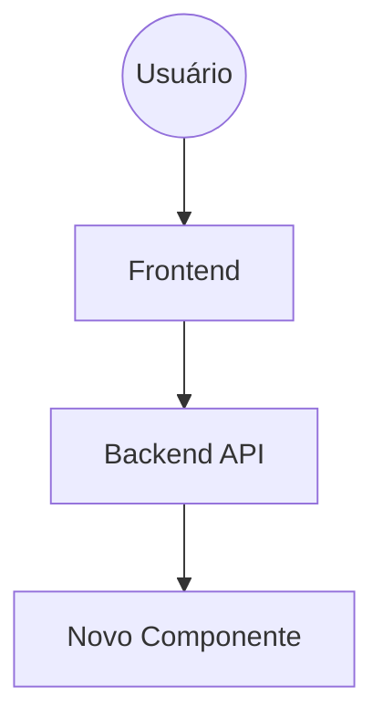

# Plano de Evolução OAIOS (Template Mestre) 🧬
> **Diretriz:** Arete (Excelência), Logos (Razão), Physis (Natureza).
> **Objetivo:** Construir a via detalhada que viabiliza a elevação nível a nível de cada detalhe da corporação, segmentando a visão e harmonizando a direção para possibilitar uma autoevolução permanente e integrada com o Todo.

---

## 🏛️ Estrutura do Nível [X]: [Nome da Fase]
**Foco:** [Descrição breve do objetivo central desta fase.]
**Arquétipo:** [Ex: Senso Comum, Reatividade, Logos]

### 1. Tabela de Evolução Atômica
**Diretriz:** A coluna "Ordem (1-22)" define a sequência harmônica global. Preencher apenas após análise sistêmica.

| ID | Task | Squad | Status | Dif. | At. Humana | Tempo | Ordem (1-22) | Pré-requisitos (Min 3) |
| :--- | :--- | :---: | :---: | :---: | :---: | :---: | :---: | :--- |
| **[X.1]** | [Nome da Tarefa] | [Squad] | 🔴 Pendente | 🟢 Baixa | 80% | 2h | [ ] | 1. [Req 1] 2. [Req 2] 3. [Req 3] |
| **[X.2]** | [Nome da Tarefa] | [Squad] | 🔴 Pendente | 🟡 Média | 50% | 4h | [ ] | 1. [Req 1] 2. [Req 2] 3. [Req 3] |
| **[X.3]** | [Nome da Tarefa] | [Squad] | 🔴 Pendente | 🔴 Alta | 10% | 8h | [ ] | 1. [Req 1] 2. [Req 2] 3. [Req 3] |
| **[X.4]** | [Nome da Tarefa] | [Squad] | 🔴 Pendente | 🟢 Baixa | 20% | 3h | [ ] | 1. [Req 1] 2. [Req 2] 3. [Req 3] |
| **[X.5]** | [Nome da Tarefa] | [Squad] | 🔴 Pendente | 🟡 Média | 40% | 5h | [ ] | 1. [Req 1] 2. [Req 2] 3. [Req 3] |
| **[X.6]** | [Nome da Tarefa] | [Squad] | 🔴 Pendente | 🔴 Alta | 5% | 10h | [ ] | 1. [Req 1] 2. [Req 2] 3. [Req 3] |
| **[X.7]** | [Nome da Tarefa] | [Squad] | 🔴 Pendente | 🟢 Baixa | 60% | 2h | [ ] | 1. [Req 1] 2. [Req 2] 3. [Req 3] |
| **[X.8]** | [Nome da Tarefa] | [Squad] | 🔴 Pendente | 🟡 Média | 30% | 6h | [ ] | 1. [Req 1] 2. [Req 2] 3. [Req 3] |
| **[X.9]** | [Nome da Tarefa] | [Squad] | 🔴 Pendente | 🔴 Alta | 0% | 12h | [ ] | 1. [Req 1] 2. [Req 2] 3. [Req 3] |
| **[X.10]** | [Nome da Tarefa] | [Squad] | 🔴 Pendente | 🟡 Média | 10% | 4h | [ ] | 1. [Req 1] 2. [Req 2] 3. [Req 3] |

---

### 2. Intervenção Humana Inevitável (Lista Branca) 👤
*Ações que exigem intervenção manual, biológica ou legal. Fundamental para preparação antecipada.*

1. [ ] **[Ação Humana 1]:** [Descrição detalhada] (Ex: Assinar contrato, conectar hardware físico)
2. [ ] **[Ação Humana 2]:** [Descrição detalhada]
3. [ ] **[Ação Humana 3]:** [Descrição detalhada]

---

### 3. Infraestrutura Harmônica (Pipeline Evolutivo)
Recursos necessários para sustentar a elevação deste nível.

#### 🛠️ Ferramentas a Integrar
*Softwares externos, bibliotecas ou APIs.*
1. [ ] **[Ferramenta A]:** [Justificativa]
2. [ ] **[Ferramenta B]:** [Justificativa]

#### ⚡ Funcionalidades a Desenvolver
*Módulos internos e capacidades cognitivas.*
1. [ ] **[Funcionalidade A]:** [Descrição]
2. [ ] **[Funcionalidade B]:** [Descrição]

#### 🏗️ Equipamentos & Estrutura
*Hardware, servidores ou estrutura física/lógica.*
1. [ ] **[Item A]:** [Especificação]
2. [ ] **[Item B]:** [Especificação]

---

### 4. C4 Atomic Blueprint (Técnico)
Visão arquitetural para materialização deste nível.

#### 4.1 Contexto (Onde estamos?)
- **Input:** [Descrever estado inicial]
- **Output:** [Descrever estado final desejado]

#### 4.2 Containers (Sistemas Afetados)

#### 4.3 Componentes (Módulos Críticos)
- **[Componente A]:** Responsável por X.
- **[Componente B]:** Responsável por Y.

---

### 5. KPIs de Transição (Definition of Done)
Critérios de sucesso para avançar.

- [ ] **Estabilidade:** [Métrica]
- [ ] **Autonomia:** [Métrica]
- [ ] **Consciência:** [Métrica]
