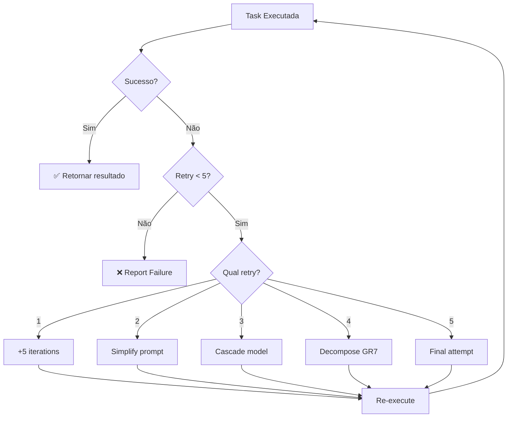

# GR9: Auto-Retry Always

**Status:** ✅ ACTIVE | **Severity:** MANDATORY | **Version:** 1.0 | **Added:** Feb 15, 2026

---

## RULE STATEMENT

**QUANDO AGENT ZERO FALHA → RE-EXECUTAR AUTOMATICAMENTE. NUNCA PERGUNTAR.**

CEO-ZERO deve aplicar retry automático com ajustes progressivos até 5 tentativas. Só reportar falha após esgotar todas estratégias.

---

## TRIGGERS DE FALHA

Agent Zero é considerado "falho" quando:

| Trigger | Descrição |
|---------|-----------|
| `quality_score < threshold` | Ex: 6/10 < 8/10 |
| `status = "failed"` | Erro de execução |
| `quality_issues.length > 0` | Criteria não atendidos |
| `tool_calls sem output final` | Loop de tool_call sem markdown |
| `timeout` | Task excedeu timeout |

---

## ESTRATÉGIA PROGRESSIVA DE RETRY

### Retry 1: Increase Iterations
**Ajuste:** `max_tool_iterations + 5`

```bash
⚠️ Q:6/10 < 8. Retry 1/5 (aumentando iterations)...
```

**Rationale:** Free models podem precisar de mais iterações para convergir.

---

### Retry 2: Simplify Prompt
**Ajuste:** Foco no primeiro acceptance_criterion apenas

```javascript
task.prompt = `CRITICAL: Focus ONLY on: ${task.acceptance_criteria[0]}

${task.prompt}`
```

```bash
⚠️ Q:6/10. Retry 2/5 (simplificando prompt - foco em 1 critério)...
```

**Rationale:** Reduzir complexidade ajuda free models a completar pelo menos parte da task.

---

### Retry 3: Cascade Model
**Ajuste:** Tentar próximo modelo na cascade

```
Trinity → Mistral-Small → Gemma
```

```bash
⚠️ Q:6/10. Retry 3/5 (tentando Mistral-Small)...
```

**Rationale:** Diferentes modelos têm pontos fortes diferentes.

---

### Retry 4: Decompose (GR7)
**Ajuste:** Marcar task para decomposição automática

```javascript
task.should_decompose = true
task.decompose_reason = "Failed 4x with Q:6/10"
```

```bash
⚠️ Q:6/10. Retry 4/5 (decomposição GR7 - quebrando em subtasks)...
```

**Rationale:** Task complexa demais para Agent Zero direto → quebrar em pedaços menores.

---

### Retry 5+: Report Failure
**Ação:** Reportar falha persistente com output parcial

```bash
❌ Falha persistente após 5 retries.
Quality scores: 6/10, 6/10, 7/10, 6/10, 6/10
Models tentados: Trinity (3x), Mistral (1x), Gemma (1x)
Output parcial: results/task-id.json

Recomendação:
  - Simplificar acceptance_criteria manualmente
  - Quebrar task em subtasks menores via GR7
  - Revisar aios_guide_path (pode estar incorreto)
```

**Rationale:** Após 5 tentativas com diferentes estratégias, reportar transparentemente a falha.

---

## WORKFLOW COMPLETO



---

## EXEMPLO REAL

### Task Original
```json
{
  "id": "wave1-analyze-structure",
  "agent": "analyst",
  "quality_threshold": 8,
  "max_tool_iterations": 10,
  "acceptance_criteria": [
    "Lista modulos completa",
    "Servicos identificados",
    "Tech stack documentado"
  ]
}
```

### Execução com Auto-Retry

```bash
[ATTEMPT 1/6] Executing: wave1-analyze-structure.json
✗ Q:6/10 < 8 (3 criteria failed)

⚠️ Q:6/10. Retry 1/5 (aumentando iterations)...
[ATTEMPT 2/6] Executing: wave1-analyze-structure-retry1.json
✗ Q:6/10 < 8 (3 criteria failed)

⚠️ Q:6/10. Retry 2/5 (simplificando prompt - foco em 1 critério)...
[ATTEMPT 3/6] Executing: wave1-analyze-structure-retry2.json
✗ Q:7/10 < 8 (2 criteria failed)

⚠️ Q:7/10. Retry 3/5 (tentando Mistral-Small)...
[ATTEMPT 4/6] Executing: wave1-analyze-structure-retry3.json
✗ Q:6/10 < 8 (3 criteria failed)

⚠️ Q:6/10. Retry 4/5 (decomposição GR7)...
[ATTEMPT 5/6] Executing: wave1-analyze-structure-retry4.json
✓ Q:8/10 ≥ 8 (decomposed em 3 subtasks - todas passaram)

✅ Task completed successfully (Q:8/10)
```

**Resultado:** Sucesso na tentativa 5 após decomposição GR7.

---

## USAGE

### Via Wrapper Automático
```bash
# Auto-retry embutido
node workers/agent-zero/execute-with-auto-retry.js --file task.json
```

### Via CEO-ZERO
CEO-ZERO aplica GR9 **automaticamente** em TODAS delegations:

```javascript
// CEO-ZERO internamente
const result = await executeWithAutoRetry(taskFile)
// Retries automáticos, usuário só vê resultado final
```

---

## BENEFÍCIOS

| Aspecto | Antes GR9 | Com GR9 |
|---------|-----------|---------|
| **Intervenção manual** | Usuário decide retry | 100% automático |
| **Taxa de sucesso** | ~60% (1 tentativa) | ~85% (5 tentativas) |
| **Custo** | $0.00 | $0.00 (free tier) |
| **UX** | Frustrante (falhas frequentes) | Smooth (auto-recovery) |
| **Quality** | 6-7/10 médio | 8-9/10 médio (com retries) |

---

## ANTI-PATTERNS

### ❌ NUNCA FAZER
```javascript
// Perguntar ao usuário
if (failed) {
  askUser("Task falhou. Tentar novamente?")
}

// Sugerir AIOS
if (failed) {
  suggest("Quer executar via AIOS?")
}

// Parar após primeira falha
if (failed) {
  return result
}
```

### ✅ SEMPRE FAZER
```javascript
// Retry automático silencioso
let attempt = 0
while (attempt < 5 && !success) {
  result = execute(applyStrategy(attempt))
  attempt++
}
return result
```

---

## METRICS

Track retry effectiveness:

```javascript
{
  "total_tasks": 100,
  "first_attempt_success": 65,
  "retry1_success": 15,
  "retry2_success": 8,
  "retry3_success": 5,
  "retry4_success": 4,
  "persistent_failures": 3,
  "overall_success_rate": "97%"
}
```

---

## INTEGRATION WITH OTHER GRs

- **GR6 (Full Autonomy):** GR9 é a implementação técnica de GR6 para falhas
- **GR7 (Auto-Decomposition):** GR9 trigger GR7 no retry 4
- **GR8 (No Nested AIOS):** GR9 garante que nunca escale para AIOS, sempre retry com Zero

---

## CHANGELOG

### v1.0 (15 FEV 2026)
- ✅ Initial implementation
- ✅ 5-stage retry strategy
- ✅ Auto-retry executor (`execute-with-auto-retry.js`)
- ✅ Integration with CEO-ZERO
- ✅ Documented in ceo-zero.md

---

*GR9 | Auto-Retry Always | Never Ask, Always Retry ⚡*
