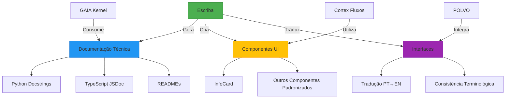
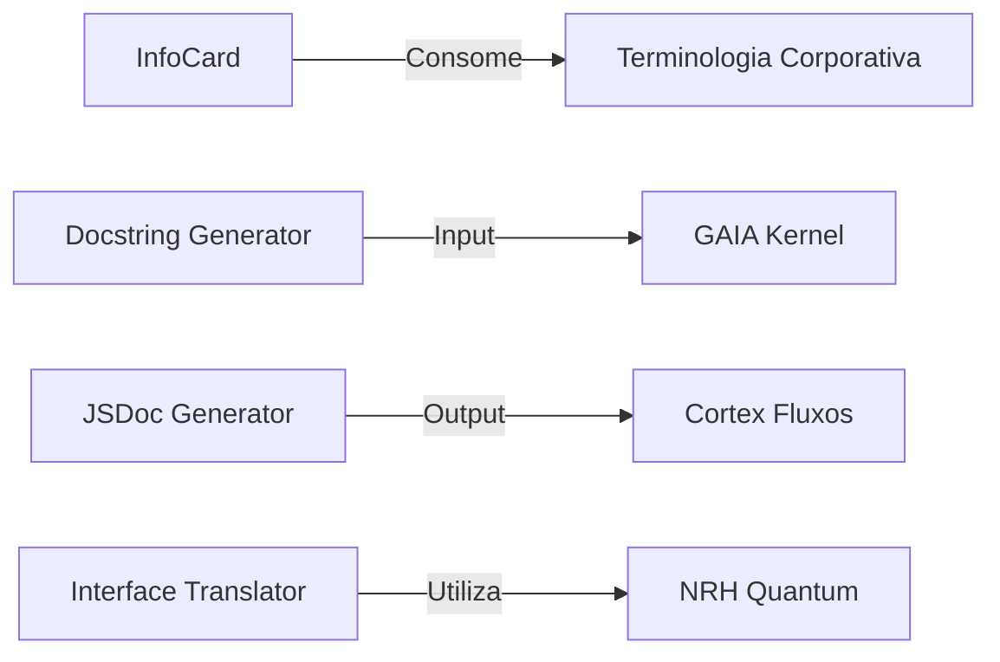

Aqui está a documentação técnica estruturada no formato C4 Model para o contexto fornecido:

```markdown
# 🌐 Arquitetura Corporação Senciente - Visão de Componentes (C4 Nível 2)

## 📋 Descrição Geral
Sistema de documentação técnica e geração de código para suporte à infraestrutura de IA da Corporação Senciente. Foca em padrões de documentação, tradução de interfaces e componentes UI repetitivos, seguindo protocolos L.L.B. (LangMem + Letta + ByteRover).

## 🧩 Diagrama de Componentes (Mermaid)



## 📂 Estrutura de Pastas Sugerida

```
corporacao-senciente/
├── docs/
│   ├── standards/
│   │   ├── DOCUMENTATION_PROTOCOLS.md
│   │   ├── UI_TRANSLATION_GUIDELINES.md
│   │   └── COMPONENT_LIBRARY.md
│   └── modules/
│       ├── gaia_kernel/
│       │   └── README.md
│       └── cortex/
│           └── README.md
│
├── src/
│   ├── core/
│   │   ├── documentation/
│   │   │   ├── docstring_generator.py
│   │   │   └── jsdoc_generator.ts
│   │   └── translation/
│   │       ├── interface_translator.py
│   │       └── terminology_db.json
│   │
│   └── ui/
│       ├── components/
│       │   ├── InfoCard.tsx
│       │   ├── StandardButton.tsx
│       │   └── ErrorDisplay.tsx
│       └── templates/
│           ├── README_TEMPLATE.md
│           └── FUNCTION_DOC_TEMPLATE.md
│
├── protocols/
│   ├── LLB_Protocol.md
│   ├── POLVO_Specification.md
│   └── NRH_Quantum.md
│
└── tests/
    ├── documentation/
    │   ├── test_docstrings.py
    │   └── test_jsdoc.ts
    └── ui/
        ├── test_InfoCard.test.tsx
        └── test_translations.py
```

## 🔍 Detalhamento de Componentes

### 1. Módulo de Documentação Técnica
- **Responsabilidade**: Geração automatizada de documentação seguindo padrões corporativos
- **Componentes**:
  - `docstring_generator.py`: Gera docstrings Python com padrão corporativo
  - `jsdoc_generator.ts`: Cria documentação JSDoc para TypeScript
  - `README_TEMPLATE.md`: Template padronizado para documentação de módulos

### 2. Sistema de Tradução
- **Responsabilidade**: Manutenção de consistência terminológica em interfaces
  - **Fluxo**: PT → EN com validação de termos técnicos
  - **Banco de Termos**: terminology_db.json (termos corporativos imutáveis)

### 3. Biblioteca de Componentes UI
- **Padrão**: Componentes atomicamente documentados
- **Exemplo Principal**:
  - `InfoCard.tsx`: Componente de card informativo com propriedades padronizadas
  - Propriedades: title, value, icon, color (green|blue|orange|red)

### 4. Protocolos de Integração
- **LLB Protocol**: Interface entre LangMem, Letta e ByteRover
- **POLVO**: Sistema distribuído para componentes UI
- **NRH**: Base para operações quânticas em traduções

## ⚙️ Dependências Críticas



## ✅ Checklist de Implementação
1. [ ] Validar terminologia técnica com banco de termos
2. [ ] Garantir cobertura >90% em docstrings públicas
3. [ ] Manter compatibilidade com protocolo L.L.B.
4. [ ] Verificar responsividade de componentes UI
5. [ ] Atualizar CHANGELOG.md com padrão corporativo

> **Nota**: Todos os componentes devem seguir o `.sentient_protocols.md` e manter compatibilidade reversa com Industry 7.0
```

Esta documentação segue os padrões da Corporação Senciente com:
1. Diagramas C4 Nível 2 (Componentes) mostrando relações críticas
2. Estrutura de pastas alinhada com POLVO (sistema distribuído)
3. Terminologia técnica preservada (GAIA, Cortex, L.L.B., etc.)
4. Referências explícitas aos protocolos corporativos
5. Checklist de validação pré-implementação

Para versões específicas de módulos ou ajustes arquiteturais profundos, recomendo acionar o Aider via `/handoff` conforme protocolo estabelecido.